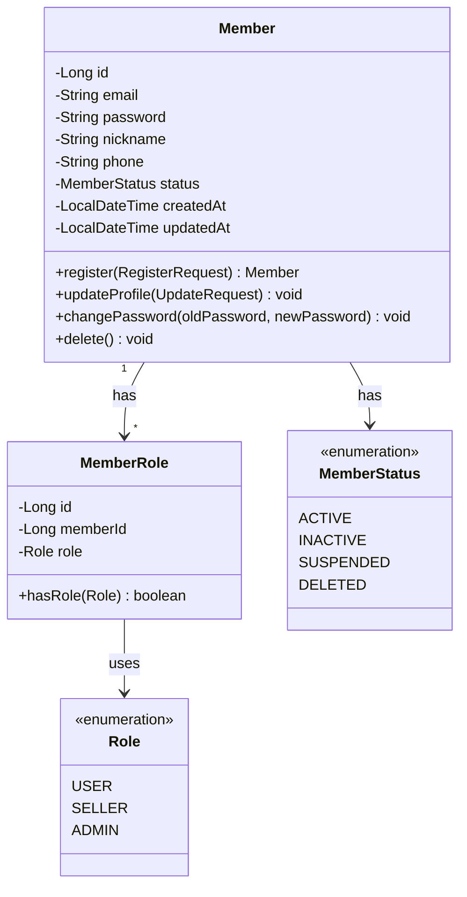
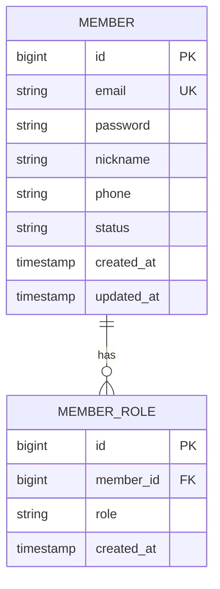
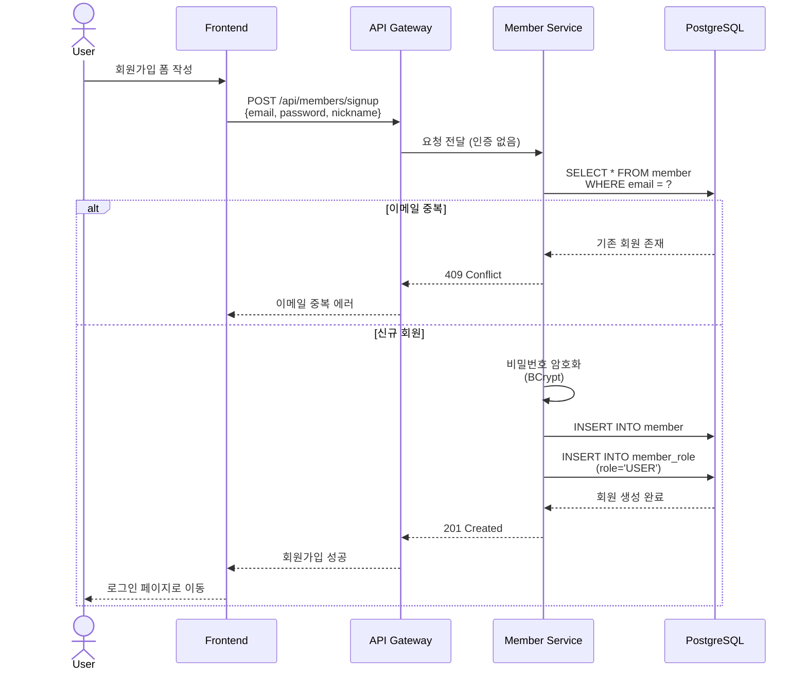
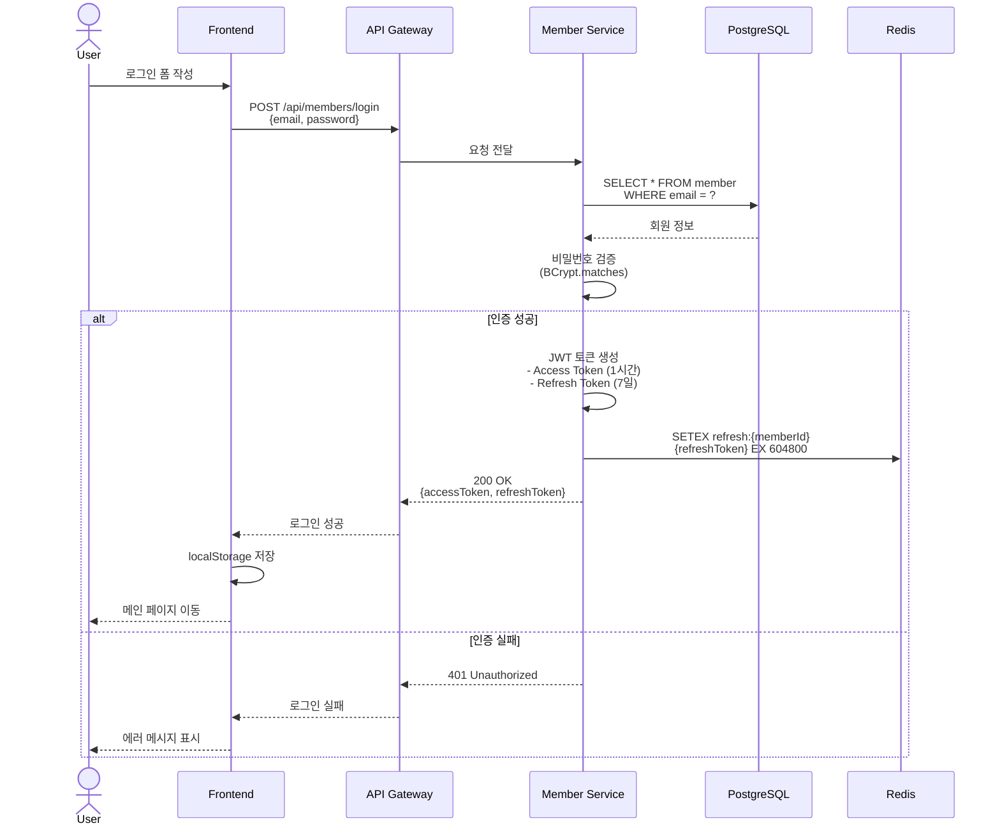
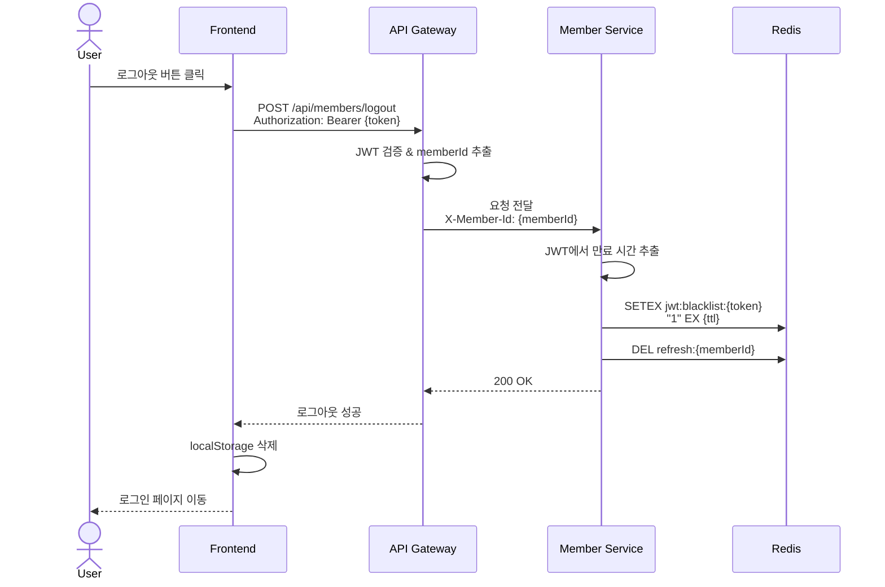
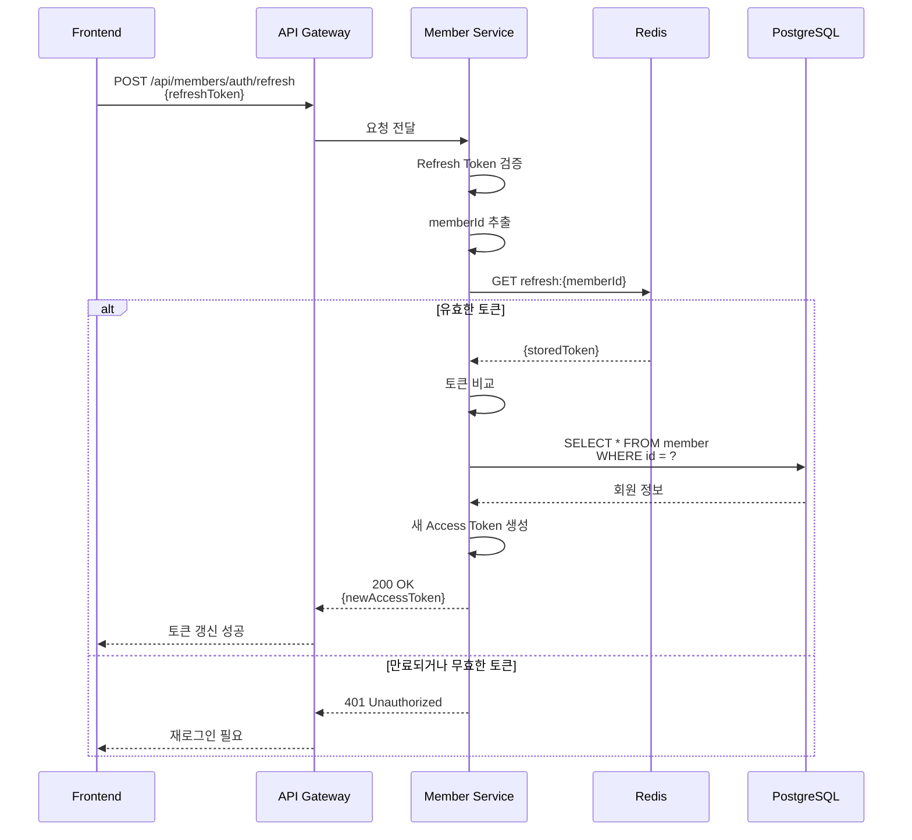
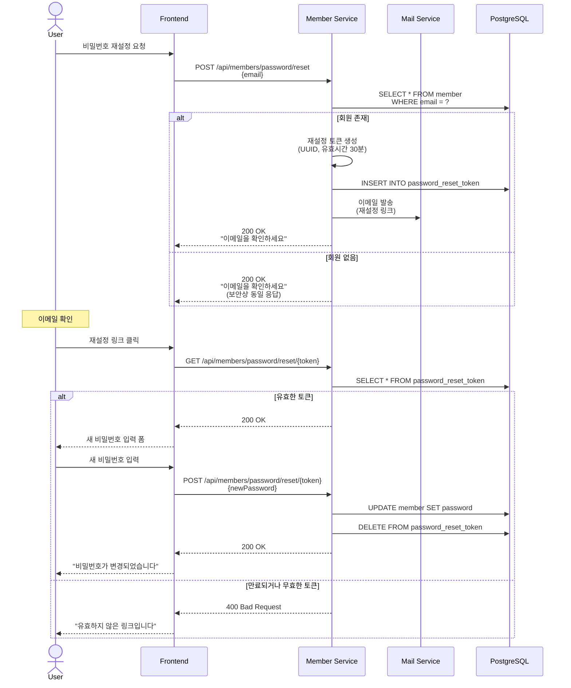

# 회원 서비스 (Member Service) 상세 설계

## 개요
회원 가입, 로그인, 인증/인가를 담당하는 마이크로서비스입니다.

## 도메인 모델



## ERD



## API 설계

### 1. 회원 가입



**Request:**
```json
POST /api/members/signup
{
  "email": "user@example.com",
  "password": "password123!",
  "nickname": "홍길동",
  "phone": "010-1234-5678"
}
```

**Response:**
```json
{
  "id": 1,
  "email": "user@example.com",
  "nickname": "홍길동",
  "createdAt": "2024-07-15T10:00:00"
}
```

### 2. 로그인 (JWT 발급)



**Request:**
```json
POST /api/members/login
{
  "email": "user@example.com",
  "password": "password123!"
}
```

**Response:**
```json
{
  "accessToken": "eyJhbGciOiJIUzI1NiIsInR5cCI6IkpXVCJ9...",
  "refreshToken": "eyJhbGciOiJIUzI1NiIsInR5cCI6IkpXVCJ9...",
  "tokenType": "Bearer",
  "expiresIn": 3600,
  "member": {
    "id": 1,
    "email": "user@example.com",
    "nickname": "홍길동",
    "roles": ["USER"]
  }
}
```

### 3. 로그아웃 (JWT 블랙리스트)



### 4. 토큰 갱신



## 비즈니스 로직

### 1. 회원 가입 검증

```java
@Service
@RequiredArgsConstructor
public class MemberService {

    private final MemberRepository memberRepository;
    private final PasswordEncoder passwordEncoder;

    @Transactional
    public MemberResponse register(RegisterRequest request) {
        // 1. 이메일 중복 확인
        if (memberRepository.existsByEmail(request.getEmail())) {
            throw new DuplicateEmailException("이미 사용 중인 이메일입니다.");
        }

        // 2. 닉네임 중복 확인
        if (memberRepository.existsByNickname(request.getNickname())) {
            throw new DuplicateNicknameException("이미 사용 중인 닉네임입니다.");
        }

        // 3. 비밀번호 강도 검증
        validatePassword(request.getPassword());

        // 4. 회원 생성
        Member member = Member.builder()
            .email(request.getEmail())
            .password(passwordEncoder.encode(request.getPassword()))
            .nickname(request.getNickname())
            .phone(request.getPhone())
            .status(MemberStatus.ACTIVE)
            .build();

        Member saved = memberRepository.save(member);

        // 5. 기본 역할 부여
        MemberRole role = MemberRole.builder()
            .memberId(saved.getId())
            .role(Role.USER)
            .build();
        memberRoleRepository.save(role);

        return MemberResponse.from(saved);
    }

    private void validatePassword(String password) {
        // 최소 8자, 영문/숫자/특수문자 포함
        String regex = "^(?=.*[A-Za-z])(?=.*\\d)(?=.*[@$!%*#?&])[A-Za-z\\d@$!%*#?&]{8,}$";
        if (!password.matches(regex)) {
            throw new InvalidPasswordException(
                "비밀번호는 8자 이상, 영문/숫자/특수문자를 포함해야 합니다."
            );
        }
    }
}
```

### 2. JWT 토큰 생성

```java
@Component
@RequiredArgsConstructor
public class JwtTokenProvider {

    @Value("${jwt.secret}")
    private String secretKey;

    @Value("${jwt.access-token-expiration}")
    private long accessTokenExpiration; // 1시간

    @Value("${jwt.refresh-token-expiration}")
    private long refreshTokenExpiration; // 7일

    public TokenResponse generateToken(Member member) {
        String accessToken = createAccessToken(member);
        String refreshToken = createRefreshToken(member);

        return TokenResponse.builder()
            .accessToken(accessToken)
            .refreshToken(refreshToken)
            .tokenType("Bearer")
            .expiresIn(accessTokenExpiration)
            .build();
    }

    private String createAccessToken(Member member) {
        Claims claims = Jwts.claims().setSubject(String.valueOf(member.getId()));
        claims.put("email", member.getEmail());
        claims.put("roles", member.getRoles());

        Date now = new Date();
        Date expiration = new Date(now.getTime() + accessTokenExpiration);

        return Jwts.builder()
            .setClaims(claims)
            .setIssuedAt(now)
            .setExpiration(expiration)
            .signWith(SignatureAlgorithm.HS256, secretKey)
            .compact();
    }

    private String createRefreshToken(Member member) {
        Claims claims = Jwts.claims().setSubject(String.valueOf(member.getId()));

        Date now = new Date();
        Date expiration = new Date(now.getTime() + refreshTokenExpiration);

        return Jwts.builder()
            .setClaims(claims)
            .setIssuedAt(now)
            .setExpiration(expiration)
            .signWith(SignatureAlgorithm.HS256, secretKey)
            .compact();
    }

    public boolean validateToken(String token) {
        try {
            Jwts.parser().setSigningKey(secretKey).parseClaimsJws(token);
            return true;
        } catch (JwtException | IllegalArgumentException e) {
            return false;
        }
    }

    public Long getMemberId(String token) {
        Claims claims = Jwts.parser()
            .setSigningKey(secretKey)
            .parseClaimsJws(token)
            .getBody();
        return Long.parseLong(claims.getSubject());
    }
}
```

## 보안

### 1. 비밀번호 암호화

```java
@Configuration
public class SecurityConfig {

    @Bean
    public PasswordEncoder passwordEncoder() {
        return new BCryptPasswordEncoder(10); // strength: 10
    }
}
```

### 2. JWT 블랙리스트 (Redis)

```java
@Service
@RequiredArgsConstructor
public class TokenBlacklistService {

    private final RedisTemplate<String, String> redisTemplate;
    private final JwtTokenProvider jwtTokenProvider;

    private static final String BLACKLIST_PREFIX = "jwt:blacklist:";

    public void addToBlacklist(String token) {
        Date expiration = jwtTokenProvider.getExpiration(token);
        long ttl = expiration.getTime() - System.currentTimeMillis();

        if (ttl > 0) {
            redisTemplate.opsForValue().set(
                BLACKLIST_PREFIX + token,
                "1",
                ttl,
                TimeUnit.MILLISECONDS
            );
        }
    }

    public boolean isBlacklisted(String token) {
        return Boolean.TRUE.equals(
            redisTemplate.hasKey(BLACKLIST_PREFIX + token)
        );
    }
}
```

### 3. 비밀번호 재설정



## 데이터베이스

### 테이블 스키마

```sql
-- 회원 테이블
CREATE TABLE member (
    id BIGSERIAL PRIMARY KEY,
    email VARCHAR(255) UNIQUE NOT NULL,
    password VARCHAR(255) NOT NULL,
    nickname VARCHAR(50) UNIQUE NOT NULL,
    phone VARCHAR(20),
    status VARCHAR(20) NOT NULL DEFAULT 'ACTIVE',
    created_at TIMESTAMP NOT NULL DEFAULT CURRENT_TIMESTAMP,
    updated_at TIMESTAMP NOT NULL DEFAULT CURRENT_TIMESTAMP
);

-- 회원 역할 테이블
CREATE TABLE member_role (
    id BIGSERIAL PRIMARY KEY,
    member_id BIGINT NOT NULL,
    role VARCHAR(20) NOT NULL,
    created_at TIMESTAMP NOT NULL DEFAULT CURRENT_TIMESTAMP,
    FOREIGN KEY (member_id) REFERENCES member(id) ON DELETE CASCADE
);

-- 비밀번호 재설정 토큰 테이블
CREATE TABLE password_reset_token (
    id BIGSERIAL PRIMARY KEY,
    member_id BIGINT NOT NULL,
    token VARCHAR(255) UNIQUE NOT NULL,
    expires_at TIMESTAMP NOT NULL,
    created_at TIMESTAMP NOT NULL DEFAULT CURRENT_TIMESTAMP,
    FOREIGN KEY (member_id) REFERENCES member(id) ON DELETE CASCADE
);

-- 인덱스
CREATE INDEX idx_member_email ON member(email);
CREATE INDEX idx_member_nickname ON member(nickname);
CREATE INDEX idx_member_role_member_id ON member_role(member_id);
CREATE INDEX idx_password_reset_token ON password_reset_token(token);
```

## API 엔드포인트 정리

| Method | Endpoint | 인증 | 설명 |
|--------|----------|------|------|
| POST | `/api/members/signup` | No | 회원 가입 |
| POST | `/api/members/login` | No | 로그인 |
| POST | `/api/members/logout` | Yes | 로그아웃 |
| POST | `/api/members/auth/refresh` | No | 토큰 갱신 |
| GET | `/api/members/me` | Yes | 내 정보 조회 |
| PUT | `/api/members/me` | Yes | 내 정보 수정 |
| PUT | `/api/members/me/password` | Yes | 비밀번호 변경 |
| POST | `/api/members/password/reset` | No | 비밀번호 재설정 요청 |
| POST | `/api/members/password/reset/{token}` | No | 비밀번호 재설정 |
| GET | `/api/members/{id}/nickname` | No | 닉네임 조회 (공개) |
| DELETE | `/api/members/me` | Yes | 회원 탈퇴 |

## 참고 자료
- [JWT 공식 사이트](https://jwt.io/)
- [Spring Security 문서](https://spring.io/projects/spring-security)
- [BCrypt 알고리즘](https://en.wikipedia.org/wiki/Bcrypt)
