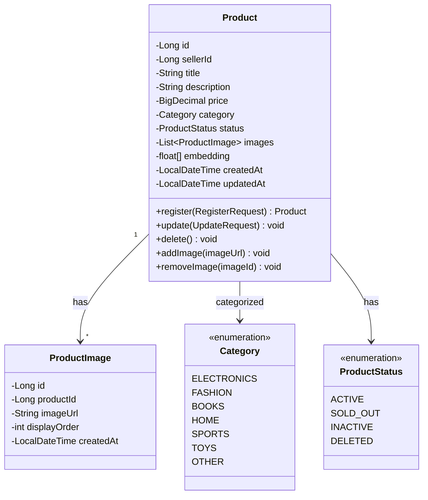
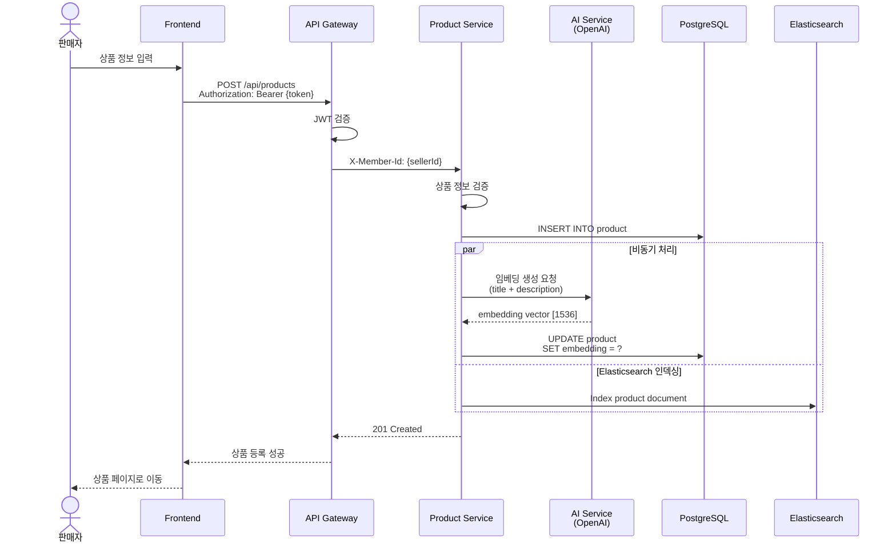
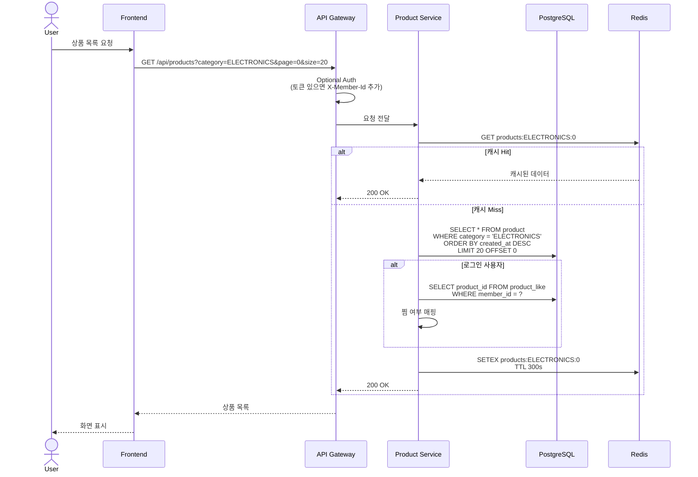
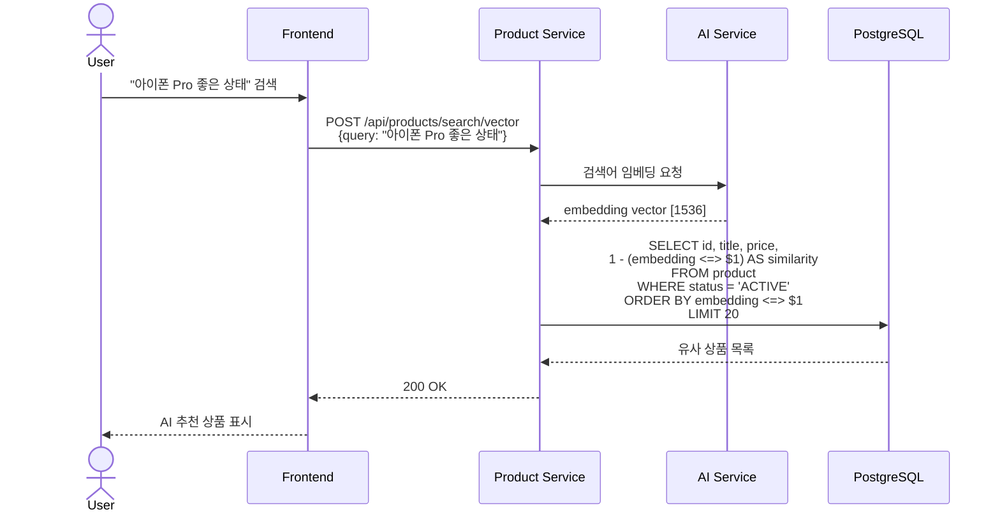

# 상품 서비스 (Product Service) 상세 설계

## 개요
일반 상품의 등록, 조회, 수정, 삭제를 담당하는 마이크로서비스입니다.
AI 기반 검색을 위한 벡터 임베딩 기능을 포함합니다.

## 도메인 모델



## ERD

```mermaid
erDiagram
    PRODUCT ||--o{ PRODUCT_IMAGE : "has"
    PRODUCT ||--o{ PRODUCT_LIKE : "has"

    PRODUCT {
        bigint id PK
        bigint seller_id FK
        string title
        text description
        decimal price
        string category
        string status
        vector embedding "pgvector (1536 dimensions)"
        timestamp created_at
        timestamp updated_at
    }

    PRODUCT_IMAGE {
        bigint id PK
        bigint product_id FK
        string image_url
        int display_order
        timestamp created_at
    }

    PRODUCT_LIKE {
        bigint id PK
        bigint product_id FK
        bigint member_id FK
        timestamp created_at
        unique(product_id, member_id)
    }
```

## API 설계

### 1. 상품 등록



**Request:**
```json
POST /api/products
Authorization: Bearer {token}
Content-Type: multipart/form-data

{
  "title": "아이폰 14 Pro",
  "description": "거의 새 제품입니다. 256GB 딥퍼플",
  "price": 1200000,
  "category": "ELECTRONICS",
  "images": [File, File, File]
}
```

**Response:**
```json
{
  "id": 1,
  "sellerId": 123,
  "title": "아이폰 14 Pro",
  "description": "거의 새 제품입니다. 256GB 딥퍼플",
  "price": 1200000,
  "category": "ELECTRONICS",
  "status": "ACTIVE",
  "images": [
    {
      "id": 1,
      "imageUrl": "https://cdn.biddy.com/products/1/image1.jpg",
      "displayOrder": 0
    }
  ],
  "createdAt": "2024-07-15T10:00:00"
}
```

### 2. 상품 목록 조회 (비로그인 허용)



**Request:**
```
GET /api/products?category=ELECTRONICS&page=0&size=20&sort=latest
Authorization: Bearer {token} (선택)
```

**Response:**
```json
{
  "content": [
    {
      "id": 1,
      "title": "아이폰 14 Pro",
      "price": 1200000,
      "category": "ELECTRONICS",
      "thumbnail": "https://cdn.biddy.com/products/1/thumb.jpg",
      "liked": true,
      "createdAt": "2024-07-15T10:00:00"
    }
  ],
  "page": 0,
  "size": 20,
  "totalElements": 150,
  "totalPages": 8
}
```

### 3. 벡터 유사도 검색 (AI 추천)



**pgvector 쿼리:**
```sql
-- 유사도 검색 (코사인 유사도)
SELECT
    id,
    title,
    price,
    1 - (embedding <=> '[0.1, 0.2, ...]'::vector) AS similarity
FROM product
WHERE status = 'ACTIVE'
  AND category = 'ELECTRONICS'
ORDER BY embedding <=> '[0.1, 0.2, ...]'::vector
LIMIT 20;
```

## 비즈니스 로직

### 1. 상품 등록 검증

```java
@Service
@RequiredArgsConstructor
public class ProductService {

    private final ProductRepository productRepository;
    private final ProductImageRepository productImageRepository;
    private final TextEmbeddingService embeddingService;
    private final ElasticsearchService elasticsearchService;

    @Transactional
    public ProductResponse registerProduct(Long sellerId, ProductRequest request) {
        // 1. 가격 검증
        if (request.getPrice().compareTo(BigDecimal.ZERO) <= 0) {
            throw new InvalidPriceException("가격은 0보다 커야 합니다.");
        }

        // 2. 이미지 개수 검증
        if (request.getImages().size() > 10) {
            throw new TooManyImagesException("이미지는 최대 10개까지 등록 가능합니다.");
        }

        // 3. 상품 생성
        Product product = Product.builder()
            .sellerId(sellerId)
            .title(request.getTitle())
            .description(request.getDescription())
            .price(request.getPrice())
            .category(request.getCategory())
            .status(ProductStatus.ACTIVE)
            .build();

        Product saved = productRepository.save(product);

        // 4. 이미지 저장
        List<ProductImage> images = saveImages(saved.getId(), request.getImages());

        // 5. 비동기 처리
        CompletableFuture.allOf(
            // 임베딩 생성
            CompletableFuture.runAsync(() -> {
                String text = request.getTitle() + " " + request.getDescription();
                float[] embedding = embeddingService.generateEmbedding(text);
                productRepository.updateEmbedding(saved.getId(), embedding);
            }),
            // Elasticsearch 인덱싱
            CompletableFuture.runAsync(() -> {
                elasticsearchService.indexProduct(saved);
            })
        ).join();

        return ProductResponse.from(saved, images);
    }

    private List<ProductImage> saveImages(Long productId, List<MultipartFile> files) {
        List<ProductImage> images = new ArrayList<>();

        for (int i = 0; i < files.size(); i++) {
            MultipartFile file = files.get(i);
            String imageUrl = s3Service.upload(file);

            ProductImage image = ProductImage.builder()
                .productId(productId)
                .imageUrl(imageUrl)
                .displayOrder(i)
                .build();

            images.add(productImageRepository.save(image));
        }

        return images;
    }
}
```

### 2. 상품 찜하기/취소

```java
@Service
@RequiredArgsConstructor
public class ProductLikeService {

    private final ProductLikeRepository productLikeRepository;
    private final ProductRepository productRepository;

    @Transactional
    public void toggleLike(Long memberId, Long productId) {
        // 1. 상품 존재 확인
        Product product = productRepository.findById(productId)
            .orElseThrow(() -> new ProductNotFoundException("상품을 찾을 수 없습니다."));

        // 2. 찜 여부 확인
        Optional<ProductLike> existingLike = productLikeRepository
            .findByMemberIdAndProductId(memberId, productId);

        if (existingLike.isPresent()) {
            // 찜 취소
            productLikeRepository.delete(existingLike.get());
        } else {
            // 찜 추가
            ProductLike like = ProductLike.builder()
                .memberId(memberId)
                .productId(productId)
                .build();
            productLikeRepository.save(like);
        }
    }

    @Transactional(readOnly = true)
    public List<ProductResponse> getMyLikes(Long memberId, Pageable pageable) {
        return productLikeRepository
            .findByMemberIdWithProduct(memberId, pageable)
            .stream()
            .map(like -> ProductResponse.from(like.getProduct()))
            .collect(Collectors.toList());
    }
}
```

### 3. 벡터 임베딩 서비스

```java
@Service
@RequiredArgsConstructor
public class TextEmbeddingService {

    @Value("${openai.api-key}")
    private String apiKey;

    private static final String EMBEDDING_MODEL = "text-embedding-3-small";
    private static final int EMBEDDING_DIMENSION = 1536;

    public float[] generateEmbedding(String text) {
        try {
            RestTemplate restTemplate = new RestTemplate();

            HttpHeaders headers = new HttpHeaders();
            headers.set("Authorization", "Bearer " + apiKey);
            headers.setContentType(MediaType.APPLICATION_JSON);

            Map<String, Object> requestBody = Map.of(
                "input", text,
                "model", EMBEDDING_MODEL
            );

            HttpEntity<Map<String, Object>> entity =
                new HttpEntity<>(requestBody, headers);

            ResponseEntity<Map> response = restTemplate.exchange(
                "https://api.openai.com/v1/embeddings",
                HttpMethod.POST,
                entity,
                Map.class
            );

            List<Map<String, Object>> data =
                (List<Map<String, Object>>) response.getBody().get("data");
            List<Double> embedding =
                (List<Double>) data.get(0).get("embedding");

            return embedding.stream()
                .map(Double::floatValue)
                .collect(Collectors.toList())
                .toArray(new Float[0]);

        } catch (Exception e) {
            log.error("Failed to generate embedding", e);
            return new float[EMBEDDING_DIMENSION]; // 빈 벡터 반환
        }
    }
}
```

## 데이터베이스

### pgvector 설정

```sql
-- pgvector 확장 설치
CREATE EXTENSION IF NOT EXISTS vector;

-- 상품 테이블
CREATE TABLE product (
    id BIGSERIAL PRIMARY KEY,
    seller_id BIGINT NOT NULL,
    title VARCHAR(255) NOT NULL,
    description TEXT,
    price DECIMAL(19, 2) NOT NULL,
    category VARCHAR(50) NOT NULL,
    status VARCHAR(20) NOT NULL DEFAULT 'ACTIVE',
    embedding vector(1536),  -- OpenAI embedding 차원
    created_at TIMESTAMP NOT NULL DEFAULT CURRENT_TIMESTAMP,
    updated_at TIMESTAMP NOT NULL DEFAULT CURRENT_TIMESTAMP,
    CONSTRAINT chk_product_price_positive CHECK (price > 0)
);

-- 벡터 유사도 검색 인덱스 (IVFFlat)
CREATE INDEX idx_product_embedding
ON product
USING ivfflat (embedding vector_cosine_ops)
WITH (lists = 100);

-- 일반 인덱스
CREATE INDEX idx_product_category ON product(category);
CREATE INDEX idx_product_status ON product(status);
CREATE INDEX idx_product_seller_id ON product(seller_id);
CREATE INDEX idx_product_created_at ON product(created_at DESC);

-- 상품 이미지 테이블
CREATE TABLE product_image (
    id BIGSERIAL PRIMARY KEY,
    product_id BIGINT NOT NULL,
    image_url VARCHAR(500) NOT NULL,
    display_order INT NOT NULL,
    created_at TIMESTAMP NOT NULL DEFAULT CURRENT_TIMESTAMP,
    FOREIGN KEY (product_id) REFERENCES product(id) ON DELETE CASCADE
);

CREATE INDEX idx_product_image_product_id ON product_image(product_id);

-- 상품 찜 테이블
CREATE TABLE product_like (
    id BIGSERIAL PRIMARY KEY,
    product_id BIGINT NOT NULL,
    member_id BIGINT NOT NULL,
    created_at TIMESTAMP NOT NULL DEFAULT CURRENT_TIMESTAMP,
    FOREIGN KEY (product_id) REFERENCES product(id) ON DELETE CASCADE,
    UNIQUE (product_id, member_id)
);

CREATE INDEX idx_product_like_member_id ON product_like(member_id);
CREATE INDEX idx_product_like_product_id ON product_like(product_id);
```

## Elasticsearch 연동

### 인덱스 매핑

```json
PUT /products
{
  "settings": {
    "number_of_shards": 3,
    "number_of_replicas": 1,
    "analysis": {
      "analyzer": {
        "korean": {
          "type": "custom",
          "tokenizer": "nori_tokenizer",
          "filter": ["lowercase", "nori_part_of_speech"]
        }
      }
    }
  },
  "mappings": {
    "properties": {
      "id": { "type": "long" },
      "title": {
        "type": "text",
        "analyzer": "korean",
        "fields": {
          "keyword": { "type": "keyword" }
        }
      },
      "description": {
        "type": "text",
        "analyzer": "korean"
      },
      "price": { "type": "long" },
      "category": { "type": "keyword" },
      "status": { "type": "keyword" },
      "sellerId": { "type": "long" },
      "createdAt": { "type": "date" }
    }
  }
}
```

### 검색 쿼리

```java
@Service
@RequiredArgsConstructor
public class ProductSearchService {

    private final ElasticsearchOperations elasticsearchOperations;

    public Page<ProductResponse> search(String keyword, Pageable pageable) {
        Query query = NativeQuery.builder()
            .withQuery(q -> q
                .bool(b -> b
                    .should(s -> s
                        .match(m -> m
                            .field("title")
                            .query(keyword)
                            .boost(2.0f)
                        )
                    )
                    .should(s -> s
                        .match(m -> m
                            .field("description")
                            .query(keyword)
                        )
                    )
                    .filter(f -> f
                        .term(t -> t
                            .field("status")
                            .value("ACTIVE")
                        )
                    )
                )
            )
            .withPageable(pageable)
            .build();

        SearchHits<ProductDocument> hits = elasticsearchOperations.search(
            query,
            ProductDocument.class
        );

        return hits.getSearchHits()
            .stream()
            .map(hit -> ProductResponse.from(hit.getContent()))
            .collect(Collectors.toList());
    }
}
```

## 캐싱 전략

### Redis 캐싱

```java
@Service
@RequiredArgsConstructor
public class ProductCacheService {

    private final RedisTemplate<String, Object> redisTemplate;
    private static final String CACHE_PREFIX = "products:";
    private static final long CACHE_TTL = 300; // 5분

    @Cacheable(value = "products", key = "#category + ':' + #page")
    public Page<ProductResponse> getProductsByCategory(
        String category,
        Pageable pageable
    ) {
        // DB 조회 로직
        return productRepository.findByCategory(category, pageable)
            .map(ProductResponse::from);
    }

    @CacheEvict(value = "products", allEntries = true)
    public void evictAllCache() {
        // 상품 등록/수정/삭제 시 캐시 무효화
    }
}
```

## API 엔드포인트 정리

| Method | Endpoint | 인증 | 설명 |
|--------|----------|------|------|
| POST | `/api/products` | Yes | 상품 등록 |
| GET | `/api/products` | Optional | 상품 목록 조회 |
| GET | `/api/products/{id}` | Optional | 상품 상세 조회 |
| PUT | `/api/products/{id}` | Yes | 상품 수정 |
| DELETE | `/api/products/{id}` | Yes | 상품 삭제 |
| POST | `/api/products/{id}/like` | Yes | 상품 찜하기/취소 |
| GET | `/api/products/my-likes` | Yes | 내가 찜한 상품 목록 |
| POST | `/api/products/search/vector` | No | AI 유사도 검색 |
| GET | `/api/products/search` | No | 키워드 검색 (Elasticsearch) |

## 성능 최적화

### 1. N+1 문제 해결

```java
@Query("SELECT p FROM Product p " +
       "LEFT JOIN FETCH p.images " +
       "WHERE p.id = :id")
Optional<Product> findByIdWithImages(@Param("id") Long id);
```

### 2. 페이지네이션

```java
@GetMapping("/api/products")
public Page<ProductResponse> getProducts(
    @RequestParam(required = false) String category,
    @PageableDefault(size = 20) Pageable pageable
) {
    return productService.getProducts(category, pageable);
}
```

### 3. 이미지 최적화

- Thumbnail 생성 (200x200)
- WebP 변환
- CDN 사용 (CloudFront)

## 참고 자료
- [pgvector GitHub](https://github.com/pgvector/pgvector)
- [OpenAI Embeddings API](https://platform.openai.com/docs/guides/embeddings)
- [Elasticsearch 공식 문서](https://www.elastic.co/guide/index.html)