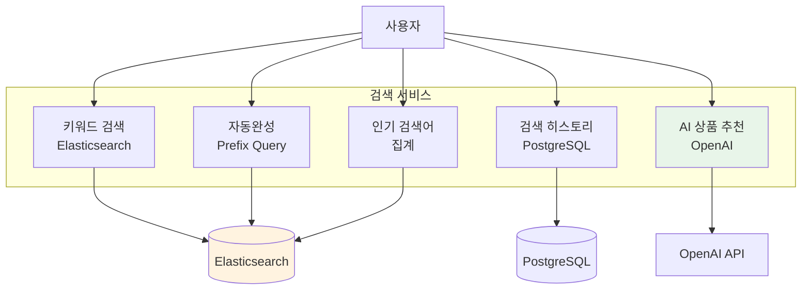
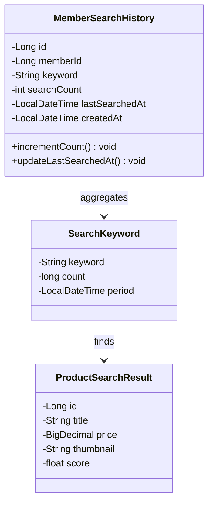
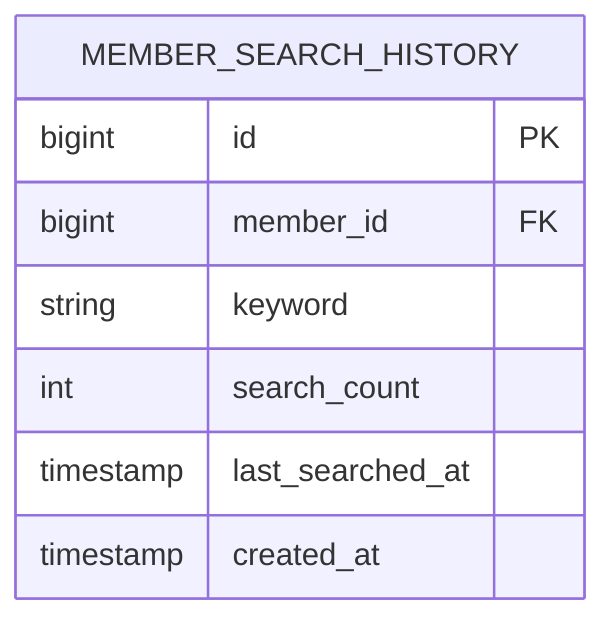
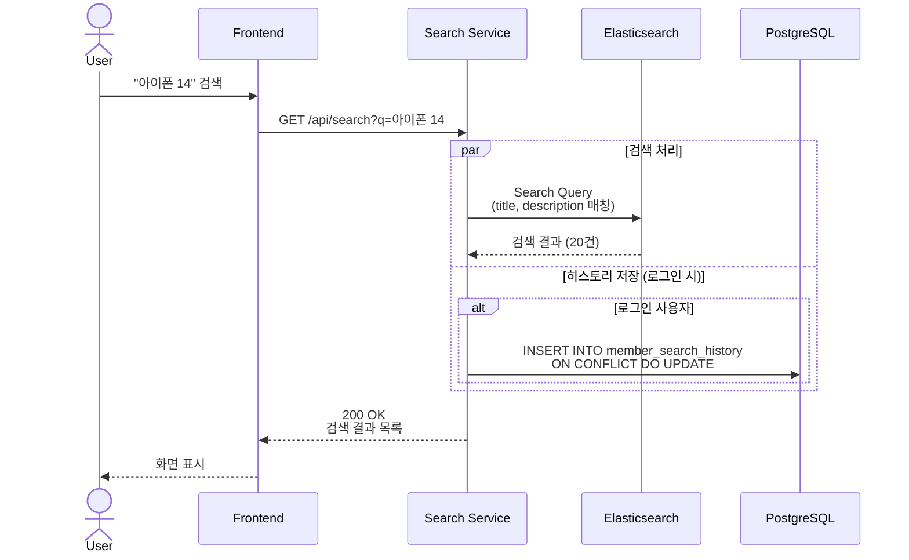
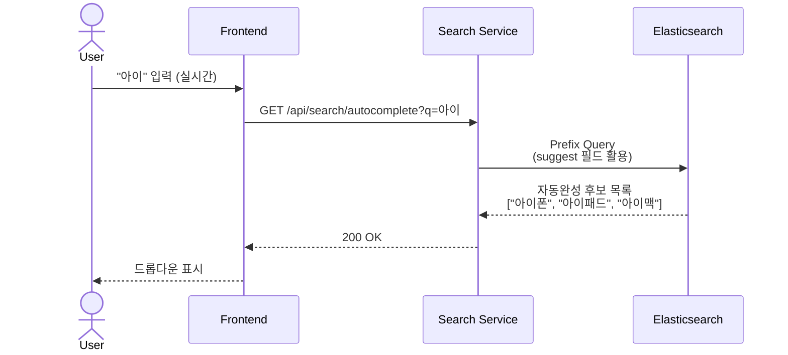
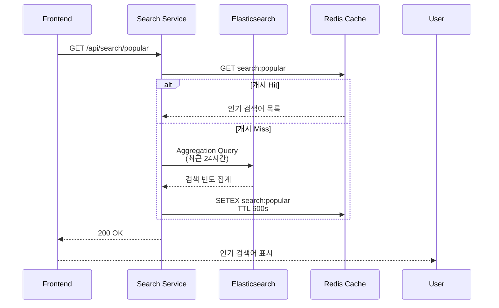
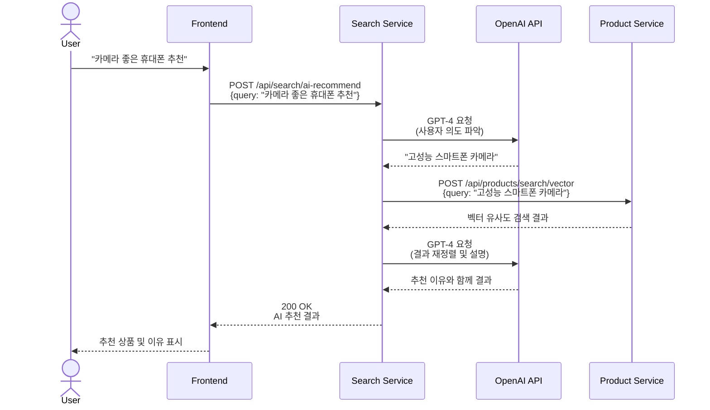

# 검색 서비스 (Search Service) 상세 설계

## 개요
Elasticsearch 기반의 상품 검색, AI 추천, 키워드 자동완성을 담당하는 마이크로서비스입니다.

## 주요 기능



## 도메인 모델



## ERD



## API 설계

### 1. 키워드 검색



**Request:**
```
GET /api/search?q=아이폰 14&page=0&size=20
Authorization: Bearer {token} (선택)
```

**Response:**
```json
{
  "keyword": "아이폰 14",
  "total": 45,
  "results": [
    {
      "id": 1,
      "title": "아이폰 14 Pro 256GB 딥퍼플",
      "price": 1200000,
      "thumbnail": "https://cdn.biddy.com/products/1/thumb.jpg",
      "score": 0.95,
      "highlightedTitle": "<em>아이폰 14</em> Pro 256GB 딥퍼플"
    }
  ],
  "suggestions": ["아이폰 14 pro", "아이폰 14 케이스"],
  "page": 0,
  "size": 20,
  "totalPages": 3
}
```

### 2. 키워드 자동완성



**Request:**
```
GET /api/search/autocomplete?q=아이
```

**Response:**
```json
{
  "suggestions": [
    {
      "keyword": "아이폰",
      "count": 1250
    },
    {
      "keyword": "아이패드",
      "count": 820
    },
    {
      "keyword": "아이맥",
      "count": 340
    }
  ]
}
```

### 3. 인기 검색어



**Response:**
```json
{
  "period": "24h",
  "keywords": [
    {
      "keyword": "아이폰 14",
      "count": 1520,
      "trend": "up"
    },
    {
      "keyword": "맥북 프로",
      "count": 980,
      "trend": "stable"
    },
    {
      "keyword": "에어팟 프로",
      "count": 750,
      "trend": "down"
    }
  ]
}
```

### 4. AI 기반 상품 추천



**Request:**
```json
POST /api/search/ai-recommend
{
  "query": "카메라 좋은 휴대폰 추천해줘",
  "budget": 1500000,
  "category": "ELECTRONICS"
}
```

**Response:**
```json
{
  "originalQuery": "카메라 좋은 휴대폰 추천해줘",
  "refinedQuery": "고성능 카메라 스마트폰",
  "explanation": "카메라 성능이 우수한 최신 스마트폰들을 추천드립니다.",
  "recommendations": [
    {
      "product": {
        "id": 1,
        "title": "아이폰 14 Pro Max",
        "price": 1590000
      },
      "reason": "48MP 메인 카메라와 향상된 야간 모드를 지원합니다.",
      "score": 0.95
    }
  ]
}
```

## 비즈니스 로직

### 1. 검색 히스토리 관리

```java
@Service
@RequiredArgsConstructor
public class MemberSearchHistoryService {

    private final MemberSearchHistoryRepository historyRepository;

    @Transactional
    public void saveSearchHistory(Long memberId, String keyword) {
        if (memberId == null || keyword == null || keyword.isBlank()) {
            return;
        }

        // 중복 검색어는 카운트만 증가
        Optional<MemberSearchHistory> existing = historyRepository
            .findByMemberIdAndKeyword(memberId, keyword);

        if (existing.isPresent()) {
            MemberSearchHistory history = existing.get();
            history.incrementCount();
            history.updateLastSearchedAt();
        } else {
            MemberSearchHistory history = MemberSearchHistory.builder()
                .memberId(memberId)
                .keyword(keyword)
                .searchCount(1)
                .lastSearchedAt(LocalDateTime.now())
                .build();
            historyRepository.save(history);
        }
    }

    @Transactional(readOnly = true)
    public List<SearchHistoryResponse> getMyHistory(Long memberId, int limit) {
        return historyRepository
            .findByMemberIdOrderByLastSearchedAtDesc(memberId, PageRequest.of(0, limit))
            .stream()
            .map(SearchHistoryResponse::from)
            .collect(Collectors.toList());
    }

    @Transactional
    public void deleteHistory(Long memberId, Long historyId) {
        historyRepository.deleteByIdAndMemberId(historyId, memberId);
    }

    @Transactional
    public void deleteAllHistory(Long memberId) {
        historyRepository.deleteByMemberId(memberId);
    }
}
```

### 2. 키워드 자동완성

```java
@Service
@RequiredArgsConstructor
public class KeywordSuggestionService {

    private final ElasticsearchOperations elasticsearchOperations;

    public List<KeywordSuggestion> getSuggestions(String prefix, int limit) {
        Query query = NativeQuery.builder()
            .withQuery(q -> q
                .bool(b -> b
                    .should(s -> s
                        .prefix(p -> p
                            .field("title.suggest")
                            .value(prefix)
                            .boost(2.0f)
                        )
                    )
                    .should(s -> s
                        .wildcard(w -> w
                            .field("title")
                            .value("*" + prefix + "*")
                        )
                    )
                    .filter(f -> f
                        .term(t -> t
                            .field("status")
                            .value("ACTIVE")
                        )
                    )
                )
            )
            .withAggregation("keywords", a -> a
                .terms(t -> t
                    .field("title.keyword")
                    .size(limit)
                )
            )
            .build();

        SearchHits<ProductDocument> hits = elasticsearchOperations.search(
            query,
            ProductDocument.class
        );

        return extractKeywords(hits, limit);
    }

    private List<KeywordSuggestion> extractKeywords(
        SearchHits<ProductDocument> hits,
        int limit
    ) {
        // 집계 결과에서 키워드 추출
        return hits.getAggregations()
            .get("keywords")
            .getBuckets()
            .stream()
            .limit(limit)
            .map(bucket -> KeywordSuggestion.builder()
                .keyword(bucket.getKeyAsString())
                .count(bucket.getDocCount())
                .build())
            .collect(Collectors.toList());
    }
}
```

### 3. AI 추천 서비스

```java
@Service
@RequiredArgsConstructor
public class LlmRecommendationService {

    @Value("${openai.api-key}")
    private String apiKey;

    private final ProductService productService;

    public RecommendationResponse recommend(String query, Long memberId) {
        // 1. GPT로 사용자 의도 파악
        String refinedQuery = refineQueryWithGPT(query);

        // 2. 벡터 검색으로 유사 상품 찾기
        List<ProductResponse> products = productService
            .searchByVector(refinedQuery, 10);

        // 3. GPT로 추천 이유 생성
        List<RecommendationItem> recommendations = products.stream()
            .map(product -> {
                String reason = generateRecommendationReason(product, query);
                return RecommendationItem.builder()
                    .product(product)
                    .reason(reason)
                    .score(0.9f)
                    .build();
            })
            .collect(Collectors.toList());

        return RecommendationResponse.builder()
            .originalQuery(query)
            .refinedQuery(refinedQuery)
            .explanation(generateExplanation(query, refinedQuery))
            .recommendations(recommendations)
            .build();
    }

    private String refineQueryWithGPT(String query) {
        String prompt = String.format(
            "사용자 쿼리: '%s'\n" +
            "위 쿼리를 상품 검색에 적합한 키워드로 변환하세요. " +
            "간결하게 핵심 키워드만 추출하세요.",
            query
        );

        return callGPT(prompt, 50);
    }

    private String generateRecommendationReason(
        ProductResponse product,
        String originalQuery
    ) {
        String prompt = String.format(
            "사용자 요청: '%s'\n" +
            "추천 상품: '%s' (가격: %d원)\n" +
            "왜 이 상품을 추천하는지 한 문장으로 설명하세요.",
            originalQuery,
            product.getTitle(),
            product.getPrice()
        );

        return callGPT(prompt, 100);
    }

    private String callGPT(String prompt, int maxTokens) {
        RestTemplate restTemplate = new RestTemplate();

        HttpHeaders headers = new HttpHeaders();
        headers.set("Authorization", "Bearer " + apiKey);
        headers.setContentType(MediaType.APPLICATION_JSON);

        Map<String, Object> requestBody = Map.of(
            "model", "gpt-4",
            "messages", List.of(
                Map.of("role", "system", "content", "당신은 전자상거래 추천 어시스턴트입니다."),
                Map.of("role", "user", "content", prompt)
            ),
            "max_tokens", maxTokens,
            "temperature", 0.7
        );

        HttpEntity<Map<String, Object>> entity =
            new HttpEntity<>(requestBody, headers);

        ResponseEntity<Map> response = restTemplate.exchange(
            "https://api.openai.com/v1/chat/completions",
            HttpMethod.POST,
            entity,
            Map.class
        );

        List<Map<String, Object>> choices =
            (List<Map<String, Object>>) response.getBody().get("choices");
        Map<String, String> message =
            (Map<String, String>) choices.get(0).get("message");

        return message.get("content").trim();
    }
}
```

## Elasticsearch 설정

### 인덱스 매핑 (상품 검색)

```json
PUT /products
{
  "settings": {
    "number_of_shards": 3,
    "number_of_replicas": 1,
    "analysis": {
      "analyzer": {
        "korean": {
          "type": "custom",
          "tokenizer": "nori_tokenizer",
          "filter": [
            "lowercase",
            "nori_part_of_speech",
            "nori_readingform"
          ]
        },
        "suggest": {
          "type": "custom",
          "tokenizer": "keyword",
          "filter": ["lowercase"]
        }
      }
    }
  },
  "mappings": {
    "properties": {
      "id": { "type": "long" },
      "title": {
        "type": "text",
        "analyzer": "korean",
        "fields": {
          "keyword": {
            "type": "keyword"
          },
          "suggest": {
            "type": "text",
            "analyzer": "suggest"
          }
        }
      },
      "description": {
        "type": "text",
        "analyzer": "korean"
      },
      "price": { "type": "long" },
      "category": { "type": "keyword" },
      "status": { "type": "keyword" },
      "sellerId": { "type": "long" },
      "createdAt": { "type": "date" }
    }
  }
}
```

### 검색 쿼리 (하이라이트 포함)

```java
Query query = NativeQuery.builder()
    .withQuery(q -> q
        .bool(b -> b
            .should(s -> s
                .match(m -> m
                    .field("title")
                    .query(keyword)
                    .boost(3.0f)
                    .fuzziness("AUTO")
                )
            )
            .should(s -> s
                .match(m -> m
                    .field("description")
                    .query(keyword)
                    .boost(1.0f)
                )
            )
            .filter(f -> f
                .term(t -> t
                    .field("status")
                    .value("ACTIVE")
                )
            )
        )
    )
    .withHighlightQuery(h -> h
        .fields("title", f -> f
            .preTags("<em>")
            .postTags("</em>")
        )
    )
    .withPageable(pageable)
    .build();
```

## 데이터베이스

### 검색 히스토리 테이블

```sql
CREATE TABLE member_search_history (
    id BIGSERIAL PRIMARY KEY,
    member_id BIGINT NOT NULL,
    keyword VARCHAR(255) NOT NULL,
    search_count INT NOT NULL DEFAULT 1,
    last_searched_at TIMESTAMP NOT NULL DEFAULT CURRENT_TIMESTAMP,
    created_at TIMESTAMP NOT NULL DEFAULT CURRENT_TIMESTAMP,
    CONSTRAINT uq_member_keyword UNIQUE (member_id, keyword)
);

CREATE INDEX idx_member_search_history_member_id
ON member_search_history(member_id);

CREATE INDEX idx_member_search_history_last_searched
ON member_search_history(last_searched_at DESC);

CREATE INDEX idx_member_search_history_keyword
ON member_search_history(keyword);
```

## API 엔드포인트 정리

| Method | Endpoint | 인증 | 설명 |
|--------|----------|------|------|
| GET | `/api/search` | Optional | 키워드 검색 |
| GET | `/api/search/autocomplete` | No | 자동완성 |
| GET | `/api/search/popular` | No | 인기 검색어 (Top 10) |
| GET | `/api/search/history` | Yes | 내 검색 히스토리 |
| DELETE | `/api/search/history/{id}` | Yes | 검색 히스토리 삭제 |
| DELETE | `/api/search/history` | Yes | 전체 히스토리 삭제 |
| POST | `/api/search/ai-recommend` | Optional | AI 상품 추천 |

## 성능 최적화

### 1. Redis 캐싱

```java
@Cacheable(value = "search:popular", ttl = 600)
public List<PopularKeyword> getPopularKeywords() {
    // Elasticsearch 집계 쿼리
}

@Cacheable(value = "search:autocomplete", key = "#prefix", ttl = 3600)
public List<KeywordSuggestion> getAutocompleteSuggestions(String prefix) {
    // Elasticsearch prefix 쿼리
}
```

### 2. Elasticsearch 최적화

- **Shard 설정**: 3 shards, 1 replica
- **Refresh Interval**: 30초 (실시간성 vs 성능 균형)
- **검색 캐시**: Query Cache, Request Cache 활성화

## 참고 자료
- [Elasticsearch 공식 문서](https://www.elastic.co/guide/index.html)
- [Nori 한글 분석기](https://www.elastic.co/guide/en/elasticsearch/plugins/current/analysis-nori.html)
- [OpenAI Chat Completions API](https://platform.openai.com/docs/guides/text-generation)