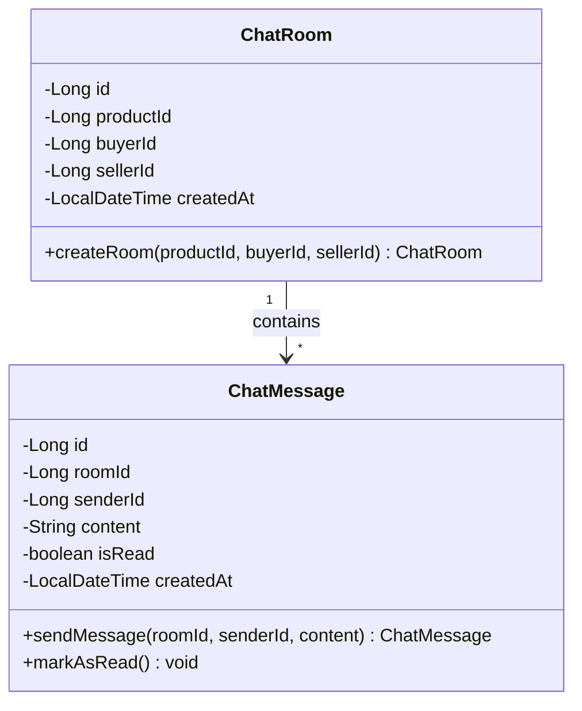
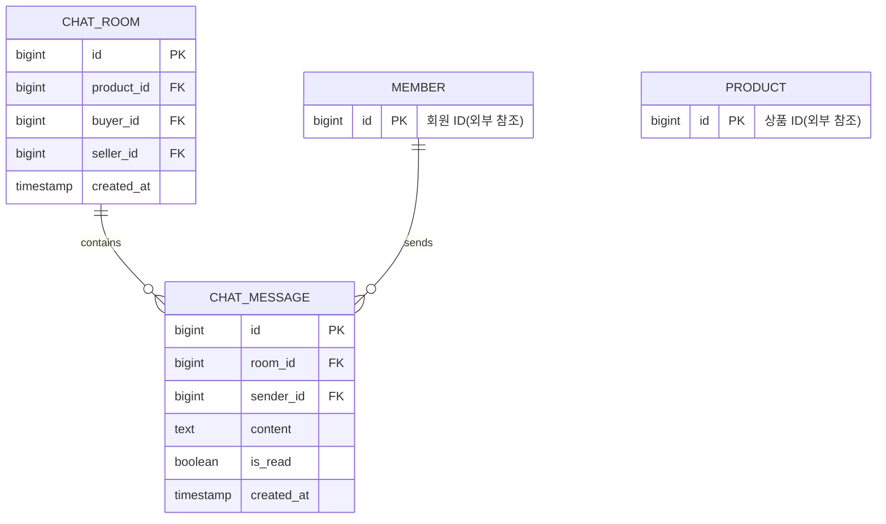
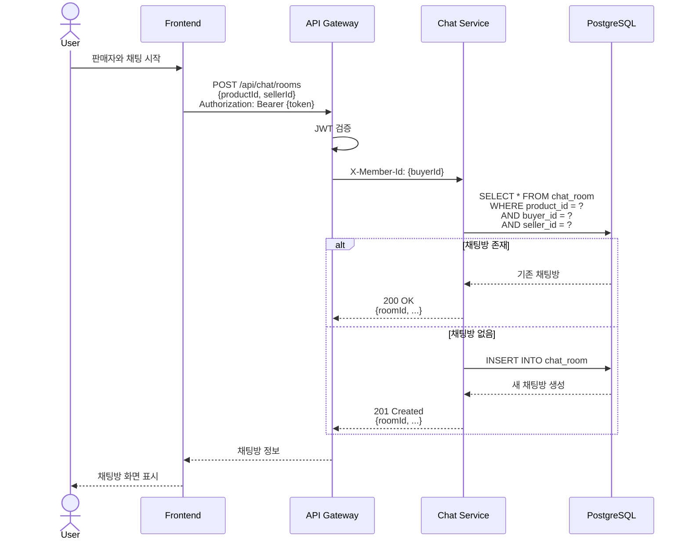
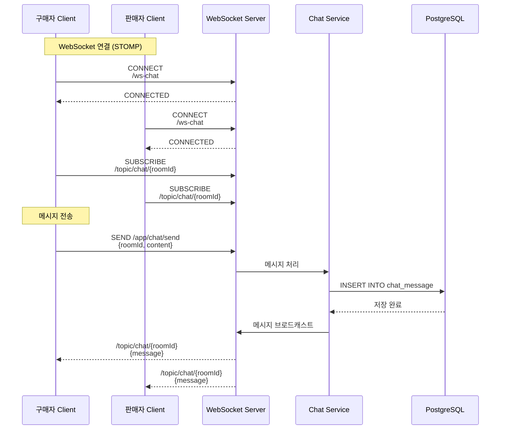
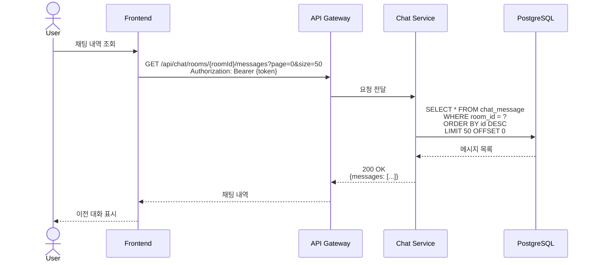
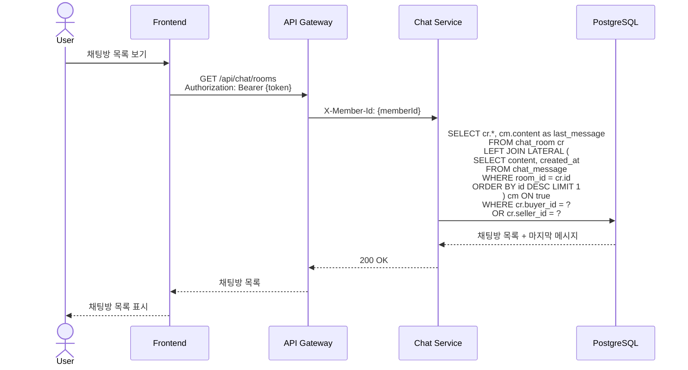

# 채팅 서비스 (Chat Service) 상세 설계

## 개요
상품 거래를 위한 판매자-구매자 간 실시간 채팅 기능을 제공하는 마이크로서비스입니다.

## 도메인 모델



## ERD



## API 설계

### 1. 채팅방 생성 또는 조회



**Request:**
```json
POST /api/chat/rooms
Authorization: Bearer {token}
{
  "productId": 123,
  "sellerId": 456
}
```

**Response:**
```json
{
  "id": 1,
  "productId": 123,
  "buyerId": 789,
  "sellerId": 456,
  "createdAt": "2024-07-15T10:00:00"
}
```

### 2. 실시간 메시지 전송 (WebSocket)



**STOMP Message:**
```json
// SEND to /app/chat/send
{
  "roomId": 1,
  "content": "안녕하세요, 상품 문의드립니다."
}

// RECEIVE from /topic/chat/{roomId}
{
  "id": 100,
  "roomId": 1,
  "senderId": 789,
  "senderNickname": "구매자A",
  "content": "안녕하세요, 상품 문의드립니다.",
  "isRead": false,
  "createdAt": "2024-07-15T10:01:00"
}
```

### 3. 채팅 내역 조회



**Response:**
```json
{
  "messages": [
    {
      "id": 102,
      "roomId": 1,
      "senderId": 456,
      "senderNickname": "판매자B",
      "content": "네, 무엇이 궁금하신가요?",
      "isRead": true,
      "createdAt": "2024-07-15T10:02:00"
    },
    {
      "id": 101,
      "roomId": 1,
      "senderId": 789,
      "senderNickname": "구매자A",
      "content": "안녕하세요, 상품 문의드립니다.",
      "isRead": true,
      "createdAt": "2024-07-15T10:01:00"
    }
  ],
  "hasNext": false,
  "totalElements": 2
}
```

### 4. 내 채팅방 목록 조회



**Response:**
```json
{
  "rooms": [
    {
      "id": 1,
      "productId": 123,
      "productTitle": "iPhone 15 Pro",
      "buyerId": 789,
      "buyerNickname": "구매자A",
      "sellerId": 456,
      "sellerNickname": "판매자B",
      "lastMessage": "네, 무엇이 궁금하신가요?",
      "lastMessageAt": "2024-07-15T10:02:00",
      "unreadCount": 2,
      "createdAt": "2024-07-15T10:00:00"
    }
  ]
}
```

## 비즈니스 로직

### 1. 채팅방 생성

```java
@Service
@RequiredArgsConstructor
public class ChatRoomService {

    private final ChatRoomRepository chatRoomRepository;
    private final ProductClient productClient;

    @Transactional
    public ChatRoomResponse createOrGetRoom(Long productId, Long buyerId, Long sellerId) {
        // 1. 상품 존재 여부 확인
        ProductResponse product = productClient.getProduct(productId);

        // 2. 판매자 본인 확인 (자기 자신과 채팅 방지)
        if (buyerId.equals(sellerId)) {
            throw new IllegalArgumentException("본인 상품과는 채팅할 수 없습니다.");
        }

        // 3. 기존 채팅방 조회
        Optional<ChatRoom> existingRoom = chatRoomRepository
            .findByProductIdAndBuyerIdAndSellerId(productId, buyerId, sellerId);

        if (existingRoom.isPresent()) {
            return ChatRoomResponse.from(existingRoom.get());
        }

        // 4. 새 채팅방 생성
        ChatRoom newRoom = ChatRoom.builder()
            .productId(productId)
            .buyerId(buyerId)
            .sellerId(sellerId)
            .build();

        ChatRoom saved = chatRoomRepository.save(newRoom);
        return ChatRoomResponse.from(saved);
    }
}
```

### 2. 실시간 메시지 전송 (WebSocket)

```java
@Controller
@RequiredArgsConstructor
public class StompChatController {

    private final ChatService chatService;
    private final SimpMessagingTemplate messagingTemplate;

    @MessageMapping("/chat/send")
    public void sendMessage(
        @Payload ChatSendRequest request,
        @Header("simpUser") Principal principal
    ) {
        Long senderId = extractMemberIdFromPrincipal(principal);

        // 1. 메시지 저장
        ChatMessage message = chatService.sendMessage(
            request.getRoomId(),
            senderId,
            request.getContent()
        );

        // 2. 메시지 브로드캐스트
        ChatMessageResponse response = ChatMessageResponse.from(message);
        messagingTemplate.convertAndSend(
            "/topic/chat/" + request.getRoomId(),
            response
        );
    }

    @MessageMapping("/chat/read")
    public void markAsRead(
        @Payload ChatReadRequest request,
        @Header("simpUser") Principal principal
    ) {
        Long readerId = extractMemberIdFromPrincipal(principal);

        chatService.markMessagesAsRead(request.getRoomId(), readerId);
    }
}
```

### 3. WebSocket 설정

```java
@Configuration
@EnableWebSocketMessageBroker
public class WebSocketConfig implements WebSocketMessageBrokerConfigurer {

    @Override
    public void configureMessageBroker(MessageBrokerRegistry config) {
        // Simple Broker 사용 (STOMP 프로토콜)
        config.enableSimpleBroker("/topic", "/queue");
        config.setApplicationDestinationPrefixes("/app");
    }

    @Override
    public void registerStompEndpoints(StompEndpointRegistry registry) {
        registry.addEndpoint("/ws-chat")
            .setAllowedOriginPatterns("*")
            .withSockJS();
    }
}
```

## 데이터베이스

### 테이블 스키마

```sql
-- 채팅방 테이블
CREATE TABLE chat_rooms (
    id BIGSERIAL PRIMARY KEY,
    product_id BIGINT NOT NULL,
    buyer_id BIGINT NOT NULL,
    seller_id BIGINT NOT NULL,
    created_at TIMESTAMP NOT NULL DEFAULT CURRENT_TIMESTAMP,

    UNIQUE(product_id, buyer_id, seller_id)
);

-- 채팅 메시지 테이블
CREATE TABLE chat_messages (
    id BIGSERIAL PRIMARY KEY,
    room_id BIGINT NOT NULL,
    sender_id BIGINT NOT NULL,
    content TEXT NOT NULL,
    is_read BOOLEAN NOT NULL DEFAULT FALSE,
    created_at TIMESTAMP NOT NULL DEFAULT CURRENT_TIMESTAMP,

    CONSTRAINT fk_chat_message_room FOREIGN KEY (room_id)
        REFERENCES chat_rooms(id) ON DELETE CASCADE
);

-- 인덱스
CREATE INDEX idx_chat_room_product_buyer_seller
ON chat_rooms(product_id, buyer_id, seller_id);

CREATE INDEX idx_chat_room_buyer_id ON chat_rooms(buyer_id);
CREATE INDEX idx_chat_room_seller_id ON chat_rooms(seller_id);

CREATE INDEX idx_chat_message_room_id_id
ON chat_messages(room_id, id DESC);

CREATE INDEX idx_chat_message_sender_id ON chat_messages(sender_id);
```

## 기술 스택

### WebSocket & STOMP
- **Spring WebSocket**: WebSocket 지원
- **STOMP**: Simple Text Oriented Messaging Protocol
- **SockJS**: WebSocket Fallback

### 실시간 메시징 흐름

```mermaid
graph TB
    subgraph "Client"
        C1[구매자 Browser]
        C2[판매자 Browser]
    end

    subgraph "WebSocket Layer"
        WS[WebSocket Server<br/>STOMP]
    end

    subgraph "Application Layer"
        CH[Chat Handler]
        CS[Chat Service]
    end

    subgraph "Data Layer"
        DB[(PostgreSQL)]
    end

    C1 -->|STOMP Connect| WS
    C2 -->|STOMP Connect| WS

    C1 -->|SEND /app/chat/send| WS
    WS --> CH
    CH --> CS
    CS --> DB

    CS --> WS
    WS -->|/topic/chat/{roomId}| C1
    WS -->|/topic/chat/{roomId}| C2

    style WS fill:#e1f5fe
    style CS fill:#f3e5f5
```

## API 엔드포인트 정리

| Method | Endpoint | 인증 | 설명 |
|--------|----------|------|------|
| POST | `/api/chat/rooms` | Yes | 채팅방 생성/조회 |
| GET | `/api/chat/rooms` | Yes | 내 채팅방 목록 |
| GET | `/api/chat/rooms/{roomId}` | Yes | 채팅방 상세 |
| GET | `/api/chat/rooms/{roomId}/messages` | Yes | 채팅 내역 조회 |
| STOMP | `/app/chat/send` | Yes | 메시지 전송 (WebSocket) |
| STOMP | `/app/chat/read` | Yes | 읽음 처리 (WebSocket) |
| SUBSCRIBE | `/topic/chat/{roomId}` | Yes | 채팅방 구독 (WebSocket) |

## 향후 개선 사항

### 1. Redis Pub/Sub (다중 서버 환경)

현재는 단일 서버에서 Simple Broker를 사용하지만, 다중 서버 환경에서는 Redis Pub/Sub 필요:

```java
@Configuration
@EnableWebSocketMessageBroker
public class WebSocketConfig implements WebSocketMessageBrokerConfigurer {

    @Override
    public void configureMessageBroker(MessageBrokerRegistry config) {
        // Redis Pub/Sub 사용
        config.enableStompBrokerRelay("/topic", "/queue")
            .setRelayHost("localhost")
            .setRelayPort(6379);

        config.setApplicationDestinationPrefixes("/app");
    }
}
```

### 2. 메시지 읽음 처리 최적화

벌크 업데이트로 성능 개선:

```sql
UPDATE chat_messages
SET is_read = TRUE
WHERE room_id = ?
  AND sender_id != ?
  AND is_read = FALSE;
```

### 3. 이미지/파일 전송

S3 업로드 + URL 전송:

```json
{
  "roomId": 1,
  "content": "상품 사진입니다.",
  "attachments": [
    {
      "type": "IMAGE",
      "url": "https://s3.amazonaws.com/..."
    }
  ]
}
```

## 참고 자료
- [Spring WebSocket 문서](https://docs.spring.io/spring-framework/reference/web/websocket.html)
- [STOMP Protocol](https://stomp.github.io/)
- [SockJS](https://github.com/sockjs/sockjs-client)