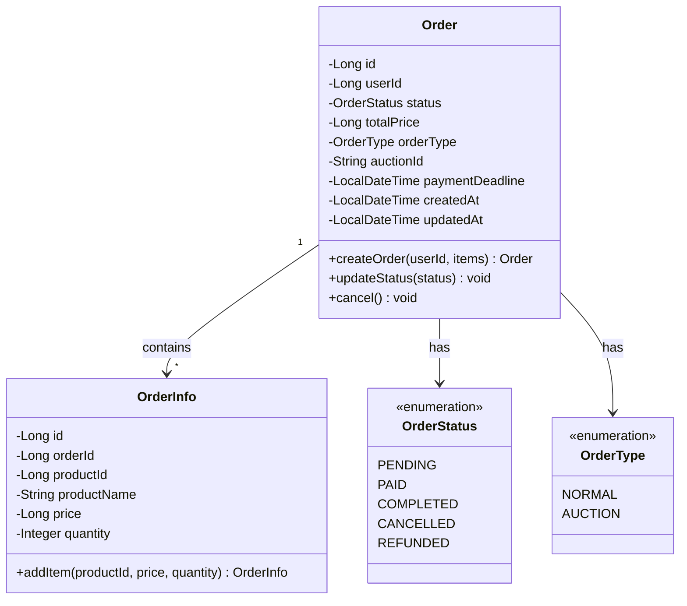
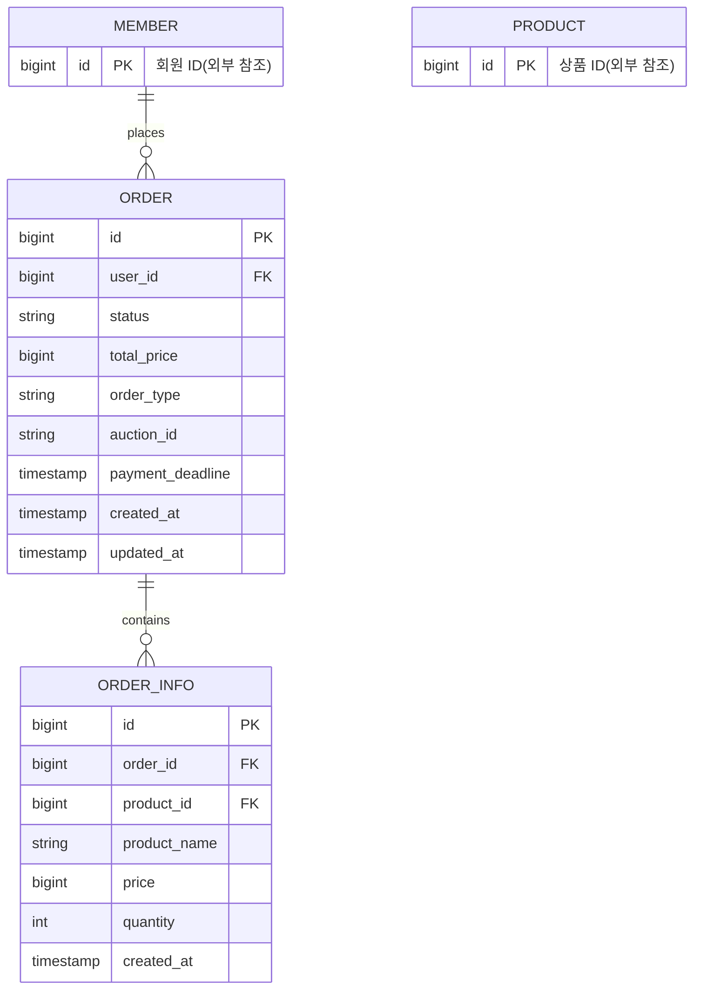
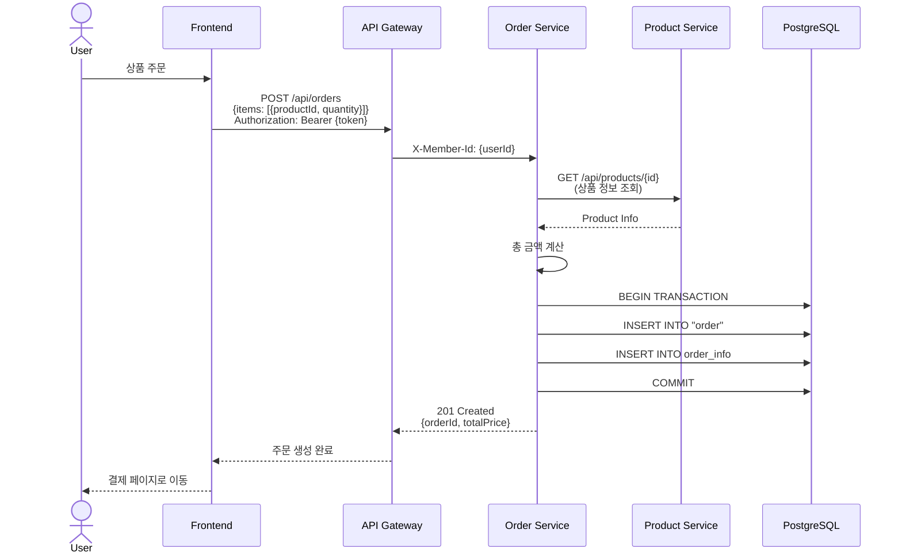
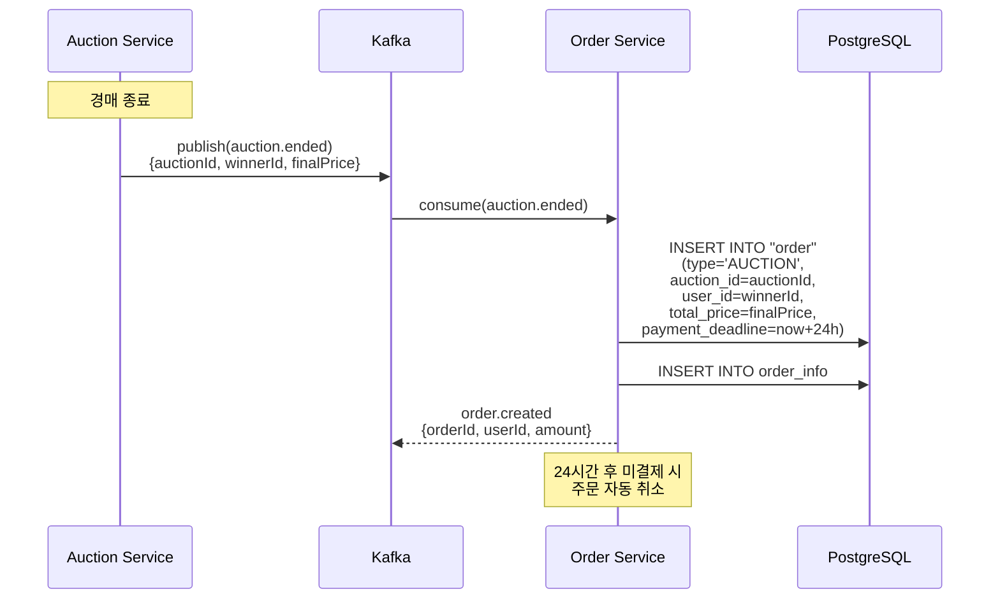
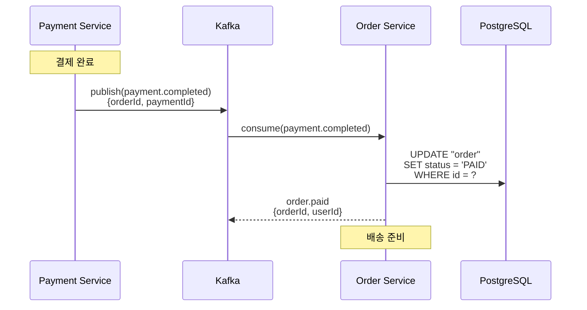
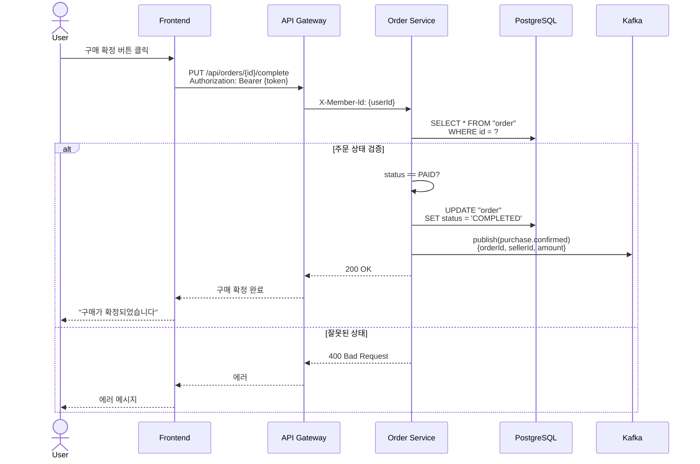
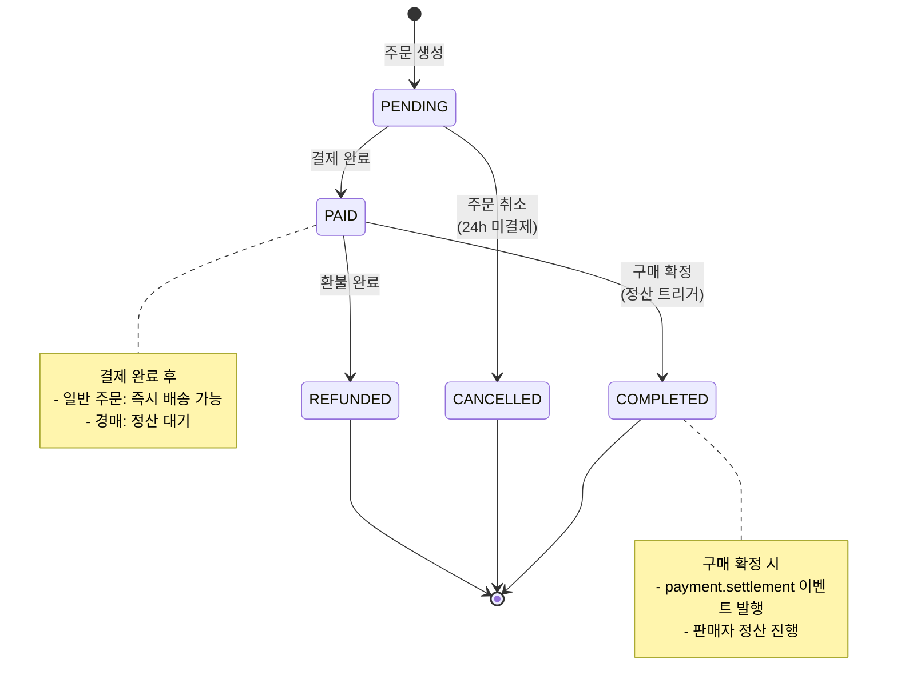

# 주문 서비스 (Order Service) 상세 설계

## 개요
일반 상품 및 경매 낙찰 상품의 주문 생성 및 관리를 담당하는 마이크로서비스입니다.

## 도메인 모델



## ERD



## API 설계

### 1. 일반 주문 생성



**Request:**
```json
POST /api/orders
Authorization: Bearer {token}
{
  "items": [
    {
      "productId": 123,
      "quantity": 2
    },
    {
      "productId": 456,
      "quantity": 1
    }
  ]
}
```

**Response:**
```json
{
  "id": 1,
  "userId": 789,
  "status": "PENDING",
  "totalPrice": 150000,
  "orderType": "NORMAL",
  "items": [
    {
      "id": 1,
      "productId": 123,
      "productName": "iPhone 15 Pro",
      "price": 50000,
      "quantity": 2
    },
    {
      "id": 2,
      "productId": 456,
      "productName": "AirPods Pro",
      "price": 50000,
      "quantity": 1
    }
  ],
  "createdAt": "2024-07-15T10:00:00"
}
```

### 2. 경매 낙찰 주문 생성 (Kafka Event)



**Kafka Event (auction.ended):**
```json
{
  "auctionId": "AUC-20240715-001",
  "productId": 999,
  "productName": "희귀 시계",
  "winnerId": 789,
  "finalPrice": 5000000,
  "endedAt": "2024-07-15T10:00:00"
}
```

**생성된 Order:**
```json
{
  "id": 2,
  "userId": 789,
  "status": "PENDING",
  "totalPrice": 5000000,
  "orderType": "AUCTION",
  "auctionId": "AUC-20240715-001",
  "paymentDeadline": "2024-07-16T10:00:00",
  "createdAt": "2024-07-15T10:00:00"
}
```

### 3. 주문 상태 변경 (결제 완료 시)



### 4. 구매 확정



## 비즈니스 로직

### 1. 일반 주문 생성

```java
@Service
@RequiredArgsConstructor
public class OrderService {

    private final OrderRepository orderRepository;
    private final ProductClient productClient;

    @Transactional
    public OrderResponse createOrder(Long userId, CreateOrderRequest request) {
        // 1. 상품 정보 조회
        List<OrderInfo> orderInfos = new ArrayList<>();
        long totalPrice = 0;

        for (OrderItemRequest item : request.getItems()) {
            ProductResponse product = productClient.getProduct(item.getProductId());

            // 재고 확인
            if (product.getStock() < item.getQuantity()) {
                throw new OutOfStockException("재고가 부족합니다.");
            }

            OrderInfo orderInfo = OrderInfo.builder()
                .productId(product.getId())
                .productName(product.getTitle())
                .price(product.getPrice())
                .quantity(item.getQuantity())
                .build();

            orderInfos.add(orderInfo);
            totalPrice += product.getPrice() * item.getQuantity();
        }

        // 2. 주문 생성
        Order order = Order.builder()
            .userId(userId)
            .status(OrderStatus.PENDING)
            .totalPrice(totalPrice)
            .orderInfos(orderInfos)
            .orderType(OrderType.NORMAL)
            .build();

        Order saved = orderRepository.save(order);

        // 3. 재고 감소 요청 (Product Service)
        productClient.decreaseStock(request.getItems());

        return OrderResponse.from(saved);
    }
}
```

### 2. 경매 낙찰 주문 생성 (Kafka Consumer)

```java
@Component
@RequiredArgsConstructor
@Slf4j
public class AuctionEventConsumer {

    private final OrderService orderService;

    @KafkaListener(topics = "auction.ended", groupId = "order-service")
    public void handleAuctionEnded(AuctionEndedEvent event) {
        log.info("경매 종료 이벤트 수신: auctionId={}, winnerId={}",
            event.getAuctionId(), event.getWinnerId());

        // 경매 낙찰 주문 생성
        OrderInfo orderInfo = OrderInfo.builder()
            .productId(event.getProductId())
            .productName(event.getProductName())
            .price(event.getFinalPrice())
            .quantity(1)
            .build();

        Order order = Order.builder()
            .userId(event.getWinnerId())
            .status(OrderStatus.PENDING)
            .totalPrice(event.getFinalPrice())
            .orderInfos(List.of(orderInfo))
            .orderType(OrderType.AUCTION)
            .auctionId(event.getAuctionId())
            .paymentDeadline(LocalDateTime.now().plusHours(24)) // 24시간
            .build();

        orderService.createAuctionOrder(order);
    }
}
```

### 3. 주문 상태 전이

```java
@Entity
@Table(name = "\"order\"")
public class Order {

    // ... 필드 생략

    public void updateStatus(OrderStatus newStatus) {
        // 상태 전이 검증
        if (this.status == OrderStatus.COMPLETED || this.status == OrderStatus.CANCELLED) {
            throw new IllegalStateException("이미 완료되거나 취소된 주문은 상태를 변경할 수 없습니다.");
        }

        if (newStatus == OrderStatus.COMPLETED && this.status != OrderStatus.PAID) {
            throw new IllegalStateException(
                "주문 완료(구매확정)는 결제 완료(PAID) 상태에서만 가능합니다."
            );
        }

        this.status = newStatus;
    }

    public void cancel() {
        if (this.status == OrderStatus.PAID) {
            throw new IllegalStateException("결제 완료된 주문은 환불 절차가 필요합니다.");
        }

        this.status = OrderStatus.CANCELLED;
    }
}
```

## 주문 상태 전이도



## 데이터베이스

### 테이블 스키마

```sql
-- 주문 테이블
CREATE TABLE "order" (
    id BIGSERIAL PRIMARY KEY,
    user_id BIGINT NOT NULL,
    status VARCHAR(20) NOT NULL DEFAULT 'PENDING',
    total_price BIGINT NOT NULL,
    order_type VARCHAR(20) NOT NULL DEFAULT 'NORMAL',
    auction_id VARCHAR(50),
    payment_deadline TIMESTAMP,
    created_at TIMESTAMP NOT NULL DEFAULT CURRENT_TIMESTAMP,
    updated_at TIMESTAMP NOT NULL DEFAULT CURRENT_TIMESTAMP
);

-- 주문 상품 정보 테이블
CREATE TABLE order_info (
    id BIGSERIAL PRIMARY KEY,
    order_id BIGINT NOT NULL,
    product_id BIGINT NOT NULL,
    product_name VARCHAR(255) NOT NULL,
    price BIGINT NOT NULL,
    quantity INT NOT NULL DEFAULT 1,
    created_at TIMESTAMP NOT NULL DEFAULT CURRENT_TIMESTAMP,

    CONSTRAINT fk_order_info_order FOREIGN KEY (order_id)
        REFERENCES "order"(id) ON DELETE CASCADE
);

-- 인덱스
CREATE INDEX idx_order_user_id ON "order"(user_id);
CREATE INDEX idx_order_status ON "order"(status);
CREATE INDEX idx_order_auction_id ON "order"(auction_id);
CREATE INDEX idx_order_payment_deadline ON "order"(payment_deadline)
    WHERE order_type = 'AUCTION' AND status = 'PENDING';

CREATE INDEX idx_order_info_order_id ON order_info(order_id);
CREATE INDEX idx_order_info_product_id ON order_info(product_id);
```

## Kafka 이벤트

### 1. 수신 이벤트

| Topic | Event | 설명 |
|-------|-------|------|
| `auction.ended` | `AuctionEndedEvent` | 경매 종료 → 주문 생성 |
| `payment.completed` | `PaymentCompletedEvent` | 결제 완료 → 주문 상태 PAID |
| `payment.failed` | `PaymentFailedEvent` | 결제 실패 → 주문 취소 |
| `payment.refunded` | `PaymentRefundedEvent` | 환불 완료 → 주문 상태 REFUNDED |

### 2. 발행 이벤트

| Topic | Event | 설명 |
|-------|-------|------|
| `order.created` | `OrderCreatedEvent` | 주문 생성 → Payment Service |
| `order.paid` | `OrderPaidEvent` | 결제 완료 → Notification Service |
| `purchase.confirmed` | `PurchaseConfirmedEvent` | 구매 확정 → Payment Service (정산) |
| `order.cancelled` | `OrderCancelledEvent` | 주문 취소 → Product Service (재고 복원) |

## API 엔드포인트 정리

| Method | Endpoint | 인증 | 설명 |
|--------|----------|------|------|
| POST | `/api/orders` | Yes | 일반 주문 생성 |
| GET | `/api/orders` | Yes | 내 주문 목록 |
| GET | `/api/orders/{id}` | Yes | 주문 상세 조회 |
| PUT | `/api/orders/{id}/complete` | Yes | 구매 확정 |
| DELETE | `/api/orders/{id}` | Yes | 주문 취소 |

## 스케줄러

### 경매 주문 자동 취소

```java
@Component
@RequiredArgsConstructor
@Slf4j
public class OrderScheduler {

    private final OrderRepository orderRepository;

    // 매 10분마다 실행
    @Scheduled(cron = "0 */10 * * * *")
    public void cancelExpiredAuctionOrders() {
        LocalDateTime now = LocalDateTime.now();

        List<Order> expiredOrders = orderRepository.findExpiredAuctionOrders(now);

        for (Order order : expiredOrders) {
            log.warn("경매 주문 결제 기한 만료: orderId={}, userId={}",
                order.getId(), order.getUserId());

            order.cancel();
            orderRepository.save(order);

            // 이벤트 발행: 경매 재개 또는 차순위 낙찰자 통보
        }
    }
}
```

```sql
SELECT *
FROM "order"
WHERE order_type = 'AUCTION'
  AND status = 'PENDING'
  AND payment_deadline < NOW();
```

## 참고 자료
- [이벤트 기반 아키텍처](https://microservices.io/patterns/data/event-driven-architecture.html)
- [주문 도메인 모델링](https://www.domainlanguage.com/ddd/)