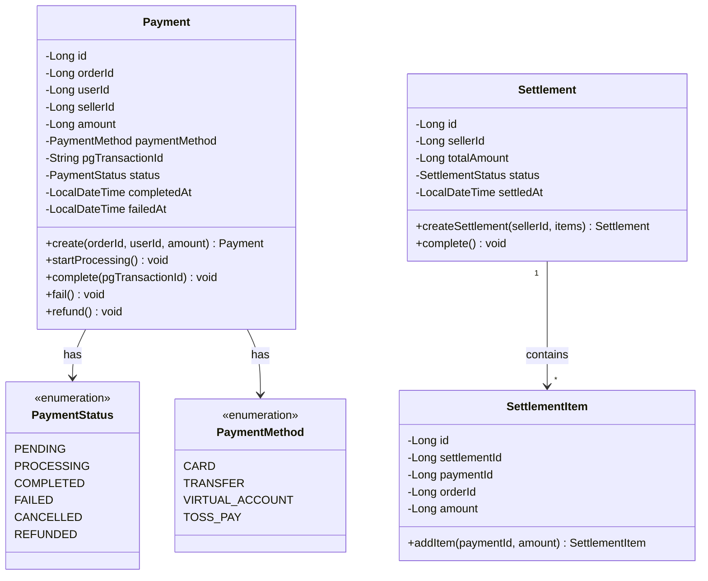
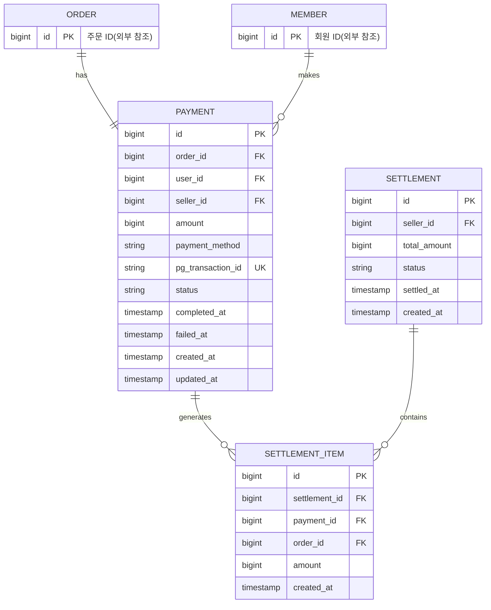
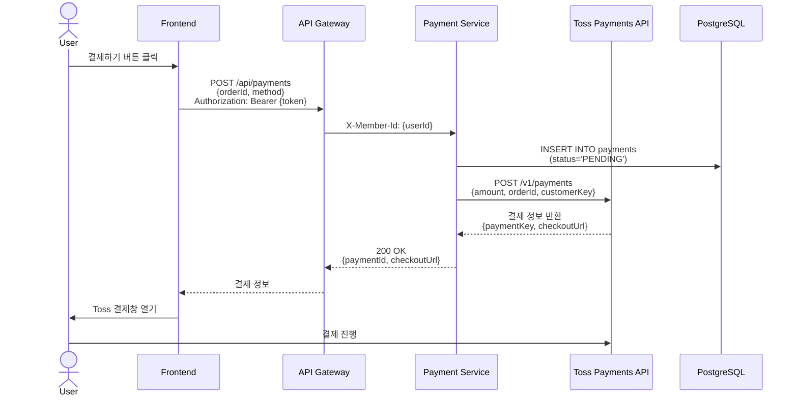
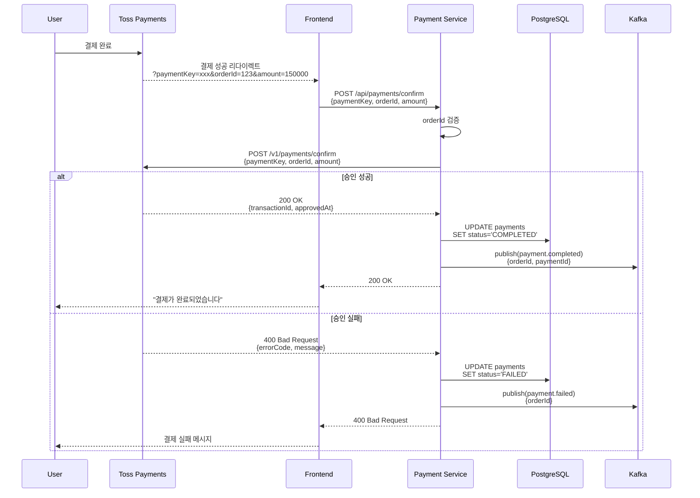
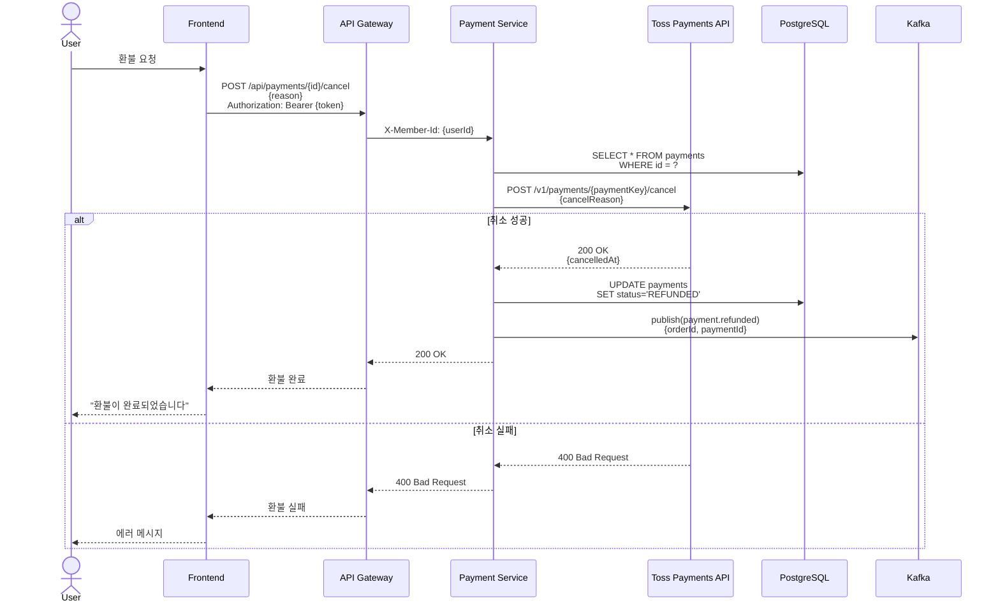
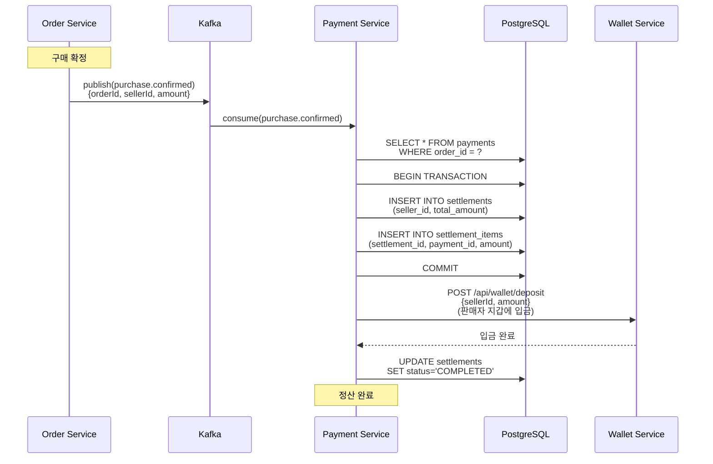
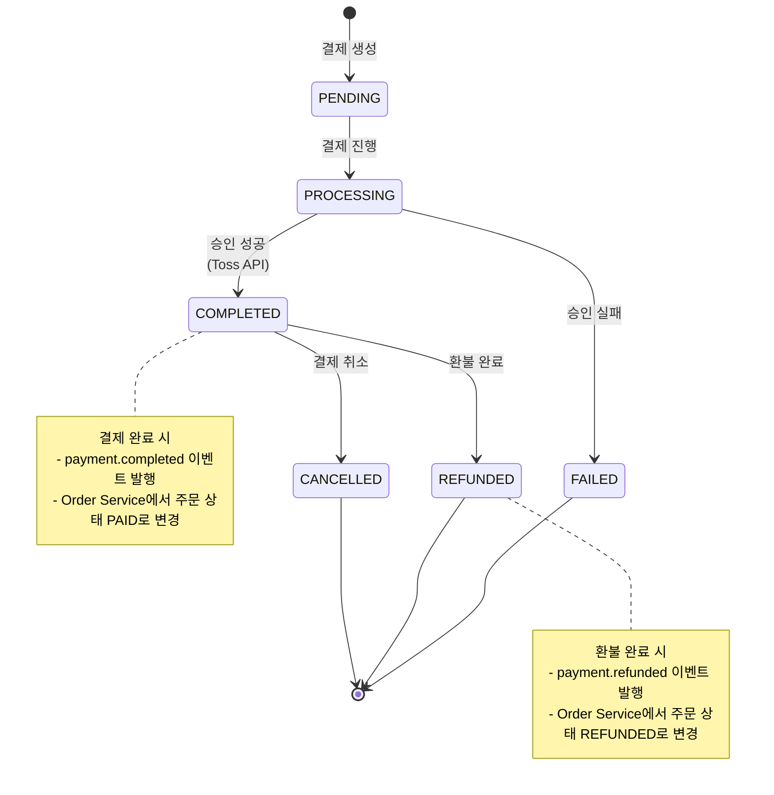

# 결제 서비스 (Payment Service) 상세 설계

## 개요
Toss Payments API를 이용한 결제 처리 및 정산 관리를 담당하는 마이크로서비스입니다.

## 도메인 모델



## ERD



## API 설계

### 1. 결제 요청



**Request:**
```json
POST /api/payments
Authorization: Bearer {token}
{
  "orderId": 123,
  "method": "CARD"
}
```

**Response:**
```json
{
  "paymentId": 1,
  "orderId": 123,
  "amount": 150000,
  "paymentKey": "tgen_xxx",
  "checkoutUrl": "https://api.tosspayments.com/v1/payments/checkout/...",
  "status": "PENDING"
}
```

### 2. 결제 승인 (Webhook)



**Request:**
```json
POST /api/payments/confirm
{
  "paymentKey": "tgen_xxx",
  "orderId": 123,
  "amount": 150000
}
```

**Response:**
```json
{
  "paymentId": 1,
  "orderId": 123,
  "amount": 150000,
  "method": "CARD",
  "pgTransactionId": "PSP_TX_20240715_xxx",
  "status": "COMPLETED",
  "approvedAt": "2024-07-15T10:05:00"
}
```

### 3. 결제 취소 (환불)



### 4. 정산 처리 (구매 확정 시)



## 비즈니스 로직

### 1. 결제 생성

```java
@Service
@RequiredArgsConstructor
public class PaymentService {

    private final PaymentRepository paymentRepository;
    private final TossPaymentsClient tossPaymentsClient;
    private final OrderClient orderClient;

    @Transactional
    public PaymentResponse createPayment(Long userId, CreatePaymentRequest request) {
        // 1. 주문 정보 조회
        OrderResponse order = orderClient.getOrder(request.getOrderId());

        if (!order.getUserId().equals(userId)) {
            throw new ForbiddenException("본인 주문만 결제할 수 있습니다.");
        }

        if (!order.getStatus().equals("PENDING")) {
            throw new IllegalStateException("이미 결제된 주문입니다.");
        }

        // 2. 결제 생성
        Payment payment = Payment.create(
            order.getId(),
            userId,
            order.getSellerId(),
            order.getTotalPrice(),
            request.getMethod(),
            null // pgTransactionId는 승인 후 저장
        );

        Payment saved = paymentRepository.save(payment);

        // 3. Toss Payments API 호출
        TossPaymentRequest tossRequest = TossPaymentRequest.builder()
            .amount(saved.getAmount())
            .orderId(String.valueOf(saved.getOrderId()))
            .orderName(order.getProductName())
            .customerKey(String.valueOf(userId))
            .build();

        TossPaymentResponse tossResponse = tossPaymentsClient.createPayment(tossRequest);

        return PaymentResponse.from(saved, tossResponse.getCheckoutUrl());
    }
}
```

### 2. 결제 승인 (Confirm)

```java
@Service
@RequiredArgsConstructor
public class PaymentService {

    private final PaymentRepository paymentRepository;
    private final TossPaymentsClient tossPaymentsClient;
    private final KafkaProducer kafkaProducer;

    @Transactional
    public PaymentResponse confirmPayment(ConfirmPaymentRequest request) {
        // 1. 주문 ID로 결제 조회
        Payment payment = paymentRepository.findByOrderId(request.getOrderId())
            .orElseThrow(() -> new NotFoundException("결제 정보를 찾을 수 없습니다."));

        // 2. 금액 검증
        if (!payment.getAmount().equals(request.getAmount())) {
            throw new PaymentValidationException("결제 금액이 일치하지 않습니다.");
        }

        // 3. Toss Payments API 승인 요청
        payment.startProcessing();

        try {
            TossConfirmResponse tossResponse = tossPaymentsClient.confirmPayment(
                request.getPaymentKey(),
                request.getOrderId(),
                request.getAmount()
            );

            // 4. 결제 완료
            payment.complete(tossResponse.getTransactionId());
            paymentRepository.save(payment);

            // 5. 이벤트 발행
            kafkaProducer.send("payment.completed", PaymentCompletedEvent.from(payment));

            return PaymentResponse.from(payment);

        } catch (TossPaymentsException e) {
            // 승인 실패
            payment.fail();
            paymentRepository.save(payment);

            kafkaProducer.send("payment.failed", PaymentFailedEvent.from(payment));

            throw new PaymentFailureException("결제 승인에 실패했습니다: " + e.getMessage());
        }
    }
}
```

### 3. 정산 처리

```java
@Component
@RequiredArgsConstructor
@Slf4j
public class SettlementEventConsumer {

    private final SettlementService settlementService;

    @KafkaListener(topics = "purchase.confirmed", groupId = "payment-service")
    public void handlePurchaseConfirmed(PurchaseConfirmedEvent event) {
        log.info("구매 확정 이벤트 수신: orderId={}, sellerId={}",
            event.getOrderId(), event.getSellerId());

        settlementService.createSettlement(event);
    }
}

@Service
@RequiredArgsConstructor
public class SettlementService {

    private final SettlementRepository settlementRepository;
    private final PaymentRepository paymentRepository;
    private final WalletClient walletClient;

    @Transactional
    public void createSettlement(PurchaseConfirmedEvent event) {
        // 1. 결제 정보 조회
        Payment payment = paymentRepository.findByOrderId(event.getOrderId())
            .orElseThrow(() -> new NotFoundException("결제 정보를 찾을 수 없습니다."));

        // 2. 정산 생성
        Settlement settlement = Settlement.builder()
            .sellerId(event.getSellerId())
            .totalAmount(event.getAmount())
            .status(SettlementStatus.PENDING)
            .build();

        Settlement saved = settlementRepository.save(settlement);

        // 3. 정산 항목 추가
        SettlementItem item = SettlementItem.builder()
            .settlementId(saved.getId())
            .paymentId(payment.getId())
            .orderId(event.getOrderId())
            .amount(event.getAmount())
            .build();

        settlementItemRepository.save(item);

        // 4. 판매자 지갑에 입금
        walletClient.deposit(event.getSellerId(), event.getAmount());

        // 5. 정산 완료
        saved.complete();
        settlementRepository.save(saved);
    }
}
```

## 결제 상태 전이도



## 데이터베이스

### 테이블 스키마

```sql
-- 결제 테이블
CREATE TABLE payments (
    id BIGSERIAL PRIMARY KEY,
    order_id BIGINT NOT NULL UNIQUE,
    user_id BIGINT NOT NULL,
    seller_id BIGINT NOT NULL,
    amount BIGINT NOT NULL,
    payment_method VARCHAR(20) NOT NULL,
    pg_transaction_id VARCHAR(255) UNIQUE,
    status VARCHAR(20) NOT NULL DEFAULT 'PENDING',
    completed_at TIMESTAMP,
    failed_at TIMESTAMP,
    created_at TIMESTAMP NOT NULL DEFAULT CURRENT_TIMESTAMP,
    updated_at TIMESTAMP NOT NULL DEFAULT CURRENT_TIMESTAMP
);

-- 정산 테이블
CREATE TABLE settlements (
    id BIGSERIAL PRIMARY KEY,
    seller_id BIGINT NOT NULL,
    total_amount BIGINT NOT NULL,
    status VARCHAR(20) NOT NULL DEFAULT 'PENDING',
    settled_at TIMESTAMP,
    created_at TIMESTAMP NOT NULL DEFAULT CURRENT_TIMESTAMP
);

-- 정산 항목 테이블
CREATE TABLE settlement_items (
    id BIGSERIAL PRIMARY KEY,
    settlement_id BIGINT NOT NULL,
    payment_id BIGINT NOT NULL,
    order_id BIGINT NOT NULL,
    amount BIGINT NOT NULL,
    created_at TIMESTAMP NOT NULL DEFAULT CURRENT_TIMESTAMP,

    CONSTRAINT fk_settlement_item_settlement FOREIGN KEY (settlement_id)
        REFERENCES settlements(id) ON DELETE CASCADE,
    CONSTRAINT fk_settlement_item_payment FOREIGN KEY (payment_id)
        REFERENCES payments(id)
);

-- 인덱스
CREATE INDEX idx_payment_order_id ON payments(order_id);
CREATE INDEX idx_payment_user_id ON payments(user_id);
CREATE INDEX idx_payment_seller_id ON payments(seller_id);
CREATE INDEX idx_payment_status ON payments(status);
CREATE INDEX idx_payment_pg_transaction_id ON payments(pg_transaction_id);

CREATE INDEX idx_settlement_seller_id ON settlements(seller_id);
CREATE INDEX idx_settlement_status ON settlements(status);

CREATE INDEX idx_settlement_item_settlement_id ON settlement_items(settlement_id);
CREATE INDEX idx_settlement_item_payment_id ON settlement_items(payment_id);
CREATE INDEX idx_settlement_item_order_id ON settlement_items(order_id);
```

## Toss Payments 연동

### 1. API 클라이언트

```java
@Component
@RequiredArgsConstructor
public class TossPaymentsClient {

    @Value("${toss.secret-key}")
    private String secretKey;

    @Value("${toss.api-url}")
    private String apiUrl;

    private final RestTemplate restTemplate;

    public TossConfirmResponse confirmPayment(
        String paymentKey,
        Long orderId,
        Long amount
    ) {
        String url = apiUrl + "/v1/payments/confirm";

        HttpHeaders headers = new HttpHeaders();
        headers.setContentType(MediaType.APPLICATION_JSON);
        headers.setBasicAuth(secretKey, "");

        Map<String, Object> body = Map.of(
            "paymentKey", paymentKey,
            "orderId", String.valueOf(orderId),
            "amount", amount
        );

        HttpEntity<Map<String, Object>> request = new HttpEntity<>(body, headers);

        ResponseEntity<TossConfirmResponse> response =
            restTemplate.postForEntity(url, request, TossConfirmResponse.class);

        if (!response.getStatusCode().is2xxSuccessful()) {
            throw new TossPaymentsException("결제 승인 실패: " + response.getBody());
        }

        return response.getBody();
    }

    public TossCancelResponse cancelPayment(String paymentKey, String cancelReason) {
        String url = apiUrl + "/v1/payments/" + paymentKey + "/cancel";

        HttpHeaders headers = new HttpHeaders();
        headers.setContentType(MediaType.APPLICATION_JSON);
        headers.setBasicAuth(secretKey, "");

        Map<String, String> body = Map.of("cancelReason", cancelReason);

        HttpEntity<Map<String, String>> request = new HttpEntity<>(body, headers);

        ResponseEntity<TossCancelResponse> response =
            restTemplate.postForEntity(url, request, TossCancelResponse.class);

        return response.getBody();
    }
}
```

### 2. 환경 설정

```yaml
# application.yaml
toss:
  api-url: https://api.tosspayments.com
  secret-key: ${TOSS_SECRET_KEY}
  client-key: ${TOSS_CLIENT_KEY}
```

## Kafka 이벤트

### 1. 발행 이벤트

| Topic | Event | 설명 |
|-------|-------|------|
| `payment.completed` | `PaymentCompletedEvent` | 결제 완료 → Order Service (주문 상태 PAID) |
| `payment.failed` | `PaymentFailedEvent` | 결제 실패 → Order Service (주문 취소) |
| `payment.refunded` | `PaymentRefundedEvent` | 환불 완료 → Order Service (주문 상태 REFUNDED) |
| `settlement.completed` | `SettlementCompletedEvent` | 정산 완료 → Notification Service |

### 2. 수신 이벤트

| Topic | Event | 설명 |
|-------|-------|------|
| `purchase.confirmed` | `PurchaseConfirmedEvent` | 구매 확정 → 정산 생성 |
| `order.cancelled` | `OrderCancelledEvent` | 주문 취소 → 자동 환불 |

## API 엔드포인트 정리

| Method | Endpoint | 인증 | 설명 |
|--------|----------|------|------|
| POST | `/api/payments` | Yes | 결제 요청 |
| POST | `/api/payments/confirm` | No | 결제 승인 (Toss Callback) |
| POST | `/api/payments/{id}/cancel` | Yes | 결제 취소 (환불) |
| GET | `/api/payments/{id}` | Yes | 결제 상세 조회 |
| GET | `/api/payments/order/{orderId}` | Yes | 주문별 결제 조회 |
| GET | `/api/settlements` | Yes | 내 정산 내역 (판매자) |

## 보안

### 1. Webhook 검증

```java
@RestController
@RequestMapping("/api/payments")
@RequiredArgsConstructor
public class PaymentController {

    @PostMapping("/webhook")
    public ResponseEntity<Void> handleWebhook(
        @RequestBody TossWebhookRequest request,
        @RequestHeader("Toss-Signature") String signature
    ) {
        // 서명 검증
        if (!verifySignature(request, signature)) {
            return ResponseEntity.status(HttpStatus.UNAUTHORIZED).build();
        }

        // 이벤트 처리
        paymentService.handleWebhook(request);

        return ResponseEntity.ok().build();
    }

    private boolean verifySignature(TossWebhookRequest request, String signature) {
        String payload = objectMapper.writeValueAsString(request);
        String computedSignature = HmacUtils.hmacSha256Hex(secretKey, payload);
        return signature.equals(computedSignature);
    }
}
```

### 2. 금액 검증

결제 승인 시 프론트엔드에서 전달한 금액과 서버의 주문 금액이 일치하는지 검증:

```java
if (!payment.getAmount().equals(request.getAmount())) {
    throw new PaymentValidationException("결제 금액 불일치");
}
```

## 참고 자료
- [Toss Payments API 문서](https://docs.tosspayments.com/)
- [결제 시스템 설계](https://www.educative.io/courses/grokking-modern-system-design-interview-for-engineers-managers/payment-system)
- [PG사 연동 Best Practices](https://stripe.com/docs/payments/accept-a-payment)