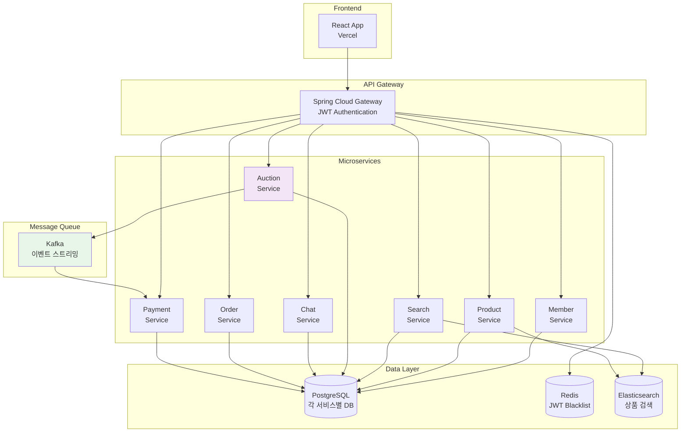
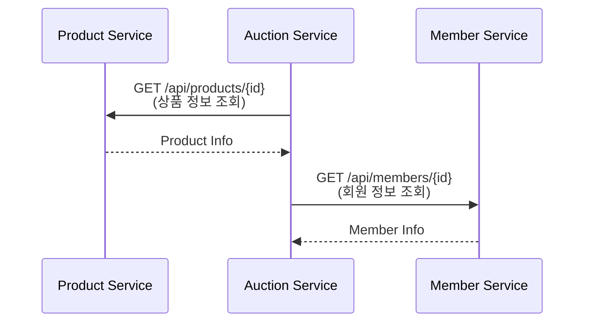
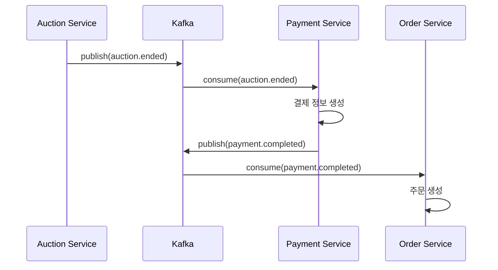
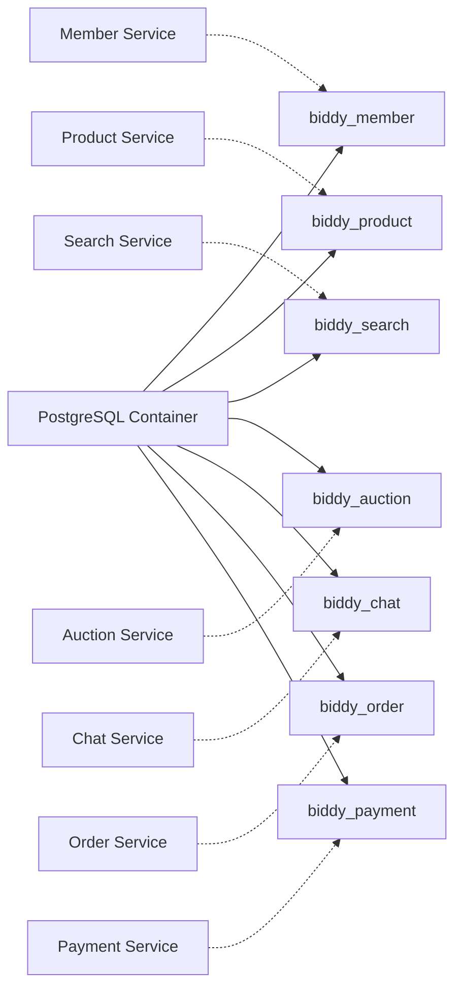
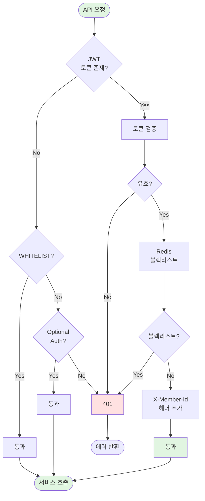
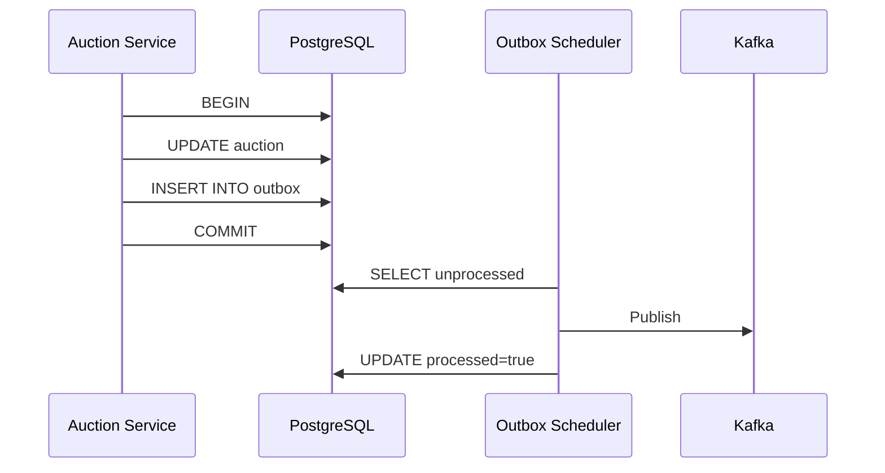

# 설계 문서

Biddy 프로젝트의 각 도메인별 상세 설계 문서입니다.

## 📑 문서 목록

### 핵심 서비스

1. **[회원 서비스](./01_회원서비스_상세설계.md)** (Member Service)
   - 회원 가입/로그인
   - JWT 인증/인가
   - 비밀번호 관리
   - 프로필 관리

2. **[상품 서비스](./02_상품서비스_상세설계.md)** (Product Service)
   - 상품 CRUD
   - 이미지 업로드
   - 상품 찜하기
   - AI 벡터 임베딩 (pgvector)

3. **[검색 서비스](./03_검색서비스_상세설계.md)** (Search Service)
   - Elasticsearch 검색
   - 키워드 자동완성
   - 인기 검색어
   - AI 추천 (OpenAI)
   - 검색 히스토리

4. **[채팅 서비스](./04_채팅서비스_상세설계.md)** (Chat Service)
   - WebSocket 실시간 채팅 (STOMP)
   - 채팅방 생성 및 조회
   - 메시지 전송/수신
   - 읽음 처리

5. **[주문 서비스](./05_주문서비스_상세설계.md)** (Order Service)
   - 일반 주문 / 경매 낙찰 주문
   - 주문 상태 관리
   - 구매 확정
   - 자동 취소 (경매 주문 24시간)

6. **[결제 서비스](./06_결제서비스_상세설계.md)** (Payment Service)
   - Toss Payments 연동
   - 결제 생성/승인/취소/환불
   - 판매자 정산 관리
   - Webhook 처리

7. **[경매 서비스](./07_경매서비스_상세설계.md)** (Auction Service)
   - 경매 생성/관리
   - 실시간 입찰 (WebSocket)
   - Transactional Outbox 패턴
   - 경매 종료 처리

### Frontend

8. **[프론트엔드 구조](./08_프론트엔드_구조.md)** (Frontend)
   - React 18 + Vite
   - WebSocket 연동 (Auction, Chat)
   - React Router v6
   - Tailwind CSS + shadcn/ui
   - Vercel 배포

## 🏗️ 아키텍처 개요

## 🔄 서비스 간 통신

### 1. 동기 통신 (REST API)

### 2. 비동기 통신 (Kafka)

## 📊 데이터베이스 구조

### PostgreSQL (각 서비스별 독립 DB)

## 🔐 인증/인가 흐름

### JWT 기반 인증

## 🎯 핵심 패턴

### 1. Transactional Outbox Pattern (Auction Service)

### 2. CQRS (Command Query Responsibility Segregation)

- **Command**: Write 작업 → PostgreSQL
- **Query**: Read 작업 → Elasticsearch (검색), Redis (캐시)

### 3. API Gateway Pattern

- JWT 인증 중앙화
- 라우팅
- Rate Limiting
- CORS 처리

## 📈 확장성 고려사항

### Horizontal Scaling

- Stateless 서비스 설계
- Redis를 통한 세션 공유
- Kafka 파티셔닝

### Database Scaling

- Connection Pool 최적화
- Read Replica (향후)
- Sharding (대용량 시)

## 📝 API 문서

### Swagger UI

각 서비스별 Swagger UI 제공:

- Member Service: `http://localhost:8081/swagger-ui.html`
- Product Service: `http://localhost:8082/swagger-ui.html`
- Auction Service: `http://localhost:8083/swagger-ui.html`
- Search Service: `http://localhost:8084/swagger-ui.html`

### API Gateway Aggregated Docs

- `http://localhost:8000/swagger-ui.html`

## 🔗 관련 문서

### 아키텍처
- [시스템 아키텍처](../03_아키텍처/01_시스템_아키텍처.md)
- [데이터베이스 설계](../03_아키텍처/02_데이터베이스_설계.md)

### 개발 가이드
- API Gateway 설정
- Kafka 이벤트 발행/구독
- Elasticsearch 인덱싱

## 📚 참고 자료

### 패턴
- [Microservices Patterns](https://microservices.io/patterns/index.html)
- [Transactional Outbox](https://microservices.io/patterns/data/transactional-outbox.html)

### 기술 스택
- [Spring Boot](https://spring.io/projects/spring-boot)
- [Spring Cloud Gateway](https://spring.io/projects/spring-cloud-gateway)
- [Apache Kafka](https://kafka.apache.org/documentation/)
- [Elasticsearch](https://www.elastic.co/guide/index.html)
- [Redis](https://redis.io/docs/)
- [PostgreSQL](https://www.postgresql.org/docs/)