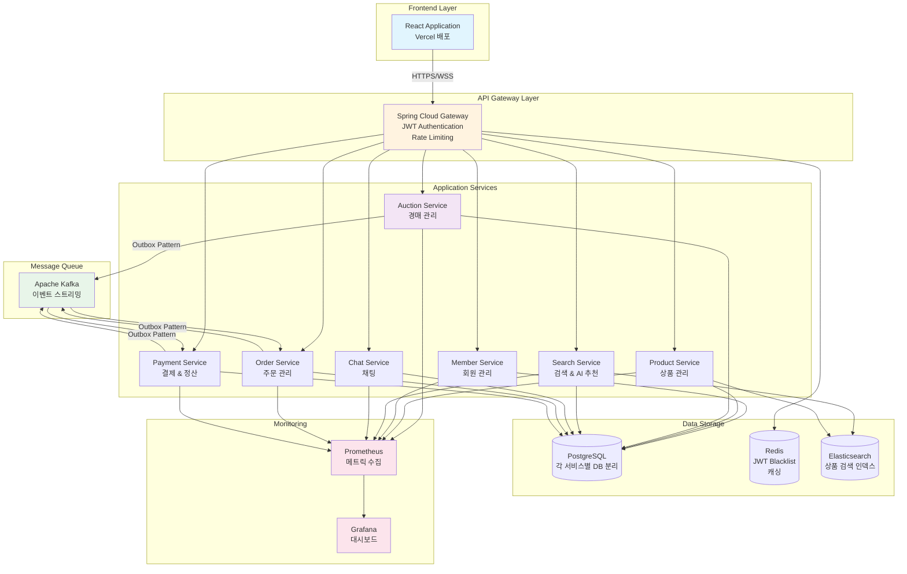
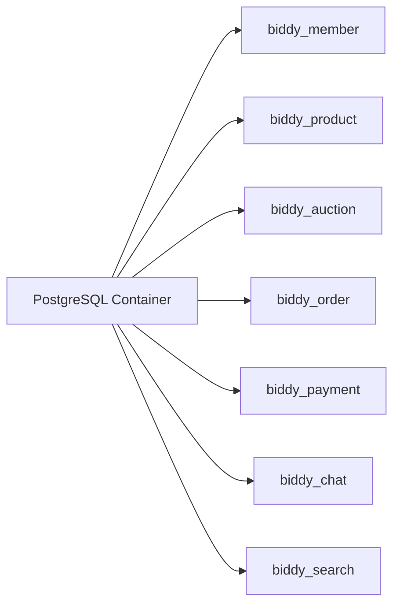
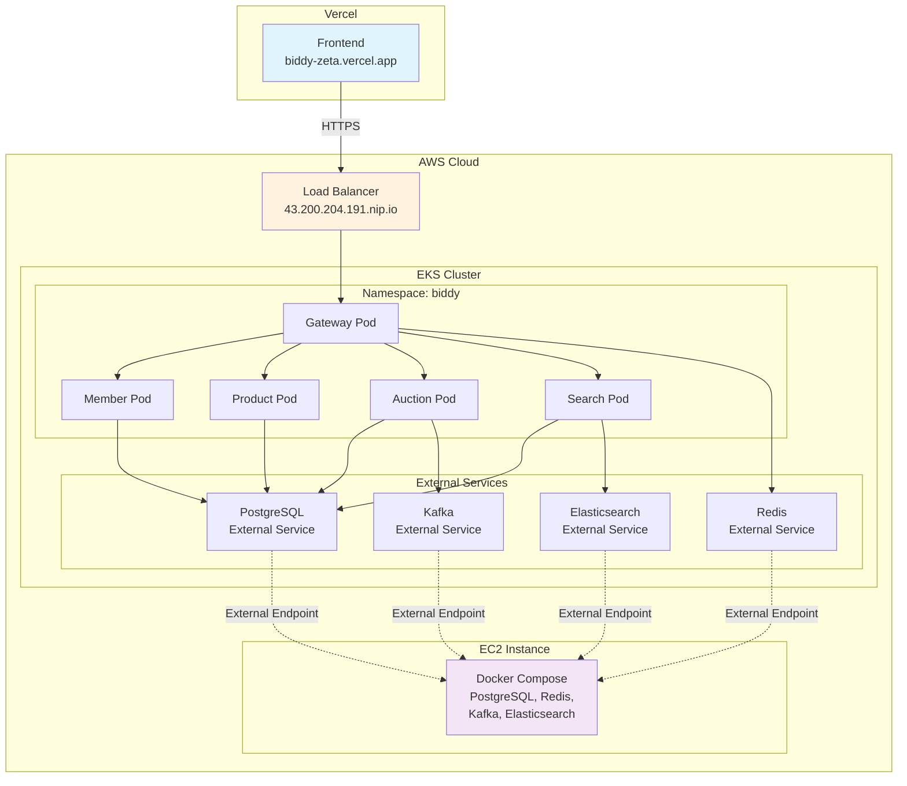
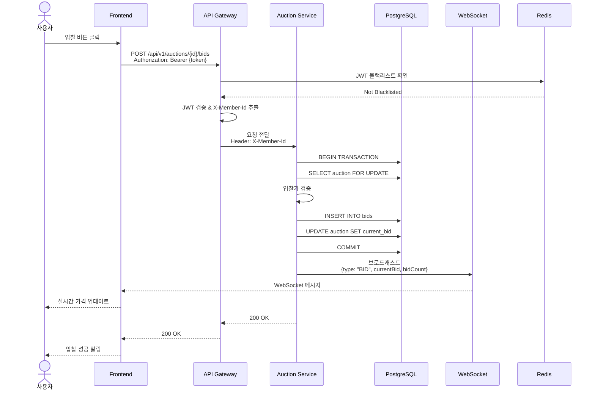
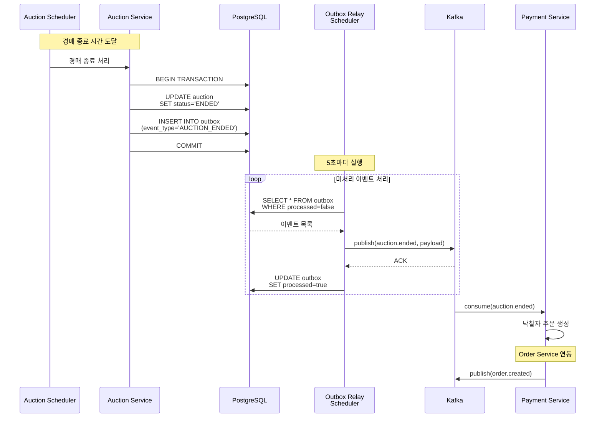
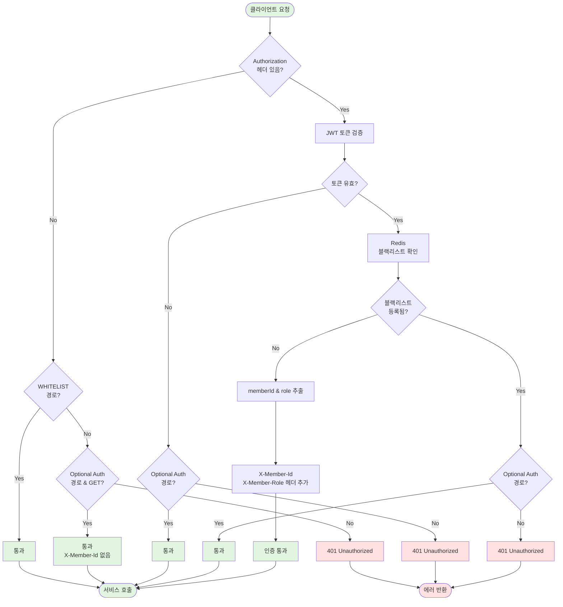
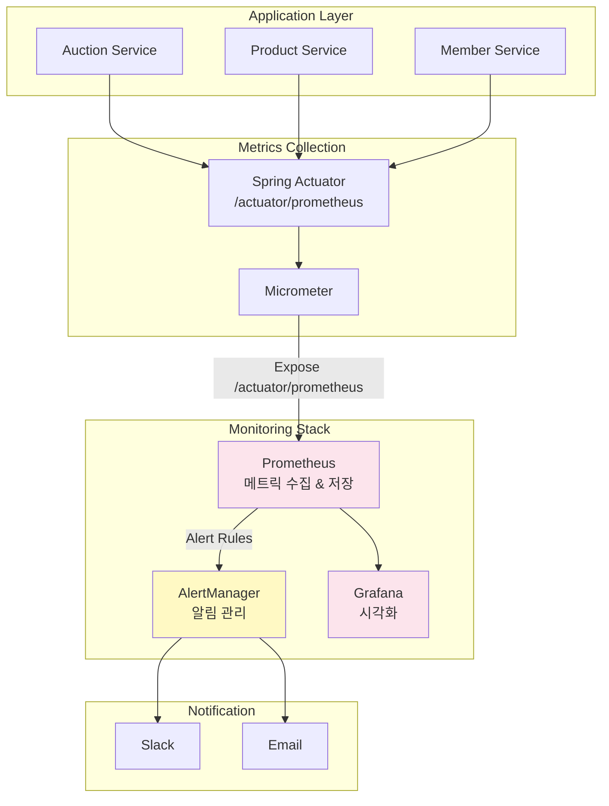
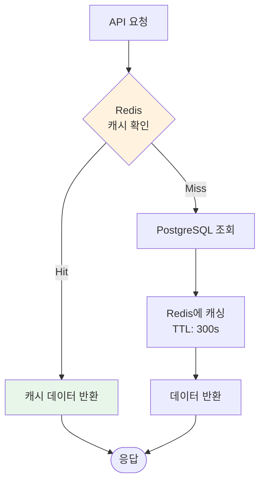
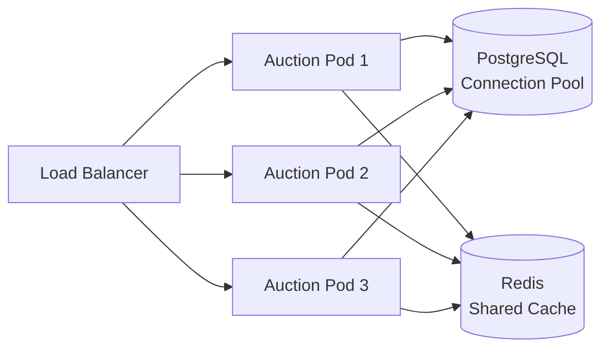

# Biddy 시스템 아키텍처

## 개요
Biddy는 마이크로서비스 아키텍처 기반의 온라인 경매 플랫폼입니다.

## 전체 아키텍처



## 주요 컴포넌트

### 1. Frontend
- **기술**: React, Vite, TailwindCSS
- **배포**: Vercel
- **기능**: 사용자 인터페이스, WebSocket 실시간 업데이트

### 2. API Gateway
- **기술**: Spring Cloud Gateway
- **기능**:
  - JWT 인증 필터
  - 라우팅
  - Rate Limiting
  - CORS 처리

### 3. Microservices
각 서비스는 독립적인 PostgreSQL 데이터베이스를 사용합니다.

#### Member Service
- 회원 가입/로그인
- JWT 토큰 발급
- 프로필 관리

#### Product Service
- 상품 등록/수정/삭제
- 상품 목록 조회
- 벡터 임베딩 (AI 검색용)

#### Auction Service
- 경매 생성/관리
- 실시간 입찰 처리
- WebSocket 실시간 알림
- **Outbox Pattern** 적용

#### Search Service
- Elasticsearch 기반 검색
- AI 기반 상품 추천
- 키워드 자동완성

#### Chat Service
- 판매자-구매자 실시간 채팅
- WebSocket (STOMP 프로토콜)
- 읽음 처리

#### Order Service
- 일반 주문 / 경매 낙찰 주문
- 주문 상태 관리
- 구매 확정
- 자동 취소 (경매 주문 24시간)

#### Payment Service
- Toss Payments API 연동
- 결제 생성/승인/취소/환불
- 판매자 정산 관리
- Webhook 처리

### 4. Data Layer

#### PostgreSQL


#### Redis
- JWT 블랙리스트
- 세션 캐싱
- Rate Limiting 카운터

#### Elasticsearch
- 상품 검색 인덱스
- 키워드 자동완성
- 검색 히스토리

### 5. Message Queue (Kafka)

#### 주요 토픽
| Topic | Producer | Consumer | 설명 |
|-------|----------|----------|------|
| `auction.ended` | Auction Service | Order Service | 경매 종료 → 주문 생성 |
| `order.created` | Order Service | Payment Service | 주문 생성 → 결제 대기 |
| `payment.completed` | Payment Service | Order Service | 결제 완료 → 주문 상태 변경 |
| `payment.failed` | Payment Service | Order Service | 결제 실패 → 주문 취소 |
| `purchase.confirmed` | Order Service | Payment Service | 구매 확정 → 정산 처리 |

#### 패턴
- **Transactional Outbox Pattern**: 안정적인 이벤트 발행
- **Event-Driven Architecture**: 서비스 간 느슨한 결합

## 배포 아키텍처



## 데이터 흐름

### 1. 경매 입찰 프로세스



### 2. 경매 종료 이벤트 처리 (Outbox Pattern)



## 보안 아키텍처

### JWT 인증 흐름



### WHITELIST vs OPTIONAL_AUTH_GET_WHITELIST

| 경로 | 타입 | 인증 | X-Member-Id | 설명 |
|------|------|------|-------------|------|
| `/api/members/signup` | WHITELIST | 불필요 | 추가 안 함 | 회원가입 |
| `/api/members/login` | WHITELIST | 불필요 | 추가 안 함 | 로그인 |
| `/api/v1/auctions` | WHITELIST | 불필요 | 추가 안 함 | 경매 목록/상세 |
| `/api/members/{id}/nickname` | WHITELIST | 불필요 | 추가 안 함 | 닉네임 조회 |
| `/api/products` | OPTIONAL_AUTH | 선택적 | 토큰 있으면 추가 | 상품 목록 (찜 여부) |

## 모니터링 아키텍처



## 성능 최적화

### 캐싱 전략



### 데이터베이스 인덱스 전략

```sql
-- 경매 조회 최적화
CREATE INDEX idx_auction_status ON auction(status);
CREATE INDEX idx_auction_ends_at ON auction(ends_at);

-- 입찰 조회 최적화
CREATE INDEX idx_bid_auction_id ON bid(auction_id);
CREATE INDEX idx_bid_created_at ON bid(created_at DESC);

-- Outbox 처리 최적화
CREATE INDEX idx_outbox_processed ON outbox(processed, created_at);
```

## 확장성 고려사항

### Horizontal Scaling



### 향후 개선 사항
- [ ] CDC (Change Data Capture) 도입
- [ ] Circuit Breaker 패턴 적용
- [ ] API Gateway Rate Limiting 강화
- [ ] 읽기 전용 Replica 구성
- [ ] Kafka 파티션 최적화

## 참고 자료
- [Spring Cloud Gateway 공식 문서](https://spring.io/projects/spring-cloud-gateway)
- [Transactional Outbox Pattern](https://microservices.io/patterns/data/transactional-outbox.html)
- [Kubernetes 공식 문서](https://kubernetes.io/docs/)