# 데이터베이스 설계

## 개요
Biddy 프로젝트는 마이크로서비스 아키텍처를 채택하여 각 서비스별로 독립적인 데이터베이스를 운영합니다.

## 데이터베이스 구조

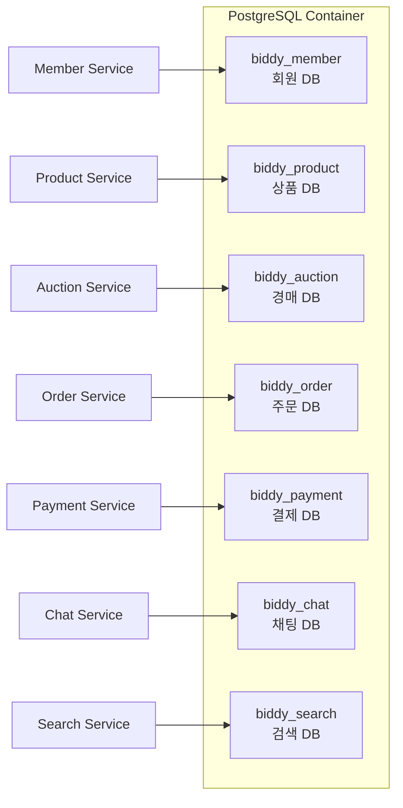

## 서비스별 데이터베이스 설계

### 1. Member Service DB (biddy_member)

#### ERD

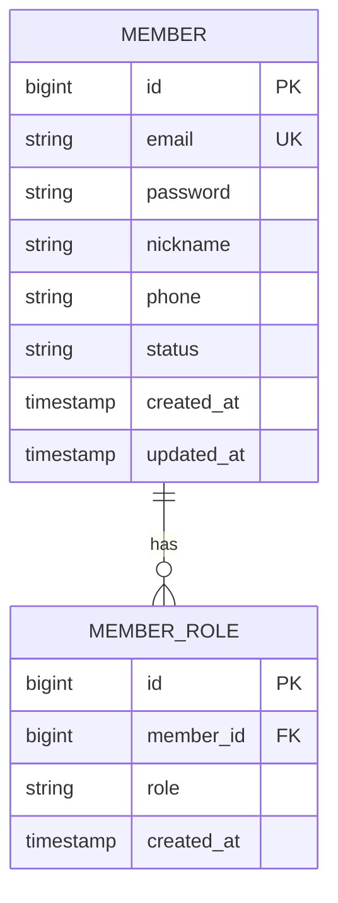

#### 테이블 상세

```sql
-- 회원 테이블
CREATE TABLE member (
    id BIGSERIAL PRIMARY KEY,
    email VARCHAR(255) UNIQUE NOT NULL,
    password VARCHAR(255) NOT NULL,
    nickname VARCHAR(50) UNIQUE NOT NULL,
    phone VARCHAR(20),
    status VARCHAR(20) NOT NULL DEFAULT 'ACTIVE',
    created_at TIMESTAMP NOT NULL DEFAULT CURRENT_TIMESTAMP,
    updated_at TIMESTAMP NOT NULL DEFAULT CURRENT_TIMESTAMP
);

-- 회원 역할 테이블
CREATE TABLE member_role (
    id BIGSERIAL PRIMARY KEY,
    member_id BIGINT NOT NULL,
    role VARCHAR(20) NOT NULL,
    created_at TIMESTAMP NOT NULL DEFAULT CURRENT_TIMESTAMP,
    FOREIGN KEY (member_id) REFERENCES member(id) ON DELETE CASCADE
);

-- 인덱스
CREATE INDEX idx_member_email ON member(email);
CREATE INDEX idx_member_nickname ON member(nickname);
CREATE INDEX idx_member_role_member_id ON member_role(member_id);
```

---

### 2. Product Service DB (biddy_product)

#### ERD

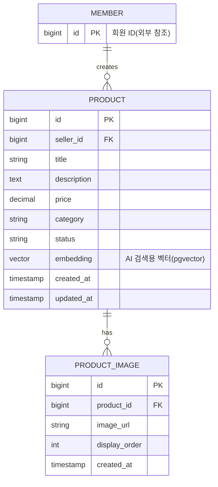

#### pgvector 활용

```sql
-- pgvector 확장 설치
CREATE EXTENSION IF NOT EXISTS vector;

-- 상품 테이블
CREATE TABLE product (
    id BIGSERIAL PRIMARY KEY,
    seller_id BIGINT NOT NULL,
    title VARCHAR(255) NOT NULL,
    description TEXT,
    price DECIMAL(19, 2) NOT NULL,
    category VARCHAR(50),
    status VARCHAR(20) NOT NULL DEFAULT 'ACTIVE',
    embedding vector(1536),  -- OpenAI embedding 차원
    created_at TIMESTAMP NOT NULL DEFAULT CURRENT_TIMESTAMP,
    updated_at TIMESTAMP NOT NULL DEFAULT CURRENT_TIMESTAMP
);

-- 상품 이미지 테이블
CREATE TABLE product_image (
    id BIGSERIAL PRIMARY KEY,
    product_id BIGINT NOT NULL,
    image_url VARCHAR(500) NOT NULL,
    display_order INT NOT NULL DEFAULT 0,
    created_at TIMESTAMP NOT NULL DEFAULT CURRENT_TIMESTAMP,
    FOREIGN KEY (product_id) REFERENCES product(id) ON DELETE CASCADE
);

-- 벡터 유사도 검색 인덱스
CREATE INDEX idx_product_embedding
ON product
USING ivfflat (embedding vector_cosine_ops)
WITH (lists = 100);

-- 일반 인덱스
CREATE INDEX idx_product_seller_id ON product(seller_id);
CREATE INDEX idx_product_category ON product(category);
CREATE INDEX idx_product_status ON product(status);
```

#### 유사 상품 검색 쿼리

```sql
-- 유사 상품 검색
SELECT
    id,
    title,
    price,
    1 - (embedding <=> '[0.1, 0.2, ...]'::vector) AS similarity
FROM product
WHERE status = 'ACTIVE'
ORDER BY embedding <=> '[0.1, 0.2, ...]'::vector
LIMIT 10;
```

---

### 3. Auction Service DB (biddy_auction)

### ERD (Entity Relationship Diagram)

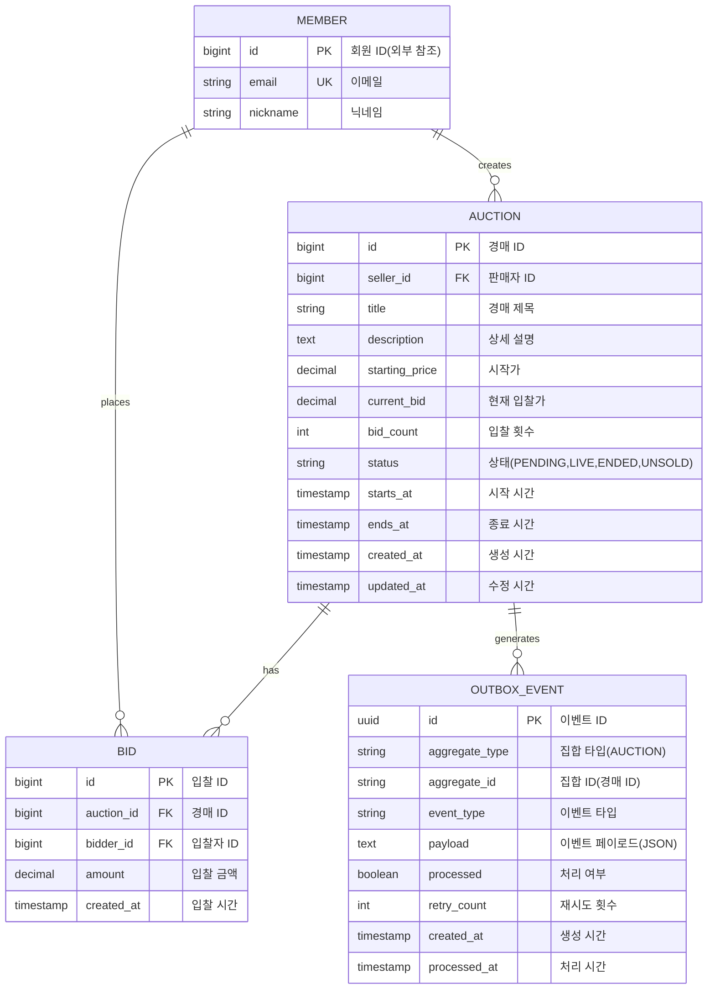

### 테이블 상세

#### 1. auction 테이블

```sql
CREATE TABLE auction (
    id BIGSERIAL PRIMARY KEY,
    seller_id BIGINT NOT NULL,
    title VARCHAR(255) NOT NULL,
    description TEXT,
    starting_price DECIMAL(19, 2) NOT NULL,
    current_bid DECIMAL(19, 2) NOT NULL DEFAULT 0,
    bid_count INT NOT NULL DEFAULT 0,
    status VARCHAR(20) NOT NULL DEFAULT 'PENDING',
    starts_at TIMESTAMP NOT NULL,
    ends_at TIMESTAMP NOT NULL,
    created_at TIMESTAMP NOT NULL DEFAULT CURRENT_TIMESTAMP,
    updated_at TIMESTAMP NOT NULL DEFAULT CURRENT_TIMESTAMP,

    CONSTRAINT chk_auction_price CHECK (current_bid >= starting_price),
    CONSTRAINT chk_auction_dates CHECK (ends_at > starts_at)
);

-- 인덱스
CREATE INDEX idx_auction_status ON auction(status);
CREATE INDEX idx_auction_ends_at ON auction(ends_at);
CREATE INDEX idx_auction_seller_id ON auction(seller_id);
CREATE INDEX idx_auction_status_ends_at ON auction(status, ends_at);
```

#### 2. bid 테이블

```sql
CREATE TABLE bid (
    id BIGSERIAL PRIMARY KEY,
    auction_id BIGINT NOT NULL,
    bidder_id BIGINT NOT NULL,
    amount DECIMAL(19, 2) NOT NULL,
    created_at TIMESTAMP NOT NULL DEFAULT CURRENT_TIMESTAMP,

    CONSTRAINT fk_bid_auction FOREIGN KEY (auction_id)
        REFERENCES auction(id) ON DELETE CASCADE,
    CONSTRAINT chk_bid_amount_positive CHECK (amount > 0)
);

-- 인덱스
CREATE INDEX idx_bid_auction_id ON bid(auction_id);
CREATE INDEX idx_bid_bidder_id ON bid(bidder_id);
CREATE INDEX idx_bid_created_at ON bid(created_at DESC);
CREATE INDEX idx_bid_auction_created ON bid(auction_id, created_at DESC);
```

#### 3. outbox 테이블 (Transactional Outbox Pattern)

```sql
CREATE TABLE outbox (
    id UUID PRIMARY KEY DEFAULT gen_random_uuid(),
    aggregate_type VARCHAR(50) NOT NULL,
    aggregate_id VARCHAR(255) NOT NULL,
    event_type VARCHAR(100) NOT NULL,
    payload TEXT NOT NULL,
    processed BOOLEAN NOT NULL DEFAULT FALSE,
    retry_count INT NOT NULL DEFAULT 0,
    created_at TIMESTAMP NOT NULL DEFAULT CURRENT_TIMESTAMP,
    processed_at TIMESTAMP,

    CONSTRAINT chk_outbox_retry_count CHECK (retry_count >= 0 AND retry_count <= 5)
);

-- 인덱스 (처리 성능 최적화)
CREATE INDEX idx_outbox_processed ON outbox(processed, created_at);
CREATE INDEX idx_outbox_aggregate ON outbox(aggregate_type, aggregate_id);
CREATE INDEX idx_outbox_retry ON outbox(retry_count) WHERE processed = FALSE;
```

### 경매 상태 전이

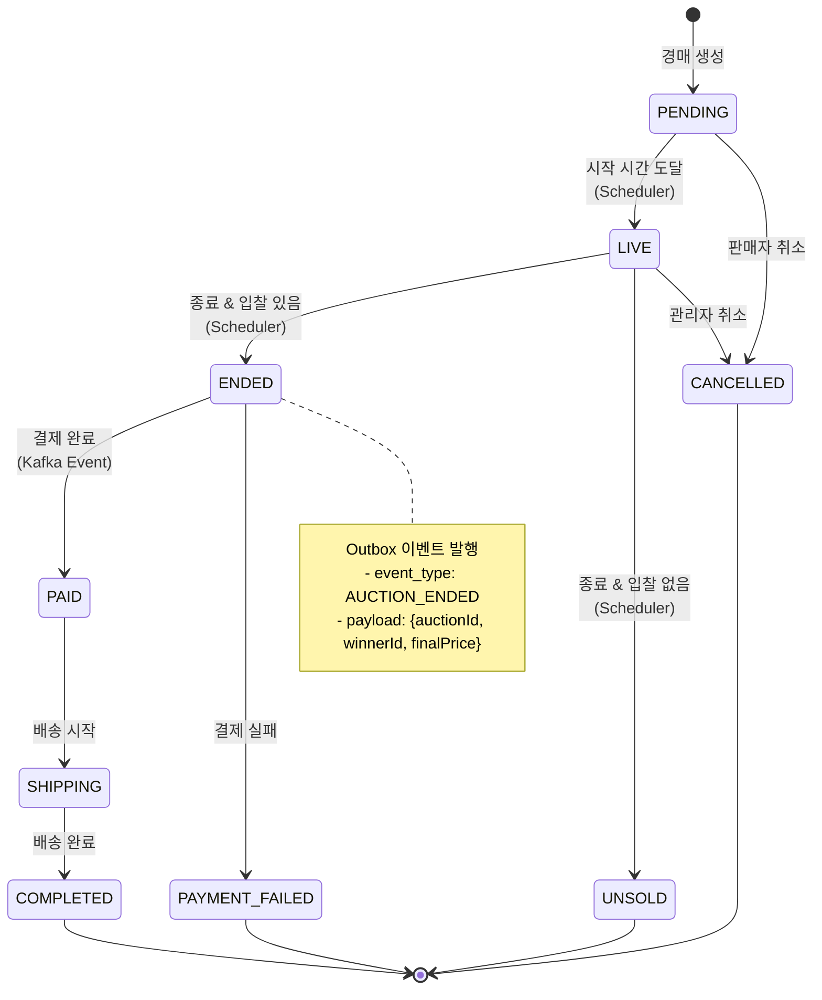

### Outbox 이벤트 처리 흐름

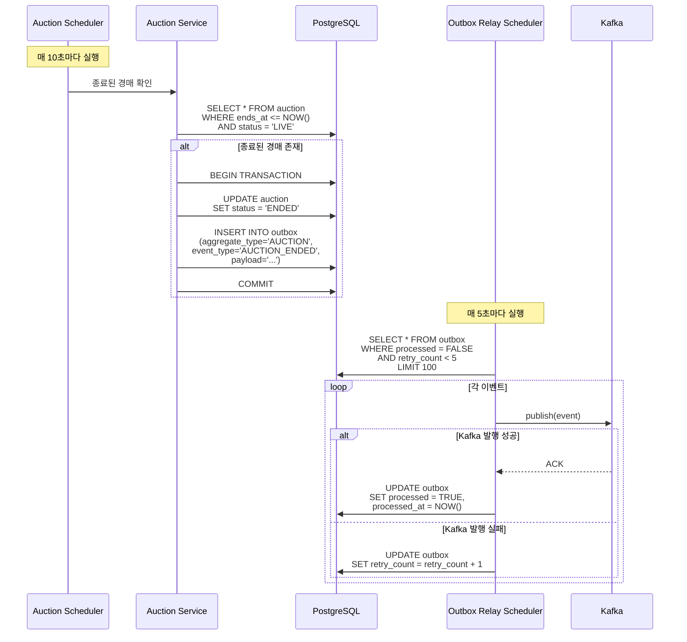

---

### 4. Search Service DB (biddy_search)

#### ERD

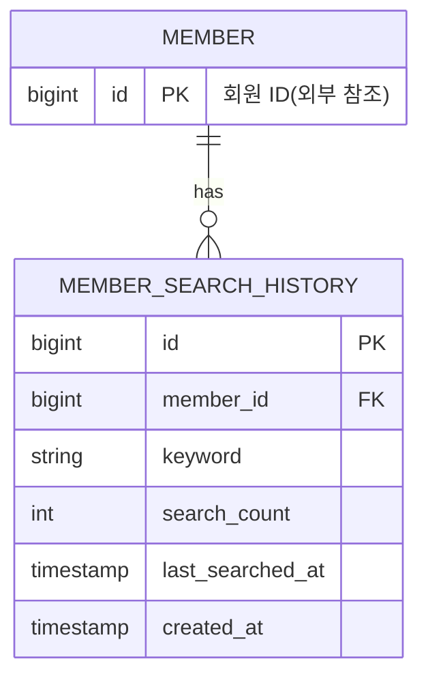

#### 테이블 상세

```sql
-- 검색 히스토리 테이블
CREATE TABLE member_search_history (
    id BIGSERIAL PRIMARY KEY,
    member_id BIGINT NOT NULL,
    keyword VARCHAR(255) NOT NULL,
    search_count INT NOT NULL DEFAULT 1,
    last_searched_at TIMESTAMP NOT NULL DEFAULT CURRENT_TIMESTAMP,
    created_at TIMESTAMP NOT NULL DEFAULT CURRENT_TIMESTAMP
);

-- 인덱스
CREATE INDEX idx_search_history_member_id ON member_search_history(member_id);
CREATE INDEX idx_search_history_keyword ON member_search_history(keyword);
CREATE INDEX idx_search_history_member_keyword ON member_search_history(member_id, keyword);
```

#### Elasticsearch 연동

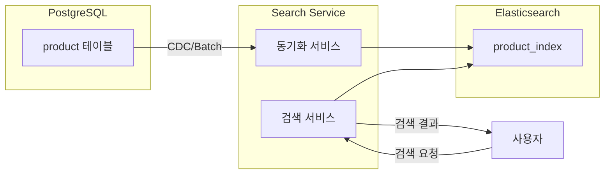

---

### 5. Order Service DB (biddy_order)

#### ERD

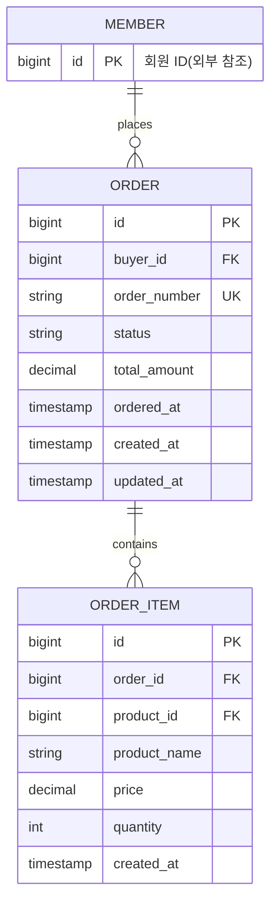

#### 테이블 상세

```sql
-- 주문 테이블
CREATE TABLE "order" (
    id BIGSERIAL PRIMARY KEY,
    buyer_id BIGINT NOT NULL,
    order_number VARCHAR(50) UNIQUE NOT NULL,
    status VARCHAR(20) NOT NULL DEFAULT 'PENDING',
    total_amount DECIMAL(19, 2) NOT NULL,
    ordered_at TIMESTAMP NOT NULL DEFAULT CURRENT_TIMESTAMP,
    created_at TIMESTAMP NOT NULL DEFAULT CURRENT_TIMESTAMP,
    updated_at TIMESTAMP NOT NULL DEFAULT CURRENT_TIMESTAMP
);

-- 주문 상품 테이블
CREATE TABLE order_item (
    id BIGSERIAL PRIMARY KEY,
    order_id BIGINT NOT NULL,
    product_id BIGINT NOT NULL,
    product_name VARCHAR(255) NOT NULL,
    price DECIMAL(19, 2) NOT NULL,
    quantity INT NOT NULL DEFAULT 1,
    created_at TIMESTAMP NOT NULL DEFAULT CURRENT_TIMESTAMP,
    FOREIGN KEY (order_id) REFERENCES "order"(id) ON DELETE CASCADE
);

-- 인덱스
CREATE INDEX idx_order_buyer_id ON "order"(buyer_id);
CREATE INDEX idx_order_number ON "order"(order_number);
CREATE INDEX idx_order_status ON "order"(status);
CREATE INDEX idx_order_item_order_id ON order_item(order_id);
CREATE INDEX idx_order_item_product_id ON order_item(product_id);
```

---

### 6. Payment Service DB (biddy_payment)

#### ERD

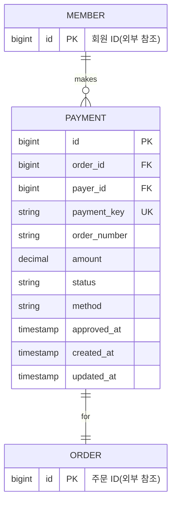

#### 테이블 상세

```sql
-- 결제 테이블
CREATE TABLE payment (
    id BIGSERIAL PRIMARY KEY,
    order_id BIGINT NOT NULL UNIQUE,
    payer_id BIGINT NOT NULL,
    payment_key VARCHAR(255) UNIQUE NOT NULL,
    order_number VARCHAR(50) NOT NULL,
    amount DECIMAL(19, 2) NOT NULL,
    status VARCHAR(20) NOT NULL DEFAULT 'PENDING',
    method VARCHAR(20),
    approved_at TIMESTAMP,
    created_at TIMESTAMP NOT NULL DEFAULT CURRENT_TIMESTAMP,
    updated_at TIMESTAMP NOT NULL DEFAULT CURRENT_TIMESTAMP
);

-- 인덱스
CREATE INDEX idx_payment_order_id ON payment(order_id);
CREATE INDEX idx_payment_payer_id ON payment(payer_id);
CREATE INDEX idx_payment_key ON payment(payment_key);
CREATE INDEX idx_payment_status ON payment(status);
```

---

### 7. Chat Service DB (biddy_chat)

#### ERD

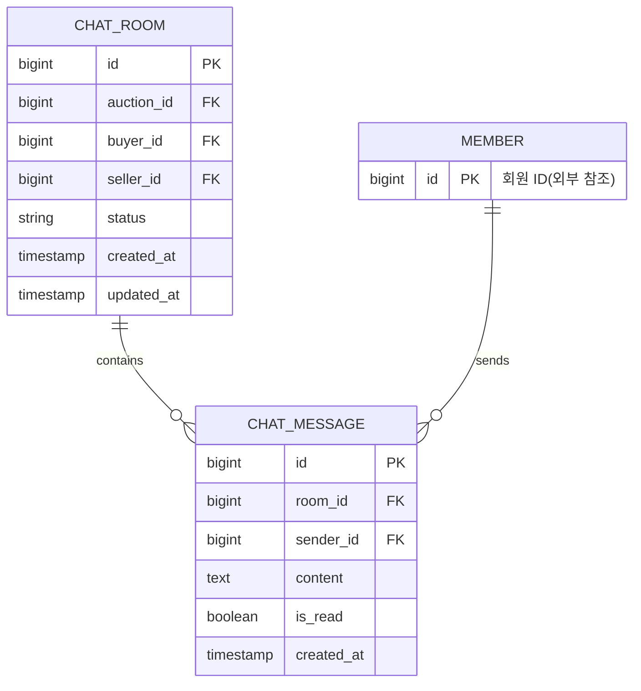

#### 테이블 상세

```sql
-- 채팅방 테이블
CREATE TABLE chat_room (
    id BIGSERIAL PRIMARY KEY,
    auction_id BIGINT NOT NULL,
    buyer_id BIGINT NOT NULL,
    seller_id BIGINT NOT NULL,
    status VARCHAR(20) NOT NULL DEFAULT 'ACTIVE',
    created_at TIMESTAMP NOT NULL DEFAULT CURRENT_TIMESTAMP,
    updated_at TIMESTAMP NOT NULL DEFAULT CURRENT_TIMESTAMP,
    UNIQUE(auction_id, buyer_id, seller_id)
);

-- 채팅 메시지 테이블
CREATE TABLE chat_message (
    id BIGSERIAL PRIMARY KEY,
    room_id BIGINT NOT NULL,
    sender_id BIGINT NOT NULL,
    content TEXT NOT NULL,
    is_read BOOLEAN NOT NULL DEFAULT FALSE,
    created_at TIMESTAMP NOT NULL DEFAULT CURRENT_TIMESTAMP,
    FOREIGN KEY (room_id) REFERENCES chat_room(id) ON DELETE CASCADE
);

-- 인덱스
CREATE INDEX idx_chat_room_auction_id ON chat_room(auction_id);
CREATE INDEX idx_chat_room_buyer_id ON chat_room(buyer_id);
CREATE INDEX idx_chat_room_seller_id ON chat_room(seller_id);
CREATE INDEX idx_chat_message_room_id ON chat_message(room_id);
CREATE INDEX idx_chat_message_sender_id ON chat_message(sender_id);
CREATE INDEX idx_chat_message_created_at ON chat_message(created_at DESC);
```

---

## 데이터베이스 성능 최적화

### 1. Connection Pool 설정

```yaml
# application.yaml
spring:
  datasource:
    hikari:
      maximum-pool-size: 10
      minimum-idle: 5
      connection-timeout: 30000
      idle-timeout: 600000
      max-lifetime: 1800000
```

### 2. 쿼리 최적화

```sql
-- Bad: N+1 문제
SELECT * FROM auction WHERE status = 'LIVE';
-- 각 경매마다
SELECT * FROM bid WHERE auction_id = ?;

-- Good: JOIN 사용
SELECT
    a.*,
    COUNT(b.id) as total_bids,
    MAX(b.amount) as highest_bid
FROM auction a
LEFT JOIN bid b ON a.id = b.auction_id
WHERE a.status = 'LIVE'
GROUP BY a.id;
```

### 3. 인덱스 전략

```sql
-- 복합 인덱스 (자주 함께 조회되는 컬럼)
CREATE INDEX idx_auction_status_ends_at
ON auction(status, ends_at);

-- 부분 인덱스 (조건에 맞는 데이터만)
CREATE INDEX idx_outbox_unprocessed
ON outbox(created_at)
WHERE processed = FALSE;

-- 커버링 인덱스 (필요한 모든 컬럼 포함)
CREATE INDEX idx_auction_list
ON auction(status, ends_at)
INCLUDE (title, current_bid, bid_count);
```

### 4. 파티셔닝 (향후 적용)

```sql
-- 날짜 기반 파티셔닝 (대용량 이력 테이블)
CREATE TABLE bid (
    id BIGSERIAL,
    auction_id BIGINT NOT NULL,
    bidder_id BIGINT NOT NULL,
    amount DECIMAL(19, 2) NOT NULL,
    created_at TIMESTAMP NOT NULL
) PARTITION BY RANGE (created_at);

CREATE TABLE bid_2024_07 PARTITION OF bid
FOR VALUES FROM ('2024-07-01') TO ('2024-08-01');

CREATE TABLE bid_2024_08 PARTITION OF bid
FOR VALUES FROM ('2024-08-01') TO ('2024-09-01');
```

## 백업 및 복구 전략

### 백업 스크립트

```bash
#!/bin/bash
# backup-postgres.sh

DATE=$(date +%Y%m%d_%H%M%S)
BACKUP_DIR="/var/backups/postgres"

# 각 데이터베이스 백업
for db in biddy_member biddy_product biddy_auction biddy_order biddy_payment; do
    docker exec biddy-postgres pg_dump -U biddy $db | \
        gzip > $BACKUP_DIR/${db}_${DATE}.sql.gz
done

# 7일 이상 된 백업 삭제
find $BACKUP_DIR -name "*.sql.gz" -mtime +7 -delete
```

### 복구 방법

```bash
# 백업 파일 복구
gunzip < backup.sql.gz | \
docker exec -i biddy-postgres psql -U biddy -d biddy_auction
```

## 모니터링 쿼리

### 1. 데이터베이스 크기

```sql
SELECT
    datname as "Database",
    pg_size_pretty(pg_database_size(datname)) as "Size"
FROM pg_database
WHERE datname LIKE 'biddy_%'
ORDER BY pg_database_size(datname) DESC;
```

### 2. 테이블별 크기

```sql
SELECT
    schemaname,
    tablename,
    pg_size_pretty(pg_total_relation_size(schemaname||'.'||tablename)) as "Total Size",
    pg_size_pretty(pg_relation_size(schemaname||'.'||tablename)) as "Table Size",
    pg_size_pretty(pg_indexes_size(schemaname||'.'||tablename)) as "Index Size",
    n_live_tup as "Live Rows"
FROM pg_tables
LEFT JOIN pg_stat_user_tables ON pg_tables.tablename = pg_stat_user_tables.relname
WHERE schemaname = 'public'
ORDER BY pg_total_relation_size(schemaname||'.'||tablename) DESC;
```

### 3. 느린 쿼리 확인

```sql
SELECT
    pid,
    usename,
    datname,
    state,
    EXTRACT(EPOCH FROM (now() - query_start)) as duration_seconds,
    query
FROM pg_stat_activity
WHERE state != 'idle'
  AND query NOT LIKE '%pg_stat_activity%'
  AND (now() - query_start) > interval '1 seconds'
ORDER BY duration_seconds DESC;
```

### 4. 인덱스 사용률

```sql
SELECT
    schemaname,
    tablename,
    indexname,
    idx_scan as "Index Scans",
    idx_tup_read as "Tuples Read",
    idx_tup_fetch as "Tuples Fetched",
    pg_size_pretty(pg_relation_size(indexrelid)) as "Size"
FROM pg_stat_user_indexes
ORDER BY idx_scan DESC;
```

### 5. Outbox 이벤트 통계

```sql
SELECT
    aggregate_type,
    event_type,
    COUNT(*) as total,
    COUNT(*) FILTER (WHERE processed = TRUE) as processed,
    COUNT(*) FILTER (WHERE processed = FALSE) as pending,
    COUNT(*) FILTER (WHERE retry_count > 0) as retried,
    MAX(retry_count) as max_retries,
    AVG(EXTRACT(EPOCH FROM (processed_at - created_at))) as avg_processing_time
FROM outbox
GROUP BY aggregate_type, event_type
ORDER BY total DESC;
```

## 참고 자료
- [PostgreSQL 공식 문서](https://www.postgresql.org/docs/)
- [pgvector GitHub](https://github.com/pgvector/pgvector)
- [Transactional Outbox Pattern](https://microservices.io/patterns/data/transactional-outbox.html)