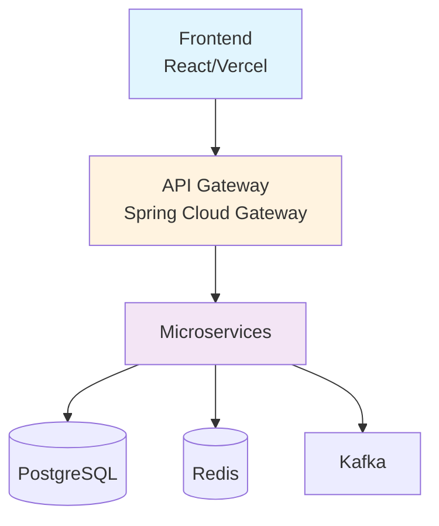
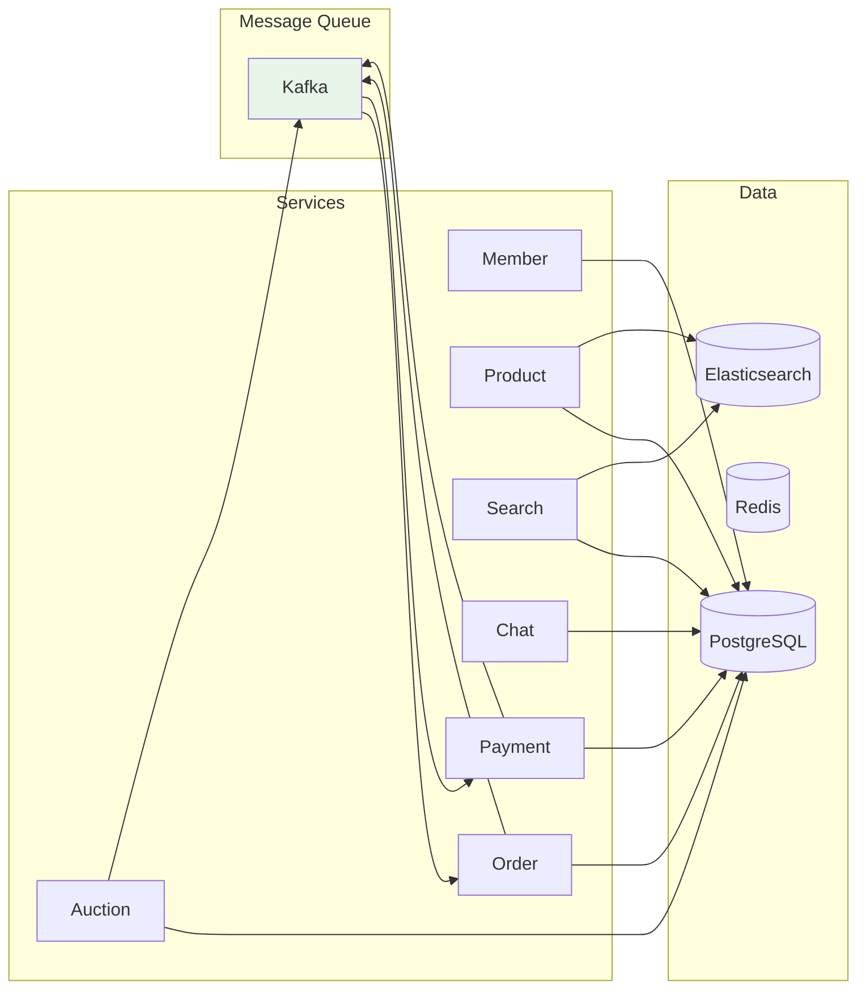
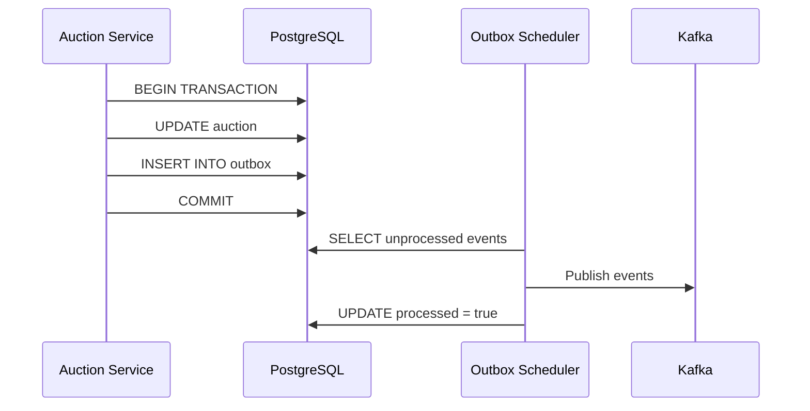
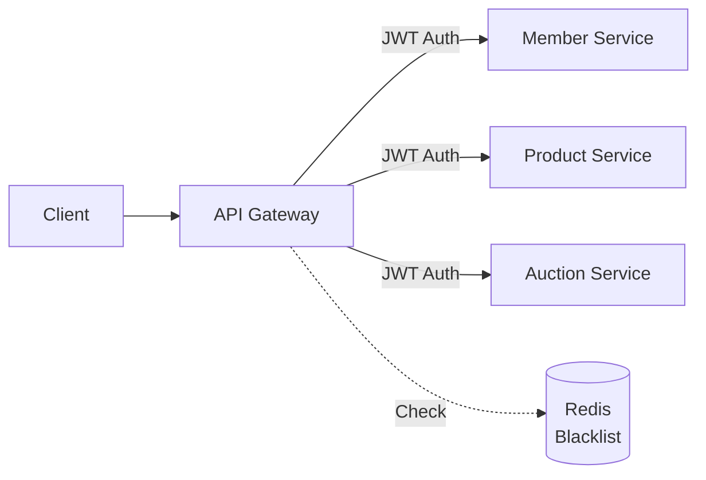

# 아키텍처 문서

Biddy 프로젝트의 시스템 아키텍처 및 설계 문서입니다.

## 📑 문서 목록

### 1. [시스템 아키텍처](./01_시스템_아키텍처.md)
- 전체 시스템 구조
- 마이크로서비스 아키텍처
- API Gateway 구성
- 보안 아키텍처
- 모니터링 구성
- 배포 아키텍처

**주요 내용:**


### 2. [데이터베이스 설계](./02_데이터베이스_설계.md)
- ERD (Entity Relationship Diagram)
- 테이블 상세 스키마
- 인덱스 전략
- Outbox 패턴 구현
- 성능 최적화
- 백업 및 복구

**주요 데이터베이스:**
- `biddy_member` - 회원 관리
- `biddy_product` - 상품 관리 (pgvector)
- `biddy_auction` - 경매 관리 (Outbox 패턴)
- `biddy_search` - 검색 히스토리
- `biddy_chat` - 채팅
- `biddy_order` - 주문 관리
- `biddy_payment` - 결제 및 정산

## 🏗️ 아키텍처 개요

### Microservices Architecture



### 핵심 패턴

#### 1. Transactional Outbox Pattern
경매 종료 이벤트를 안정적으로 발행하기 위한 패턴



#### 2. API Gateway Pattern
중앙 집중식 인증 및 라우팅



#### 3. Database per Service
각 마이크로서비스가 독립적인 데이터베이스 보유

## 📊 기술 스택

### Backend
- **Framework**: Spring Boot 3.x
- **Language**: Java 17
- **API Gateway**: Spring Cloud Gateway
- **Message Queue**: Apache Kafka
- **Database**: PostgreSQL 16 (with pgvector)
- **Cache**: Redis 7
- **Search**: Elasticsearch 8

### Frontend
- **Framework**: React 18
- **Build Tool**: Vite
- **Styling**: TailwindCSS
- **Deployment**: Vercel

### Infrastructure
- **Container**: Docker
- **Orchestration**: Kubernetes (EKS)
- **Cloud**: AWS
- **Monitoring**: Prometheus + Grafana

## 🔐 보안

### JWT 인증 흐름

1. **WHITELIST**: 인증 불필요 경로
   - `/api/members/signup`
   - `/api/members/login`
   - `/api/v1/auctions` (GET)
   - `/api/members/{id}/nickname` (GET)

2. **OPTIONAL_AUTH_GET_WHITELIST**: 선택적 인증
   - `/api/products` (GET)
   - 토큰 있으면 → X-Member-Id 헤더 추가
   - 토큰 없으면 → 그대로 통과

3. **기타 경로**: 인증 필수
   - POST, PUT, DELETE 요청
   - 개인 정보 조회/수정

### Redis Blacklist
- 로그아웃한 JWT 토큰 무효화
- TTL: JWT 만료 시간과 동일

## 📈 성능 최적화

### 1. Database Indexing
```sql
-- 경매 조회 최적화
CREATE INDEX idx_auction_status_ends_at ON auction(status, ends_at);

-- Outbox 처리 최적화
CREATE INDEX idx_outbox_processed ON outbox(processed, created_at);
```

### 2. Connection Pooling
- HikariCP 사용
- Maximum Pool Size: 10
- Minimum Idle: 5

### 3. Caching Strategy
- Redis 캐싱 (TTL: 5분)
- 상품 목록, 경매 정보
- 회원 프로필

### 4. Elasticsearch
- 상품 검색 인덱싱
- 벡터 유사도 검색 (AI 추천)

## 🚀 배포 전략

### Docker Compose (개발 환경)
```yaml
services:
  - postgres
  - redis
  - kafka
  - elasticsearch
```

### Kubernetes (프로덕션)
```yaml
namespaces:
  - biddy (애플리케이션)
  - monitoring (모니터링)

services:
  - gateway
  - member-service
  - product-service
  - auction-service
  - search-service
```

## 📝 다이어그램 규칙

본 문서의 모든 다이어그램은 **Mermaid** 문법을 사용합니다.

### IntelliJ IDEA에서 보기
1. Mermaid 플러그인 설치
2. Markdown 파일 열기
3. 다이어그램 자동 렌더링

### 온라인 편집
- [Mermaid Live Editor](https://mermaid.live/)

## 🔗 관련 문서

### 설계 문서
- [회원 서비스](../02_설계/01_회원서비스_상세설계.md)
- [상품 서비스](../02_설계/02_상품서비스_상세설계.md)
- [검색 서비스](../02_설계/03_검색서비스_상세설계.md)
- [채팅 서비스](../02_설계/04_채팅서비스_상세설계.md)
- [주문 서비스](../02_설계/05_주문서비스_상세설계.md)
- [결제 서비스](../02_설계/06_결제서비스_상세설계.md)
- [경매 서비스](../02_설계/07_경매서비스_상세설계.md)
- [프론트엔드](../02_설계/08_프론트엔드_구조.md)

### API 문서
- Swagger UI: `http://localhost:8080/swagger-ui.html`

### 모니터링
- Grafana: `http://localhost:3000`
- Prometheus: `http://localhost:9090`

## 📚 참고 자료

### 패턴
- [Microservices Patterns](https://microservices.io/patterns/index.html)
- [Transactional Outbox](https://microservices.io/patterns/data/transactional-outbox.html)
- [API Gateway Pattern](https://microservices.io/patterns/apigateway.html)

### 기술 문서
- [Spring Cloud Gateway](https://spring.io/projects/spring-cloud-gateway)
- [PostgreSQL](https://www.postgresql.org/docs/)
- [pgvector](https://github.com/pgvector/pgvector)
- [Apache Kafka](https://kafka.apache.org/documentation/)
- [Elasticsearch](https://www.elastic.co/guide/index.html)

### 도구
- [Mermaid 공식 문서](https://mermaid.js.org/)
- [Kubernetes 공식 문서](https://kubernetes.io/docs/)