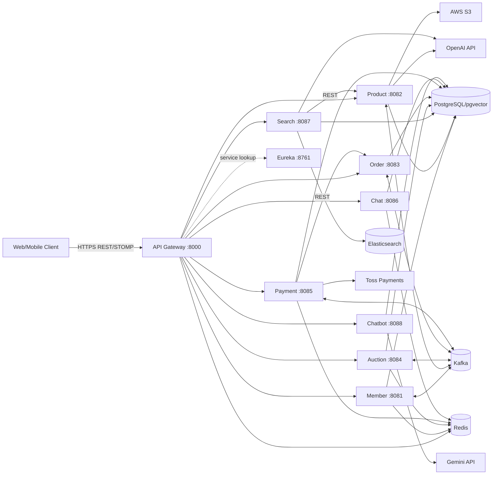
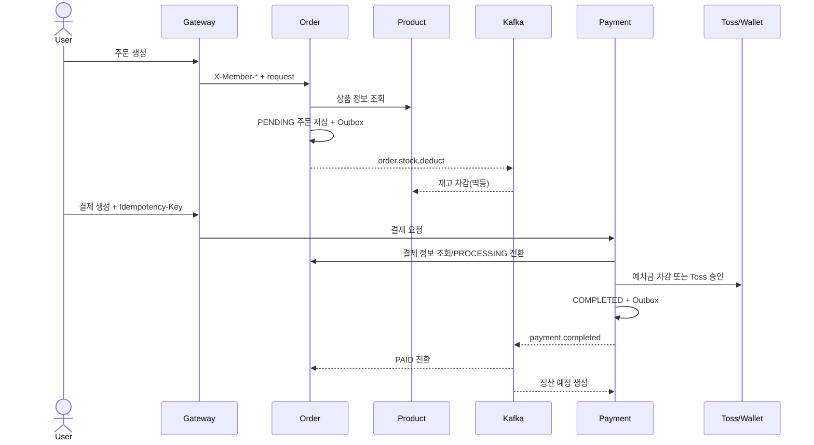
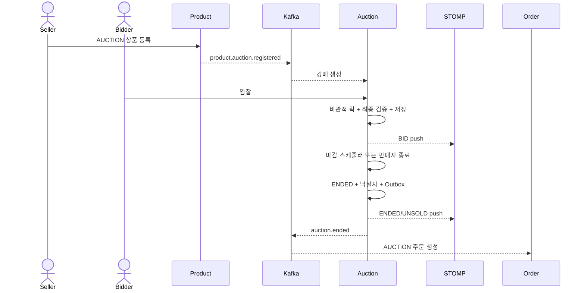

# 전체 시스템 아키텍처

## 1. 시스템 컨텍스트

Biddy는 일반 상품 거래와 실시간 경매, 주문·결제·예치금·정산, 채팅, 의미 검색과 RAG 챗봇을 제공하는 Spring 기반 MSA다.

**[구현]** Docker Compose는 하나의 PostgreSQL 인스턴스에 서비스별 database를 만들고, Kafka 1노드 KRaft와 Redis 1노드를 사용한다. 서비스는 Eureka에 등록한다. Config Server는 존재하지만 `config-repo/application.yaml`이 `{}`이므로 실질적 중앙 설정은 아직 없다.

## 2. 서비스 책임과 데이터 소유권

| 서비스 | 책임 | 소유 데이터 | 주요 의존성 |
|---|---|---|---|
| Gateway | 라우팅, JWT 검증, 사용자 헤더 전달, CORS | Redis blacklist 조회 | Eureka, Redis |
| Member | 가입·인증·프로필·정지·탈퇴 | 회원, refresh token, 인증, 탈퇴요청 | Redis, mail, Kafka |
| Product | 상품·이미지·찜·재고·상품 embedding | 상품, 찜, 처리 주문, vector | S3, OpenAI, Kafka |
| Search | 의미 검색 orchestration, 자동완성, 검색 이력 | 회원 검색 이력, ES 키워드 | Product REST, OpenAI, ES |
| Auction | 경매·입찰·관심·마감·실시간 push | 경매, 입찰, 관심, Outbox | Redis, Kafka, STOMP |
| Order | 장바구니·일반/낙찰 주문·Saga·배치 | 장바구니, 주문/항목, Outbox | Product REST, Kafka, Batch |
| Payment | 결제·예치금 원장·정산 | 결제/취소, 계좌/거래, 정산, Outbox | Order REST, Toss, Redis, Kafka |
| Chat | 1:1 상품 채팅과 읽음 처리 | 채팅방, 메시지 | Redis Pub/Sub, STOMP |
| Chatbot | 지식 수집, vector 검색, RAG 답변 | 문서 chunk/vector | Gemini |
| Discovery | 서비스 등록·탐색 | registry 메모리 | 없음 |
| Config | 중앙 설정 제공 기반 | classpath config | 없음 |

## 3. Gateway 계약

**[구현]** 주요 라우팅은 다음과 같다.

| 외부 경로 | 대상 |
|---|---|
| `/api/members/**`, `/api/admin/**` | Member |
| `/api/products/**` | Product |
| `/api/search/**` | Search |
| `/api/order/**`, `/api/orders/**`, `/api/cart/**` | Order |
| `/api/v1/auctions/**`, `/api/v1/members/me/{watches,bids}/**` | Auction |
| `/api/payments/**` | Payment |
| `/api/chats/**`, `/api/ws-chat/**` | Chat REST/WebSocket |
| `/api/chatbot/**` | Chatbot |

Gateway는 Bearer JWT의 서명·만료와 Redis blacklist를 검사한 뒤 `X-Member-Id`, `X-Member-Role`을 downstream에 전달한다. 공개·선택 인증·필수 인증 경로가 필터 코드에 정의되어 있다.

**[차이]** Auction STOMP endpoint는 서비스 코드상 `/ws`이나 Gateway에는 Auction WebSocket route가 없다. 외부 클라이언트가 Gateway만 사용한다면 실시간 경매 연결이 성립하지 않는다. `/api/ws-auction/**` 같은 전용 route와 endpoint prefix를 합의해야 한다. Swagger 집계에는 Chat 문서도 빠져 있다.

## 4. 대표 비즈니스 흐름

### 4.1 일반 상품 주문과 결제

### 4.2 경매 등록·입찰·낙찰

### 4.3 검색과 추천

Search가 질의를 OpenAI embedding으로 변환하고 Product의 pgvector 검색 API를 호출한다. 후보를 LLM으로 재정렬할 수 있으며 회원이면 검색 이력을 PostgreSQL에 저장한다. 자동완성·인기 검색어는 Elasticsearch의 별도 keyword document를 사용한다. AI/ES 장애 시 전체 상품 조회까지 실패시키지 않도록 명시적인 degrade 전략이 필요하다.

## 5. 일관성 모델

| 영역 | 일관성 | 메커니즘 |
|---|---|---|
| 단일 aggregate 갱신 | 강한 일관성 | 로컬 DB 트랜잭션 |
| 입찰 경쟁 | 직렬화에 가까운 강한 일관성 | Auction row 비관적 락 |
| 상품 재고 | 낙관적 동시성 + 최종 일관성 | `@Version`, Kafka Saga |
| 결제 중복 | 요청 멱등 + 주문 단위 배타 | Redis idempotency/lock, DB 상태 |
| 서비스 간 상태 | 최종 일관성 | Kafka + Outbox/보상 |
| 검색·추천 | 파생 데이터 | pgvector/ES, 재생성 가능 |
| 실시간 화면 | best effort projection | STOMP; 최종 상태는 REST 재조회 |

## 6. 목표 배포 경계

운영에서는 클라이언트가 Ingress/Gateway만 접근하고 서비스·DB·Kafka·Redis는 private network에 둔다. 데이터 계층은 서비스별 논리 DB를 유지하되 자격 증명을 분리한다. 단일 replica 구성은 개발용으로 한정하고 Gateway와 핵심 서비스는 최소 2개 replica, 관리형 PostgreSQL/Redis/Kafka 또는 동등한 HA 구성을 사용한다.

배포 순서는 backward-compatible DB migration → 호환 가능한 소비자 → 생산자 → API 클라이언트 순서를 기본으로 한다. 이벤트와 REST 계약은 N/N-1 버전 호환을 유지한다.

