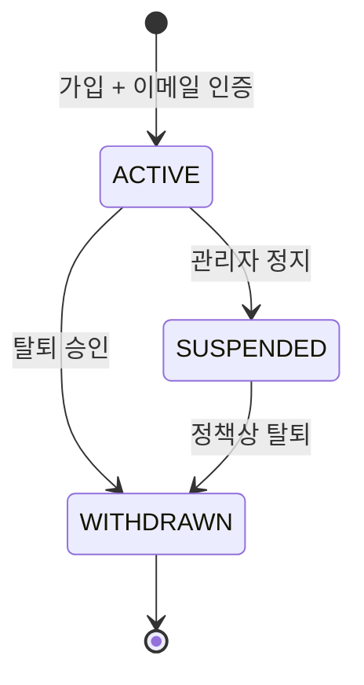

# 회원 서비스 상세설계

## 1. 책임과 경계

Member Service는 회원 계정, 이메일 인증, 로그인/토큰, 프로필, 정지·탈퇴 생명주기의 source of truth다. 상품·주문·결제 데이터는 소유하지 않으며 회원 상태 변경은 이벤트로 전달한다.

**[구현]** presentation/application/domain/infrastructure와 Outbox가 분리되어 있다. 도메인 모델과 JPA entity를 별도로 두고 repository port를 통해 변환한다.

## 2. 주요 API

| Method | Path | 인증 | 책임 |
|---|---|---|---|
| POST | `/api/members/email/send` | 공개, rate limit 필요 | 인증 메일 전송 |
| GET | `/api/members/email/verify` | 공개 | token 검증 |
| POST | `/api/members/signup` | 공개 | 가입·가입 이벤트 기록 |
| POST | `/api/members/login` | 공개 | access/refresh 발급 |
| POST | `/api/members/reissue` | refresh token | 토큰 회전 |
| POST | `/api/members/logout` | 회원 | refresh 삭제·access blacklist |
| GET/PATCH/DELETE | `/api/members/me/**` | 본인 | 조회·닉네임/비밀번호·탈퇴 요청 |
| GET | `/api/members/{id}/nickname` | 공개 | 최소 공개 프로필 |
| GET/POST | `/api/admin/**` | ADMIN | 회원·탈퇴 조회, 승인, 정지 |

## 3. 모델과 불변식

- `Member`: email과 nickname은 유일해야 하며 password는 BCrypt hash만 저장한다.
- 상태는 `ACTIVE`, `SUSPENDED`, `WITHDRAWN` 흐름으로 제한하고 로그인 시 ACTIVE 여부를 검증한다.
- 이메일 인증 완료 전 가입을 허용하지 않는다.
- `RefreshToken`은 회원과 만료시각을 가지며 매일 04시 정리 scheduler가 실행된다.
- 탈퇴는 요청과 최종 회원 상태 변경을 구분한다. 승인·정지 결과는 `member-withdraw`로 downstream에 전달한다.
- 가입 완료는 `member-signup`으로 Payment의 예치금 계좌 생성을 유도한다.

## 4. 인증 흐름

로그인은 자격증명과 상태를 확인하고 access/refresh JWT를 만든 뒤 refresh token을 DB에 저장한다. 재발급은 저장된 token, 서명·만료, 회원 상태를 모두 검증하고 **refresh rotation**을 적용하는 것이 목표다. 로그아웃은 refresh token을 삭제하고 access token의 남은 TTL만큼 Redis blacklist에 둔다.

## 5. 이벤트와 장애 처리

| Topic | 방향 | 의미 | 전달 방식 |
|---|---|---|---|
| `member-signup` | 생산 | 회원 가입 확정 | Outbox → Kafka |
| `member-withdraw` | 생산 | 회원 비활성/탈퇴 확정 | Outbox → Kafka |

Outbox 저장은 회원 상태 변경 트랜잭션과 같아야 한다. 현재 기본 Outbox는 PENDING/PROCESSED 수준이므로 재시도 횟수, FAILED, lease, 운영 재처리와 보존 정책을 Auction 수준으로 맞춘다. Payment가 가입 이벤트를 중복 수신해도 `userId` unique로 계좌 생성이 멱등이어야 한다.

메일 발송은 요청 스레드와 분리하고 인증 token은 hash 저장, TTL, 1회 사용, 재전송 throttle을 적용한다. 메일 장애가 DB transaction을 장시간 점유하지 않도록 한다.

## 6. 보안과 수용 기준

- 로그인·메일 전송은 IP+계정 rate limit, 점진적 지연, 보안 이벤트 로그를 둔다.
- 닉네임 조회는 이메일·전화·상태 같은 필드를 노출하지 않는다.
- 관리자 API는 Gateway와 서비스 양쪽에서 ADMIN을 검증하고 모든 조작을 감사한다.
- JWT key rotation과 `kid`, refresh replay 탐지를 지원한다.
- 테스트: 가입 중복 경쟁, 인증 token 만료/재사용, refresh 동시 재발급, 탈퇴 이벤트 중복, Redis/메일/Kafka 장애, BOLA/role 변조.

## 7. 구현 차이와 권고

P0는 운영 secret의 필수 주입, 사용자 헤더 신뢰 경계, 관리자 권한 검증이다. P1은 refresh rotation/reuse 탐지, Outbox 운영성, 이메일 rate limit이다. 개인정보 retention과 탈퇴 후 익명화/법정 보존 정책도 명문화해야 한다.

