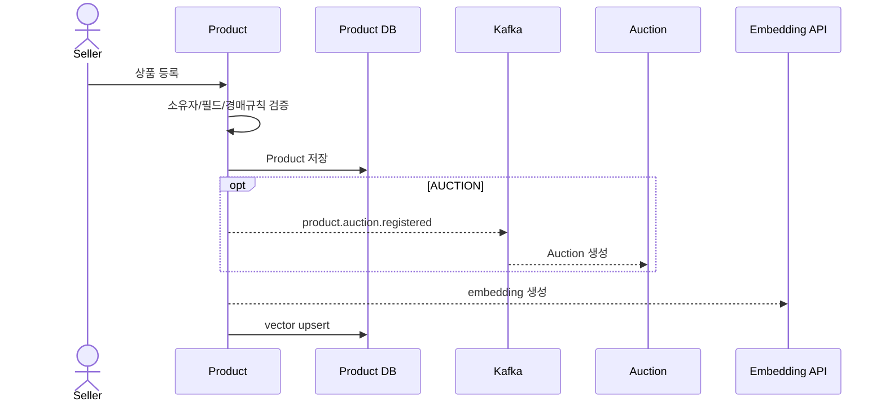

# 상품 서비스 상세설계

## 1. 책임과 경계

Product Service는 일반·경매 원본 상품, 재고, 이미지 URL, 찜, 상품 embedding의 소유자다. 경매 진행 상태와 입찰은 Auction, 검색 orchestration과 검색 이력은 Search가 소유한다.

## 2. 모델

`Product`는 `id`, `version`, 이름/설명/가격/재고/상태/판매자, `SaleType(NORMAL/AUCTION)`, 이미지 URL과 경매 속성(시작가, 최소 증가액, 시작/종료시각)을 가진다. `@Version`은 재고 동시 갱신에 사용한다. `ProductLike`는 회원-상품 관계, `ProcessedOrder`는 재고 차감 이벤트의 멱등 표식이다. embedding은 pgvector(기본 1536차원)에 별도 JDBC repository로 관리한다.

핵심 불변식은 가격·재고 음수 금지, 경매 시각 `startsAt < endsAt`, 경매 시작가/증가액 양수, 이미지 최대 5장, 소유자만 수정·삭제, 처리된 주문의 재고 중복 차감 금지다.

## 3. API 계약

| 그룹 | 경로 | 설명 |
|---|---|---|
| 상품 | `POST/GET /api/products`, `GET/PUT/DELETE /api/products/{id}` | 등록·목록·상세·수정·삭제 |
| 이미지 | `POST/DELETE /api/products/{id}/images` | 최대 5장 업로드/삭제 |
| 찜 | `/api/products/{id}/like`, `/like-count`, `/is-liked`, `/api/products/liked` | 개인화 찜 기능 |
| 내부 조회 | `POST /api/products/details` | Order의 다건 상품 정보 조회 |
| vector | `POST /api/products/search/vector` | Search가 전달한 embedding으로 후보 조회 |

내부 API는 외부 공개 route와 분리해 `/internal/v1/products:batchGet`, `/internal/v1/products:vectorSearch` 같은 service identity 전용 계약으로 이동하는 것이 목표다.

## 4. 상품 등록과 경매 연계

**[차이]** 경매 등록 이벤트는 현재 `KafkaTemplate` 직접 전송이라 DB commit과 발행이 원자적이지 않다. Product Outbox로 전환하고 embedding 생성도 transaction 밖의 비동기 job으로 분리한다. AI 장애가 상품 등록을 실패시키지 않아야 한다.

## 5. 재고 Saga

Order의 `order.stock.deduct`를 소비해 `(orderId, productId)` 멱등성을 확인하고 `@Version`으로 재고를 차감한다. 부족하면 `order.stock.deduct.failed`, 취소 시 `order.stock.restore`로 원복한다.

현재 `ProcessedOrder` 키가 `orderId` 하나이면 다품목 주문에서 첫 상품 처리 뒤 나머지가 중복으로 오인될 위험이 있으므로 실제 처리 단위를 확인하고 composite key 또는 eventId로 바꾼다. restore도 중복 소비 시 재고가 과다 증가하지 않도록 별도 멱등 기록이 필요하다.

## 6. 이미지와 embedding

S3를 운영 저장소로 단일화하고 업로드 전에 MIME signature, 크기, 개수, 소유자를 검증한다. key는 추측 불가 ID를 사용하고 삭제는 DB 참조 제거와 object 삭제를 보상 가능한 순서로 처리한다. presigned upload를 사용하면 서버 메모리 부하를 줄일 수 있다.

embedding은 `model`, `dimensions`, `contentHash`, `embeddedAt`, `status`를 기록한다. 모델 교체는 기존 vector 덮어쓰기보다 버전별 컬럼/테이블과 blue-green 재색인을 권장한다.

## 7. 수용 기준

- 동시 재고 차감 총량은 최초 재고를 넘지 않으며 동일 이벤트 재전달 결과가 같다.
- 상품 저장 성공 후 경매 생성 이벤트가 유실되지 않는다.
- AI/S3/Kafka 장애 중에도 정의한 기능이 degrade하고 복구 작업이 가능하다.
- 삭제/숨김 상품은 검색 vector와 찜 목록에서 일관되게 제외된다.
- 테스트: 다품목 주문 멱등성, optimistic lock 재시도, restore 중복, 이미지 파일 위장, 경매 규칙 경계시각, embedding 차원 불일치.

