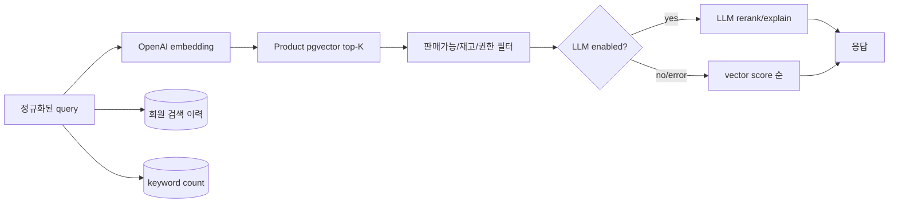

# 검색 서비스 상세설계

## 1. 책임과 구성

Search Service는 질의 embedding 생성, Product vector 후보 조회, 선택적 LLM 재정렬, 검색 이력 기반 추천, Elasticsearch 자동완성/인기 검색어를 담당한다. 상품 원문과 가격·재고의 source of truth는 Product다.

**[구현]** 포트 8087, PostgreSQL 검색 이력, Elasticsearch `search-keywords`, OpenAI embedding/LLM, Product REST client를 사용한다. 후보 기본 30건, 추천 2건, 이력 키워드 5건이며 설정으로 조정된다.

## 2. API

| Method | Path | 인증 | 동작 |
|---|---|---|---|
| POST | `/api/search` | 선택 | 의미 검색, 회원이면 이력 저장 |
| GET | `/api/search/recommendations/history` | 회원 | 이력 가중 추천 |
| GET | `/api/search/suggestions` | 공개 | prefix 자동완성 |
| POST | `/api/search/keywords` | 현재 공개 | 키워드 count 기록 |
| GET | `/api/search/keywords/popular` | 공개 | 인기 검색어 |
| GET | `/api/search/debug/embedding` | 개발 전용 | 원 vector 반환 |

`keywords` 저장은 search API 내부 동작으로 흡수하고 외부 쓰기 API는 막아 인기 검색어 조작을 방지한다. embedding debug는 운영 profile에서 bean 자체를 비활성화한다.

## 3. 검색 파이프라인

LLM 출력은 후보 product ID 집합을 벗어날 수 없게 구조화 응답과 allow-list 검증을 적용한다. 설명은 사실 데이터가 아니라 생성 텍스트임을 구분한다.

## 4. 장애·성능·비용

- embedding API timeout이면 캐시된 동일 질의 vector를 사용하고 없으면 503 또는 별도 키워드 fallback을 명시한다.
- LLM 장애는 vector 순위로 degrade하며 검색 전체를 실패시키지 않는다.
- Product 장애는 짧은 timeout/circuit breaker 후 503을 반환하고 무한 재시도하지 않는다.
- Elasticsearch 장애는 자동완성·인기 검색만 영향받도록 격리한다.
- normalized query hash 기반 embedding cache, 요청 합치기(single flight), 사용자/IP quota를 둔다.
- AI latency, input/output token, 호출 비용, fallback rate, zero-result rate, 클릭/구매 전환을 측정한다.

## 5. 개인정보와 품질 평가

검색 이력은 목적·보존 기간·삭제 방법을 정의하고 탈퇴 이벤트에 따라 삭제 또는 익명화한다. AI provider 전송 전 이메일·전화·주문번호 패턴을 탐지/마스킹한다.

오프라인 golden set에는 정확 일치, 동의어, 오타, 카테고리 혼합, 부적절 질의, prompt injection을 포함한다. Recall@K, NDCG@K, zero-result rate와 비용/지연을 버전별 비교하고 품질 회귀가 있으면 모델 rollout을 중단한다.

## 6. 수용 기준

- LLM이 후보 외 상품을 반환해도 응답에는 포함되지 않는다.
- LLM/ES 중 하나가 실패해도 정의한 fallback이 동작한다.
- 비회원은 개인 이력이 생성되지 않고 회원 이력은 본인에게만 사용된다.
- embedding dimension/model 불일치는 배포 전 감지된다.
- debug와 keyword 쓰기 endpoint는 운영 외부망에서 호출할 수 없다.

