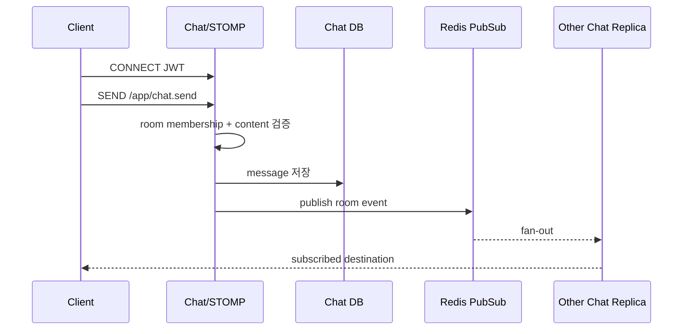

# 채팅 서비스 상세설계

## 1. 책임과 경계

Chat Service는 상품 단위 buyer-seller 채팅방, 메시지 영속화, 읽음 처리, WebSocket 실시간 전달을 소유한다. 회원·상품의 존재/상태는 다른 서비스가 소유하므로 방 생성 시 검증 계약이 필요하다.

**[구현]** REST는 `/api/chats`, STOMP client send는 `/app/chat.send`, `/app/chat.read`, WebSocket endpoint는 `/api/ws-chat`, broker는 Redis Pub/Sub로 확장된다. `ChatRoom`과 `ChatMessage`를 PostgreSQL에 저장한다.

## 2. API와 실시간 계약

| 채널 | 계약 | 설명 |
|---|---|---|
| REST | `POST /api/chats/rooms` | 인증 회원을 buyer로 강제해 생성 또는 조회 |
| REST | `GET /api/chats/rooms` | 참여 중인 방 목록 |
| REST | `GET /api/chats/rooms/{roomId}/messages?lastMessageId=&size=` | cursor 기반 메시지 조회 |
| STOMP SEND | `/app/chat.send` | 메시지 전송 |
| STOMP SEND | `/app/chat.read` | 읽음 확인 |
| STOMP SUB | 사용자/방 destination | 새 메시지와 읽음 상태 수신; 코드 destination을 공식 계약으로 고정 필요 |

WebSocket CONNECT에서 JWT를 검증해 principal을 만들고, SEND/SUBSCRIBE마다 해당 room의 buyer/seller인지 다시 권한 검사한다. destination ID만 아는 비참여자의 구독을 차단한다.

## 3. 데이터와 불변식

- `ChatRoom(productId,buyerId,sellerId,createdAt)`: seller와 buyer는 달라야 하고 조합 unique를 권장한다.
- `ChatMessage(roomId,senderId,content,isRead,createdAt)`: sender는 방 참여자여야 한다.
- 메시지 조회는 `(roomId,id desc)` index와 `id < lastMessageId` cursor를 사용한다.
- 읽음은 현재 boolean이므로 1:1 채팅에는 가능하지만 확장성을 위해 room participant별 `lastReadMessageId` 모델이 더 명확하다.

## 4. 메시지 흐름

DB 저장 성공 후 publish 실패 시 클라이언트는 REST 재조회로 복구할 수 있지만 실시간 알림은 유실된다. 신뢰성이 필요하면 Chat Outbox/stream을 사용하고 `messageId`로 중복 표시를 제거한다. Redis Pub/Sub는 durable queue가 아님을 명시한다.

## 5. 보안·운영·테스트

- message length, binary 여부, 금칙어/신고 정책, connection/send rate limit를 둔다.
- JWT를 query string에 넣지 않고 STOMP header 또는 보안 cookie를 사용하며 로그에 남기지 않는다.
- 연결 수, 인증 실패, send rate, Redis publish 오류, 저장→전달 p95, slow consumer를 측정한다.
- 테스트: 비참여 구독/SEND, 위조 senderId, 중복 방 생성 경쟁, Redis 재연결, 다중 replica 전달, cursor 경계, XSS payload 출력 encoding.

## 6. 구현 차이

Chat은 Gateway Swagger 집계 목록에 없고 서비스 내부 authorization의 일관성 확인이 필요하다. `chat_rooms`에 중복 방 방지 제약, 읽음 cursor 모델, durable 전달 여부와 retention/신고·삭제 정책을 우선 결정한다.

