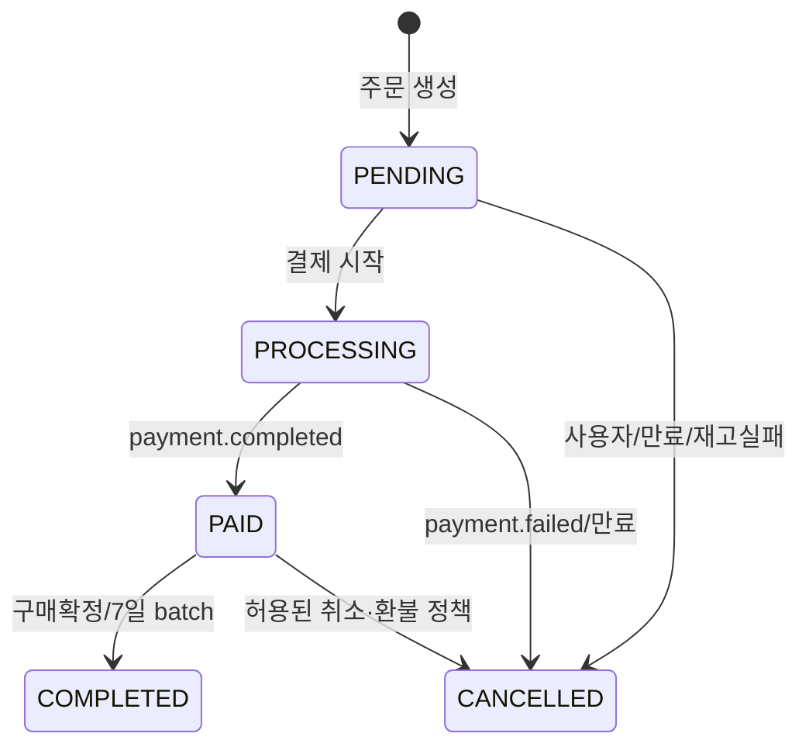
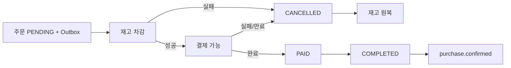

# 주문 서비스 상세설계

## 1. 책임과 경계

Order Service는 장바구니, 일반 주문과 경매 낙찰 주문, 주문 상태, 재고·결제 Saga, 만료/자동 구매확정 batch를 소유한다. 금전 승인과 원장은 Payment, 상품 재고 source of truth는 Product다.

## 2. 모델과 상태

`Order`는 구매자, 판매자, 총액, `OrderType(NORMAL/AUCTION)`, 상태, 결제기한과 시각을 가진다. `OrderInfo`는 상품별 주문 정보를 저장하고 `Cart`는 사용자-상품 관계다.

임의 `statusChange` API가 상태 머신을 우회하지 못하게 허용 전이, actor, 사유를 domain method에 둔다. 금액과 seller는 Product snapshot에서 계산하며 클라이언트 입력을 신뢰하지 않는다.

## 3. API

| 그룹 | 현재 경로 | 설계 주의점 |
|---|---|---|
| 장바구니 | `/api/cart/item|list|delete|clean` | 본인 소유 검증, `(userId,productId)` 중복 정책 |
| 주문 | `/api/order/create|list|info|statusChange|cancel|complete` | resource-oriented v1로 점진 개선 |
| Payment 내부 | `/api/orders/{id}/payment-info`, `/payment-processing` | 외부 차단, service identity, 멱등성 |
| Batch 수동 | `/api/orders/batch/**` | 운영자/내부 전용, 중복 실행 방지 |

## 4. Saga와 이벤트

| Topic | 방향 | 처리 |
|---|---|---|
| `auction.ended` | 소비 | 낙찰 주문 멱등 생성 |
| `order.stock.deduct` | 생산 | 일반 주문 상품 재고 차감 |
| `order.stock.deduct.failed` | 소비 | 주문 취소/실패 및 보상 |
| `order.stock.restore` | 생산 | 취소 재고 원복 |
| `payment.completed` | 소비 | PAID 전환 |
| `payment.failed` | 소비 | 결제 실패 반영 |
| 주문 취소 topic | 생산 | Payment 취소 유도 |
| `purchase.confirmed` | 생산 | Settlement 확정 유도 |

각 listener는 eventId 또는 business key unique로 멱등해야 한다. `auctionId`는 낙찰 주문 unique, `paymentId` 처리 기록은 unique, restore도 deduced 여부와 쌍을 맞춘다. 순서가 뒤바뀌면 현재 상태와 event version으로 지연 적용 또는 격리한다.

## 5. Batch와 장애 처리

결제 만료는 기본 5분마다, 자동 구매확정은 매일 02시에 실행된다. 다중 replica에서는 동일 job 동시 실행을 DB job repository/ShedLock/leader election으로 막는다. batch는 keyset pagination과 chunk transaction을 사용하고 재시작 가능한 checkpoint를 둔다.

Payment→Order 내부 호출의 `payment-processing`은 같은 요청 재시도에 멱등이어야 한다. Order가 PROCESSING인데 Payment 결과가 없는 상태를 주기적으로 대사해 PENDING 복귀 또는 실패 확정 정책을 둔다.

## 6. 수용 기준

- 동일 `auction.ended`를 반복 수신해도 주문은 하나다.
- 같은 주문에 결제가 하나만 활성화되며 금액은 서버 snapshot과 일치한다.
- 재고 차감 성공 뒤 결제 실패/취소 시 원복이 정확히 한 번의 효과를 낸다.
- batch 재실행과 다중 replica에서도 중복 구매확정 이벤트가 발생하지 않는다.
- 사용자 A가 사용자 B의 주문 상태를 조회/변경할 수 없다.
- 계약·통합 테스트는 Kafka 순서 역전, duplicate, poison event, Product/Payment timeout을 포함한다.

