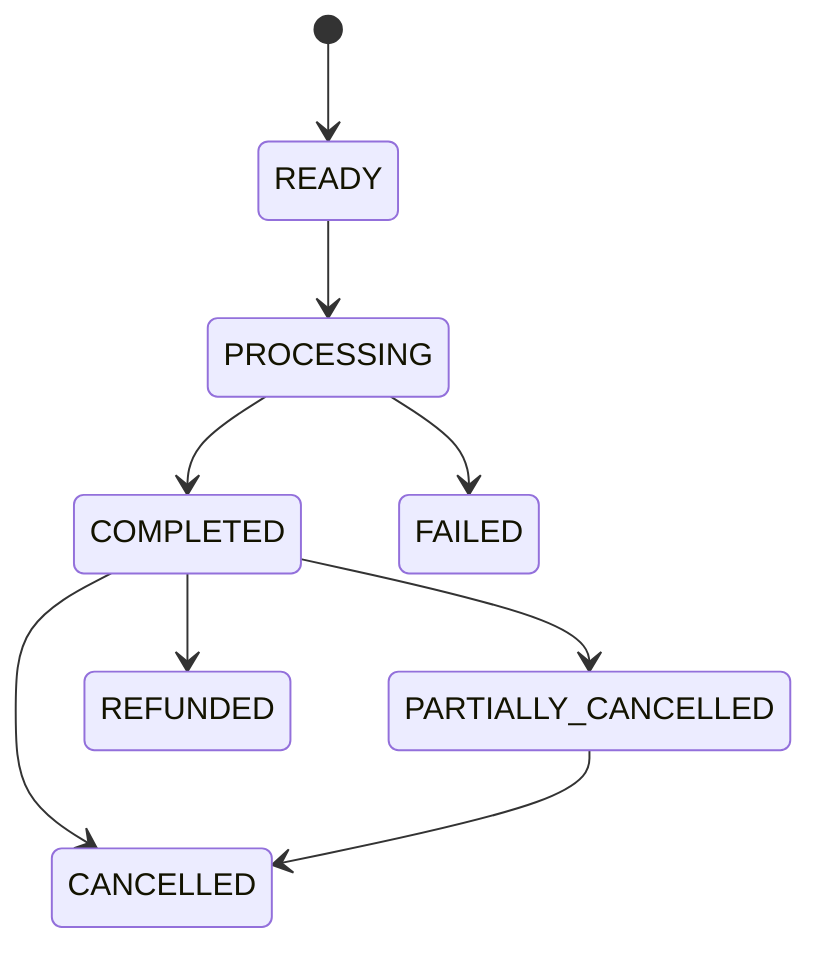
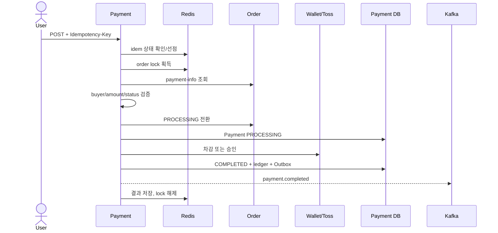

# 결제 서비스 상세설계

## 1. 책임과 컨텍스트

Payment Service는 하나의 배포 단위 안에 세 개의 명확한 컨텍스트를 가진다.

| 컨텍스트 | 책임 | 핵심 모델 |
|---|---|---|
| payment | 주문 결제 승인, 취소, 환불, 멱등 처리 | `Payment`, `PaymentCancel` |
| wallet | 회원 예치금 잔액과 불변 거래 원장 | `DepositAccount`, `DepositTransaction` |
| settlement | 판매자 정산 예정/확정/월 집계 | `Settlement`, `SettlementItem` |

Order가 주문 상태와 결제 가능 금액을 소유하고, Toss가 외부 결제 승인 결과를 소유한다. Payment는 이 둘을 조정하면서 자체 상태와 원장을 source of truth로 유지한다.

## 2. 결제 상태와 불변식

- 동일 order에 성공 결제는 최대 하나다. DB unique constraint로 최종 보장한다.
- 승인/취소 누적 금액은 최초 승인 금액을 넘지 않는다.
- 예치금 잔액은 음수가 될 수 없고 모든 변경은 거래 원장과 같은 transaction에 기록한다.
- 결제 요청의 buyer/seller/amount는 Order 내부 API 결과와 일치해야 한다.
- 완료 이벤트와 결제 상태 변경은 동일 transaction의 Outbox에 포함한다.

## 3. API

| 영역 | 경로 | 권한 |
|---|---|---|
| 결제 | `POST /api/payments` | 주문 구매자, `Idempotency-Key` 필수화 권장 |
| 결제 | `GET /api/payments/{id}` | 결제 구매자/정책상 관리자 |
| 취소·환불 | `POST /api/payments/{id}/cancel|refund` | 허용된 당사자와 상태 |
| 예치금 | `/api/payments/deposits/charge|charge/cancel|withdraw` | 본인 |
| 예치금 | `GET .../balance|transactions` | 본인; 관리자 조회는 감사 |
| 강제 조정 | `PATCH .../deposits/adjust` | ADMIN 전용 |
| 정산 | `/api/payments/settlements/**` | 판매자 조회; 월 실행은 내부/admin |

강제 조정과 월 정산 API는 현재 Controller에 역할 선언이 드러나지 않으므로 P0로 Gateway+서비스 권한 검증을 추가한다.

## 4. 결제 생성 시퀀스

Redis는 성능과 조정 도구이지 금전 정확성의 유일한 보장점이 될 수 없다. Redis 유실 후에도 DB의 order unique, payment 상태, provider paymentKey unique, 원장 idempotency key가 중복을 막아야 한다. lock 해제는 소유 token을 비교하는 Lua/Redisson 방식으로 다른 요청의 lock을 지우지 않게 한다.

## 5. 외부 결제 불확실성

Toss 호출 timeout은 성공/실패를 추정할 수 없는 **UNKNOWN** 상태다. 동일 idempotency key/provider key로 상태 조회 후 확정하고, 주기적 reconciliation job이 Order-Payment-Toss-원장을 대사한다. webhook을 도입하면 signature, timestamp/replay 방지, event idempotency를 검증한다.

취소도 provider 성공 후 로컬 commit 실패가 가능하므로 provider 조회와 보상/재처리로 수렴한다. 외부 호출을 긴 DB transaction 안에 묶지 않고 intent 저장 → 외부 호출 → 결과 확정 패턴을 사용한다.

## 6. 이벤트·정산

Payment 결과는 Outbox로 `payment.completed`, `payment.failed`, `payment.refunded`를 발행한다. Order 취소를 소비해 필요 결제를 취소한다. Settlement는 payment completed로 예정 item을 만들고 `purchase.confirmed`로 확정하며 refund로 취소/차감한다.

정산 계산은 수수료율·세금·정책 버전을 item에 snapshot으로 저장해야 재계산 가능하다. 월 정산은 `(sellerId, period)` unique와 재실행 멱등성을 가진다.

## 7. 수용 기준

- 같은 idempotency key의 동일 요청은 같은 결과를, 다른 payload는 409를 반환한다.
- Redis flush/timeout과 동시 요청에도 성공 결제·원장 차감이 하나다.
- Toss timeout 후 reconciliation으로 최종 상태에 수렴한다.
- 원장 합계와 계좌 잔액, 결제/정산 합계가 일치한다.
- 관리자 조정·환불·월정산에 actor/reason 감사 로그가 남는다.
- test suite는 optimistic conflict, lock lease 만료, Outbox 중복, 부분취소 누적, 이벤트 순서 역전을 포함한다.

