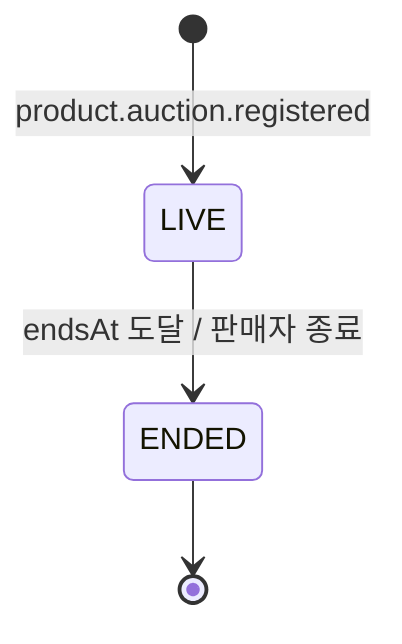
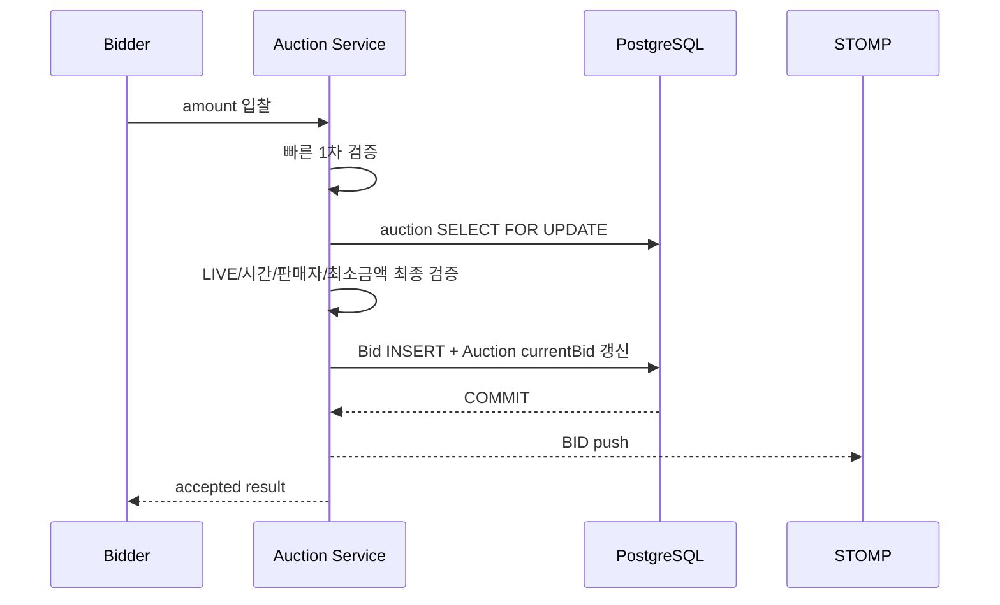

# 경매 서비스 상세설계

## 1. 책임과 구조

Auction Service는 `auction`, `bid`, `watch` 하위 도메인을 한 배포 단위에서 운영한다. 각 영역은 presentation/application/domain/infra 계층과 repository port를 가진다. 경매 원본 상품은 Product, 낙찰 이후 주문은 Order가 소유한다.

## 2. 모델과 상태

- `Auction`: 문자열 `auctionId`, product/seller, 시작가·현재가·최소 증가액, bid count, LIVE/ENDED, 시각, winner/winningBid.
- `Bid`: auction, bidder, amount, 생성시각. 금액은 양수이고 판매자는 입찰할 수 없다.
- `AuctionWatch`: `(auctionId,memberId)` unique 관심 관계. Redis는 count/cache projection이다.
- `OutboxEvent`: PENDING/PROCESSED/FAILED, retry count와 오류를 가진다.

ENDED 시 입찰이 있으면 winnerId/winningBidId/currentBid를 확정하고 `auction.ended`를 한 번의 효과로 생산한다. 입찰이 없으면 UNSOLD WebSocket 메시지만 발행하고 주문 이벤트는 만들지 않는다.

## 3. API·실시간 계약

| 영역 | 경로 | 설명 |
|---|---|---|
| 피드/상세/결과 | `GET /api/v1/auctions/**` | 상태·정렬·페이지, 관심 여부, 종료 결과 |
| 종료 | `POST /api/v1/auctions/{id}/close` | 판매자만 즉시 종료 |
| 입찰 | `POST/GET /api/v1/auctions/{id}/bids` | 입찰 실행/내역 |
| 내 입찰 | `GET /api/v1/members/me/bids` | 참여 경매 |
| 관심 | `/api/v1/auctions/{id}/watch`, `/api/v1/members/me/watches` | toggle/조회 |
| STOMP | `/ws`, `/topic/auctions/{auctionId}` | BID/ENDED/UNSOLD push |

**[차이]** Gateway에 Auction WebSocket route가 없으므로 외부 endpoint를 정합화해야 한다. 실시간 메시지는 UI 편의 projection이며 최종 결과는 REST/DB를 기준으로 한다.

## 4. 입찰 동시성

DB 시간을 마감 판정 기준으로 통일하거나 인스턴스 clock skew를 엄격히 관리한다. lock 대기 timeout을 정하고 마감 직전 부하에서 p99와 실패 코드를 측정한다. 동일 사용자의 network retry를 위한 client bid id/idempotency key를 추가한다.

## 5. 종료와 이벤트

Scheduler는 1초 fixed delay로 만료 LIVE 경매를 찾는다. 판매자 즉시 종료와 scheduler가 경쟁할 수 있으므로 DB에서 LIVE→ENDED conditional update/lock으로 승자를 하나로 만든다. 다중 replica에서는 `SKIP LOCKED` claim과 batch limit를 권장한다.

낙찰 처리와 Outbox 저장은 동일 transaction이며 relay가 `auction.ended`를 발행한다. WebSocket publish가 transaction commit 전에 실행되면 rollback 상태를 먼저 알릴 수 있으므로 after-commit listener 또는 Outbox 소비 기반 push로 이동한다.

Product의 `product.auction.registered` 소비도 `productId/eventId` unique로 멱등해야 한다. 잘못된 payload는 DLQ로 보내고 offset을 조용히 커밋하지 않는다.

## 6. 수용 기준

- 100개 동시 입찰에서 최종가는 유효한 최고 입찰이고 bid count/내역과 일치한다.
- 종료시각 경계 이후 입찰은 어떤 replica에서도 수락되지 않는다.
- scheduler/판매자 종료/재시작이 경쟁해도 낙찰 이벤트는 한 번의 효과를 낸다.
- Kafka/Redis/WebSocket 장애 후 DB 상태와 Order 생성은 복구 가능하다.
- 판매자는 자기 경매에 입찰하거나 타 판매자의 경매를 종료할 수 없다.
- 관심 cache flush 뒤 DB로 복구되고 count가 수렴한다.

