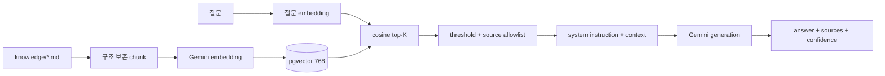

# 챗봇 서비스 상세설계

## 1. 책임과 구현

Chatbot Service는 저장소의 `knowledge/*.md`를 chunk로 나누어 Gemini embedding을 생성하고 PostgreSQL pgvector에 저장한 뒤, 질문과 유사한 top-K 문맥으로 답변을 생성하는 RAG FAQ 서비스다.

**[구현]** 포트 8088, `document_chunk` 테이블의 `vector(768)`, 기본 top-K 4, `gemini-embedding-001`과 설정상 `gemini-3.1-flash-lite`를 사용한다. Controller 설명에 다른 모델명이 남아 있어 설정을 기준으로 정합화가 필요하다.

## 2. API

| Method | Path | 책임 |
|---|---|---|
| POST | `/api/chatbot/query` | 질문 검색·생성 |
| POST | `/api/chatbot/admin/reingest` | 모든 지식 문서 재적재 |

`reingest`는 외부 공개 금지, ADMIN보다 좁은 운영 service identity 또는 deployment job으로 제한한다. 질의 API에는 질문 길이, 사용자/IP quota와 timeout을 둔다.

## 3. RAG 파이프라인

질문과 문서 내용을 모두 불신 입력으로 보고 문서 안의 지시문을 실행하지 않도록 system prompt를 고정한다. 답변은 제공된 context에만 근거하고 근거 부족 시 모른다고 답해야 한다.

## 4. 수집·버전 관리

- chunk에 `documentVersion`, `contentHash`, heading path, source URI, embeddedAt, model을 저장한다.
- 전체 delete 후 insert가 아니라 새 version을 staging 적재하고 검증 후 active version을 전환한다.
- 동일 hash는 재embedding하지 않고 삭제 문서는 새 active version에서 제외한다.
- embedding dimension/model 변경은 별도 table/index로 blue-green migration한다.
- Startup ingestion은 여러 replica에서 동시에 실행되지 않게 lock하고, 외부 API 장애가 서비스 전체 readiness를 영구 차단하지 않게 한다.

## 5. 안전·품질·비용

질문에서 개인정보를 마스킹하고 원문 질의 저장 여부와 보존 기간을 명시한다. 답변에는 출처 문서와 “정책은 변경될 수 있음”을 표시하며 결제·환불 같은 중요 정책은 원문 링크로 확인하게 한다. prompt/context/answer를 그대로 로그에 남기지 않는다.

평가는 정책별 golden Q&A로 groundedness, answer correctness, citation correctness, refusal, latency, cost를 측정한다. prompt injection, 상충 문서, 관련 문서 없음, 모델 timeout, malformed 응답을 회귀 테스트한다.

## 6. 수용 기준

- 근거 threshold 미만이면 임의 답변 대신 미확인 응답을 반환한다.
- 모든 정책 답변에 실제 사용한 source가 포함되고 존재하지 않는 출처를 만들지 않는다.
- 재적재 중에도 이전 active corpus로 질의가 가능하며 전환은 원자적이다.
- Gemini 장애 시 명확한 503/fallback과 재시도 후 복구가 가능하다.
- admin reingest는 외부 일반 사용자에게 노출되지 않는다.

