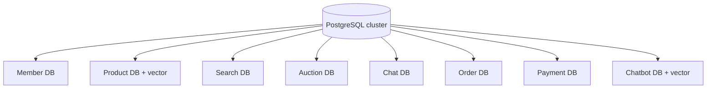
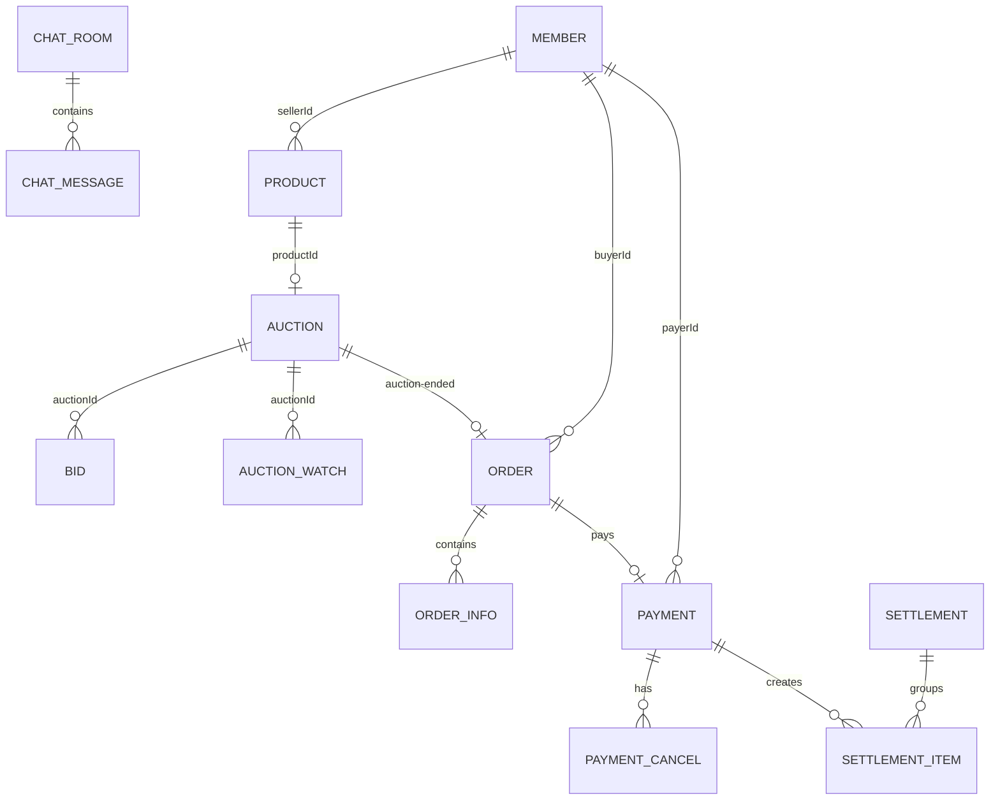

# 데이터베이스 설계

## 1. 소유권과 배치

**[구현]** 개발 Compose는 pgvector PostgreSQL 16 한 인스턴스 안에 `biddy_member`, `biddy_product`, `biddy_search`, `biddy_auction`, `biddy_chat`, `biddy_order`, `biddy_payment`, `biddy_chatbot` database를 만든다. 서비스별 datasource는 자신의 database만 바라본다.

운영에서는 각 서비스 자격증명을 분리하고 다른 database 권한을 제거한다. 물리 cluster를 공유하더라도 cross-database join과 직접 조회를 금지한다.

## 2. 논리 테이블 카탈로그

| DB | 현재 주요 테이블 | 역할/핵심 키 |
|---|---|---|
| Member | `member`, `email_verification`, `refresh_token`, `withdrawal_request`, `outbox_events` | email/nickname unique, 회원 생명주기 |
| Product | `product`, `product_image_urls`, `product_like`, `processed_order`, embedding table | product source, `(member_id,product_id)` like, vector |
| Search | `member_search_histories` | `(member_id,keyword)` unique와 count |
| Auction | `auction`, `bid`, `auction_watch`, `outbox_events` | 문자열 auction ID, 관심 unique |
| Chat | `chat_rooms`, `chat_messages` | room 참여자, `(room_id,id desc)` 메시지 |
| Order | `cart`, `order`, `order_info`, `outbox_events`, Spring Batch metadata | 주문/항목, batch 재시작 |
| Payment | `payments`, `payment_cancels`, `deposit_accounts`, `deposit_transactions`, `settlements`, `settlement_items`, `outbox_events` | 결제·원장·정산 |
| Chatbot | `document_chunk` | `(source,chunk_index)` unique, `vector(768)` |

Elasticsearch의 `search-keywords`는 자동완성과 인기 검색어를 위한 파생 index이며 PostgreSQL source of truth와 같은 복구 수준을 요구하지 않는다. Redis의 blacklist, 결제 멱등 키/lock, Auction watch cache, Chat Pub/Sub도 영속 원장으로 사용하지 않는다.

## 3. 핵심 관계

서비스 간 ID는 DB foreign key가 아닌 논리 참조다.

외부 ID의 존재는 생성 시 API snapshot 또는 이벤트로 검증하고, 이후 원본이 바뀌어도 거래 이력은 snapshot을 유지한다. 예를 들어 주문 item의 상품명/단가, 정산 item의 수수료율은 당시 값을 저장한다.

## 4. 제약과 인덱스

애플리케이션 검증만으로 동시성 무결성을 보장하지 말고 DB 제약을 마지막 방어선으로 둔다.

| 테이블 | 권장 제약/인덱스 |
|---|---|
| member | unique(lower(email)), unique(nickname), status index |
| refresh_token | unique(member_id 또는 token hash 정책), expires_at index |
| product | seller/status/sale_type 복합, `stock >= 0`, price >= 0 |
| product_like | unique(member_id,product_id), member_id index |
| processed event | unique(event_id) 또는 unique(order_id,product_id,operation) |
| auction | `(status,ends_at)`, product_id unique, winner consistency check |
| bid | `(auction_id,created_at desc)`, `(bidder_id,created_at desc)`, amount > 0 |
| auction_watch | unique(auction_id,member_id), member_id index |
| chat_room | unique(product_id,buyer_id,seller_id) |
| chat_message | `(room_id,id desc)`, content length check |
| order | `(user_id,created_at desc)`, `(status,payment_due_at)`, auction_id unique |
| payment | order_id successful unique, provider payment_key unique, user/time index |
| deposit_account | user_id unique, balance >= 0, version |
| deposit_transaction | account/time index, idempotency key unique, amount > 0 |
| settlement | unique(seller_id,period), status/time index |
| outbox_events | `(status,created_at)`, event_id unique, aggregate index |

## 5. 스키마 변경

**[차이]** 대부분의 서비스가 `spring.jpa.hibernate.ddl-auto:update`를 사용한다. 이는 개발 편의용으로만 두고 운영에서는 `validate`로 바꾼다. 각 서비스에 독립 Flyway/Liquibase history를 두며 migration 파일의 소유자는 해당 서비스다.

Expand/contract 절차:

1. nullable 새 컬럼/새 테이블/새 index를 online 방식으로 추가한다.
2. 구버전과 신버전이 함께 읽고 쓸 수 있게 배포한다.
3. backfill을 작은 batch와 checkpoint로 수행한다.
4. 읽기 전환과 데이터 검증 후 old write를 중단한다.
5. 다음 배포 이후 old column/계약을 제거한다.

큰 index는 PostgreSQL `CREATE INDEX CONCURRENTLY`를 별도 transaction migration으로 수행한다. 금전·재고 migration은 row count, null, 합계 reconciliation 쿼리를 배포 조건으로 둔다.

## 6. 보존·백업·복구

| 데이터 | 보존 원칙 |
|---|---|
| 회원 개인정보 | 목적/법적 기간 후 삭제·익명화, 탈퇴 처리 기록 분리 |
| refresh/email token | 만료 후 짧은 grace 뒤 삭제, token은 hash |
| 주문·결제·원장·정산 | 회계/법정 정책에 따른 장기 보존과 immutable audit |
| 채팅 | 서비스 정책 기간, 사용자 삭제/신고/법적 보존 분리 |
| 검색 이력/AI 질의 | 최소 기간, opt-out와 삭제 지원 |
| Outbox/inbox | 처리 완료 후 운영 추적 기간 보존 후 partition/drop |
| vector/ES/cache | 원본에서 재생성 가능; 별도 낮은 RPO 허용 가능 |

운영 목표 초안은 거래 DB RPO ≤ 5분, RTO ≤ 60분이다. PITR 가능한 backup, 암호화, 복구 연습을 분기마다 수행하고 단순 backup 성공이 아니라 실제 restore+정합성 검증을 기록한다.

