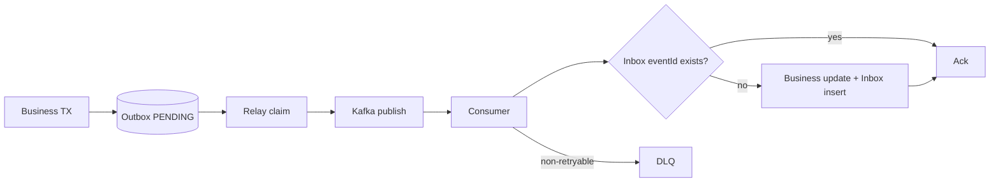

# 이벤트와 통합 계약

## 1. 현재 Kafka 토픽 카탈로그

| Topic | 생산자 | 소비자 | 목적 | 현재 신뢰성 |
|---|---|---|---|---|
| `member-signup` | Member | Payment wallet | 예치금 계좌 생성 | Member Outbox |
| `member-withdraw` | Member | Product | 판매 상품 숨김 | Member Outbox |
| `product.auction.registered` | Product | Auction | 경매 aggregate 생성 | 직접 발행 |
| `auction.ended` | Auction | Order | 낙찰 주문 생성 | Auction Outbox |
| `order.stock.deduct` | Order | Product | 재고 차감 | Order Outbox |
| `order.stock.deduct.failed` | Product | Order | 주문 실패/취소 | 직접 발행 |
| `order.stock.restore` | Order | Product | 재고 보상 | Order Outbox |
| `order.cancelled` | Order | Payment | 결제 취소 | Order Outbox |
| `payment.completed` | Payment | Order, Settlement | PAID/예정정산 | Payment Outbox, 별도 group |
| `payment.failed` | Payment | Order | 주문 실패 반영 | Payment Outbox |
| `payment.refunded` | Payment | Settlement | 정산 취소/차감 | Payment Outbox |
| `purchase.confirmed` | Order | Settlement | 정산 확정 | Order Outbox |

## 2. 목표 이벤트 envelope

```json
{
  "eventId": "019...uuid",
  "eventType": "payment.completed",
  "eventVersion": 1,
  "aggregateType": "PAYMENT",
  "aggregateId": "12345",
  "occurredAt": "2026-07-22T12:34:56.789Z",
  "producer": "payment-service",
  "traceId": "...",
  "payload": {}
}
```

- Kafka key는 aggregate 순서가 중요하면 `aggregateId`다. 재고 이벤트는 product별 순서와 주문 멱등성 요구를 함께 고려한다.
- 시간은 UTC ISO-8601 offset을 사용하고 의미가 다른 `occurredAt`, `publishedAt`, 소비시각을 구분한다.
- 금액은 integer smallest unit 또는 JSON decimal string, ID는 타입 변환 손실 없는 문자열 표현을 권장한다.
- schema registry의 Avro/Protobuf 또는 versioned JSON Schema를 CI에서 호환성 검사한다.

## 3. 최소 payload 계약

| Event | 반드시 포함할 값 |
|---|---|
| member-signup | memberId |
| member-withdraw | memberId, effectiveAt, reason category |
| product.auction.registered | productId, sellerId, startingPrice, minIncrement, startsAt, endsAt |
| auction.ended | auctionId, productId, sellerId, winnerId, winningBidId, finalPrice, endedAt |
| order.stock.* | orderId, productId, quantity, operationId |
| order.cancelled | orderId, buyerId, reason, cancelledAt |
| payment.completed | paymentId, orderId, buyerId, sellerId, amount, method, completedAt |
| payment.failed | paymentId/orderId, failureCode, retryable, failedAt |
| payment.refunded | paymentId, orderId, refundId, amount, cumulativeAmount, refundedAt |
| purchase.confirmed | orderId, confirmedAt, confirmationType |

개인정보, token, provider secret은 이벤트에 넣지 않는다. consumer가 필요한 식별자와 거래 snapshot만 전달한다.

## 4. 전달·소비 규칙

Kafka는 exactly-once business effect를 자동 제공하지 않는다. 모든 토픽은 at-least-once로 간주한다.



생산자 규칙:

- business update와 Outbox insert를 같은 transaction에 둔다.
- 직렬화 실패를 로그만 남기고 business 성공으로 처리하지 않는다.
- relay 다중 실행 안전, 제한 retry, FAILED, backlog alarm, purge를 지원한다.

소비자 규칙:

- business update와 Inbox insert를 같은 transaction에 둔다.
- transient 예외를 다시 throw해 retry하고 broad catch로 삼키지 않는다.
- schema/validation 오류는 DLQ로 보낸다.
- 이미 지나간 상태 이벤트는 멱등 ack 또는 명시적 quarantine으로 처리한다.

## 5. REST 통합 계약

현재 주요 내부 호출은 Search→Product vector 후보, Order→Product 상품 정보, Payment→Order payment-info/processing이다. 목표는 외부 API와 `/internal/v1/**` namespace를 분리하고 service identity를 요구하는 것이다.

모든 내부 API는 connect/read timeout, 최대 payload/page, idempotency, 오류 code, 계약 version을 명시한다. Payment→Order의 상태 변경은 `Idempotency-Key` 또는 payment attempt ID를 받아 중복 요청이 같은 결과를 내야 한다. REST response의 product/order snapshot은 consumer가 계산에 필요한 필드를 빠짐없이 가지되 내부 Entity 전체를 노출하지 않는다.

## 6. WebSocket 계약

Auction message는 `eventId`, `eventType(BID/ENDED/UNSOLD)`, `auctionId`, `version`, `occurredAt`, payload를 가진다. Chat message는 `messageId`, `roomId`, `senderId`, `content`, `createdAt`과 read event cursor를 가진다. 클라이언트는 event ID 중복 제거와 version 역행 방지를 수행하고 reconnect 후 REST로 gap을 복구한다.

## 7. 계약 변경 절차

1. 소비자 영향과 N/N-1 호환성을 기록한다.
2. schema에 optional 필드를 먼저 추가한다.
3. 새 필드를 이해하는 소비자를 먼저 배포한다.
4. 생산자를 배포하고 lag/DLQ를 관찰한다.
5. 구 필드 제거는 모든 소비자 전환과 retention window 후 새 major version에서 수행한다.
6. consumer-driven contract와 replay fixture를 CI에서 검증한다.

