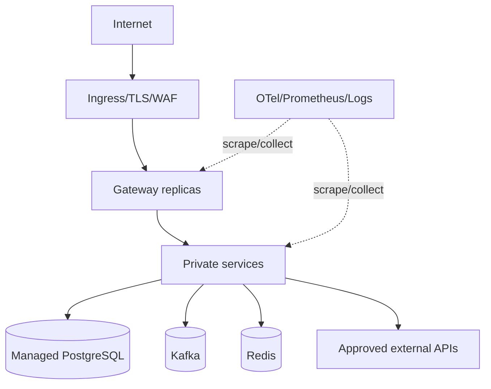

# 배포와 관측성 설계

## 1. 현재 배포 구조

개발은 Docker Compose로 PostgreSQL/Redis/Kafka와 전체 서비스를 기동한다. Kubernetes base/monitoring manifest와 서비스별 GitHub Actions CI, develop branch 성공 후 SSH를 통해 원격 저장소 pull·`kubectl apply`·rollout restart하는 배포 workflow가 있다.

**[차이]** 원격 서버에서 `latest`와 mutable 상태를 pull/restart하는 방식은 “테스트한 정확한 artifact” 보장을 약화한다. CI가 만든 SHA digest image와 Git에 고정된 manifest를 배포해야 한다.

## 2. 목표 환경과 네트워크

- namespace와 NetworkPolicy로 Gateway→서비스, 서비스→자기 DB/필요 dependency만 허용한다.
- 외부 egress는 S3/Toss/OpenAI/Gemini 등 allow-list와 proxy/audit를 고려한다.
- 모든 public traffic은 TLS, 내부 민감 호출은 mTLS/workload identity를 사용한다.
- Pod는 non-root, read-only root filesystem, 최소 capability, resource request/limit를 적용한다.

## 3. 배포 전략

1. CI가 test/scan 후 image를 commit SHA와 digest로 publish한다.
2. manifest의 digest를 GitOps 방식으로 갱신하고 승인한다.
3. backward-compatible migration job을 먼저 실행한다.
4. consumer → producer 순서로 rolling/canary 배포한다.
5. readiness와 synthetic transaction, error budget를 확인한다.
6. 이상 시 application은 이전 digest로 되돌리고 DB는 검증된 roll-forward를 수행한다.

Payment/Auction/Order는 canary traffic을 적게 시작하되 Kafka consumer group rebalancing과 scheduler 중복 실행을 고려한다. scheduler는 별도 deployment 또는 leader election으로 ownership을 분명히 한다.

## 4. Probe와 리소스

- liveness: JVM/event loop가 복구 불가능하게 멈췄는지 최소 검사.
- readiness: traffic 처리 가능 여부; DB pool/필수 dependency는 짧고 신중하게 판정.
- startup: migration/JIT/warm-up 동안 liveness 재시작 loop 방지.
- graceful shutdown: readiness off → inflight 완료 → Kafka stop/offset commit → 종료.

HPA는 CPU만이 아니라 Gateway RPS, Kafka lag, Chat connections 같은 workload 지표를 사용한다. DB pool 합계가 DB max connection을 넘지 않게 replica×pool budget을 계산한다.

## 5. 관측성 표준

로그는 JSON으로 timestamp, level, service, version, environment, traceId, spanId, memberId hash, aggregate ID, eventId, error code를 포함한다. secret/PII와 event 전체 payload는 로그하지 않는다.

| 신호 | 필수 항목 |
|---|---|
| Metrics | HTTP RED, JVM, DB pool/query, Kafka lag, Outbox, Redis, scheduler, AI, business invariants |
| Traces | Gateway→REST, Kafka produce/consume link, external provider spans |
| Logs | 구조화 오류 code와 trace/event 연결 |
| Business | bid accepted/rejected, payment completed/unknown, ledger mismatch, order aging |

대시보드는 서비스 건강보다 사용자 여정을 우선한다: 경매 입찰, 주문→결제, 결제→주문 반영, 구매확정→정산, 검색/챗봇 fallback, 채팅 전달.

## 6. 알림과 runbook

| 심각도 | 조건 예 | 즉시 조치 |
|---|---|---|
| P0 | 중복 승인/원장 불일치/낙찰 주문 누락/인증 우회 | 영향 차단, 결제/관련 consumer pause, 대사 |
| P1 | error budget 급소진, Outbox FAILED, Kafka lag 임계, DB pool 고갈 | on-call 호출, scale/failover/원인 격리 |
| P2 | AI fallback/비용 증가, cache hit 저하, batch 지연 | 업무시간 조사 |

각 runbook은 증상, 영향 확인, dashboard/query, 안전한 완화, 데이터 복구, 재개, 검증, 사후분석 template를 가진다. 알람은 단순 CPU 임계보다 multi-window error budget burn을 우선한다.

## 7. 재해복구와 운영 점검

- PostgreSQL PITR과 분기 restore drill, Redis/Kafka 장애 전환 연습.
- Kafka topic partition/replication/retention과 DLQ quota를 환경별 코드로 관리.
- secret rotation, JWT signing key overlap rotation, provider key 폐기 절차.
- 월별 dependency/image patch와 분기별 권한/NetworkPolicy 검토.
- 배포 후 synthetic 가입(테스트 tenant), 공개 조회, 입찰 sandbox, 결제 sandbox, chatbot query를 자동 확인한다.

